# Overview

<details>
<summary>Relevant source files</summary>

The following files were used as context for generating this wiki page:

- [README.md](README.md)
- [docker-compose.yml](docker-compose.yml)
- [pom.xml](pom.xml)
- [src/main/java/project/brianle/securestorage/Application.java](src/main/java/project/brianle/securestorage/Application.java)
- [src/main/java/project/brianle/securestorage/service/impl/JwtServiceImpl.java](src/main/java/project/brianle/securestorage/service/impl/JwtServiceImpl.java)

</details>


This document provides a technical introduction to the secure-storage-back-end system, a Spring Boot application designed for secure document management with comprehensive user authentication and access control capabilities. For detailed information about specific subsystems, please refer to the dedicated pages on [System Architecture](#1.1), [User Management](#2), and [Document Management](#3).

## Purpose and Scope

The secure-storage-back-end provides a REST API for secure document storage, retrieval, and management with the following key capabilities:

- User authentication with JWT-based security
- Multi-factor authentication (MFA) with TOTP
- Role-based access control (RBAC)
- Secure document upload, download, and management
- Comprehensive audit trail of system activities

Sources: [README.md:20-47](), [pom.xml:10-16]()

## System Architecture

The application follows a multi-tiered architecture based on the Spring framework:

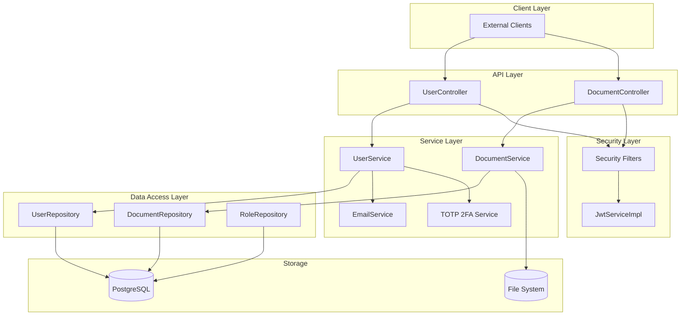

Sources: [src/main/java/project/brianle/securestorage/Application.java:15-41](), [pom.xml:32-125]()

## Technical Stack

The application is built using the following core technologies:

| Component | Technology | Description |
|-----------|------------|-------------|
| Framework | Spring Boot 3.2.2 | Application framework with auto-configuration |
| Security | Spring Security | Authentication and authorization framework |
| JWT | JJWT 0.12.5 | JSON Web Token implementation |
| Database | PostgreSQL | Relational database for data persistence |
| ORM | Spring Data JPA | Database access layer |
| MFA | TOTP 1.7.1 | Time-based One-Time Password for multi-factor authentication |
| API Documentation | Springdoc OpenAPI | API documentation and testing interface |
| Build | Maven | Dependency management and build tool |

Sources: [pom.xml:32-125](), [docker-compose.yml:1-29]()

## Core Components

### Authentication System

The authentication system is JWT-based, implementing secure cookie-based token storage with both access and refresh tokens:

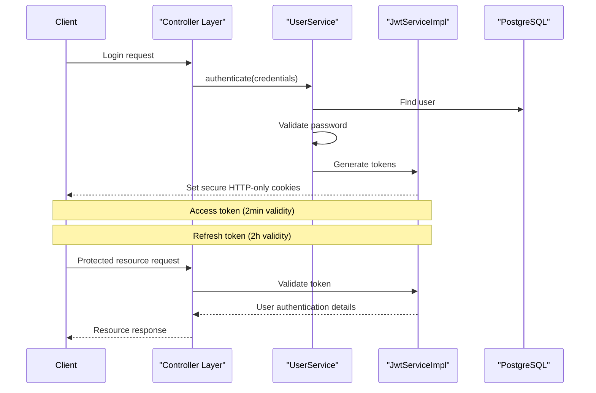

The `JwtServiceImpl` class implements token generation, validation, and cookie management. The system stores JWT in HTTP-only secure cookies with appropriate SameSite attributes to prevent CSRF attacks.

Sources: [src/main/java/project/brianle/securestorage/service/impl/JwtServiceImpl.java:42-164]()

### Document Management Flow

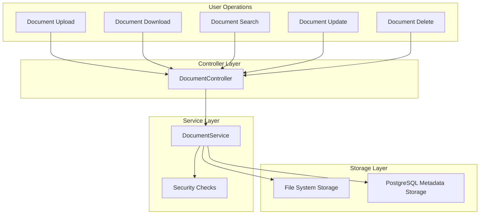

The document management system provides controlled access to files with strict security checks at both the controller and service layers.

Sources: [README.md:36-44]()

### Role-Based Access Control

The system implements a comprehensive role-based access control mechanism with predefined roles (USER, ADMIN, SUPER_ADMIN) and fine-grained permissions:

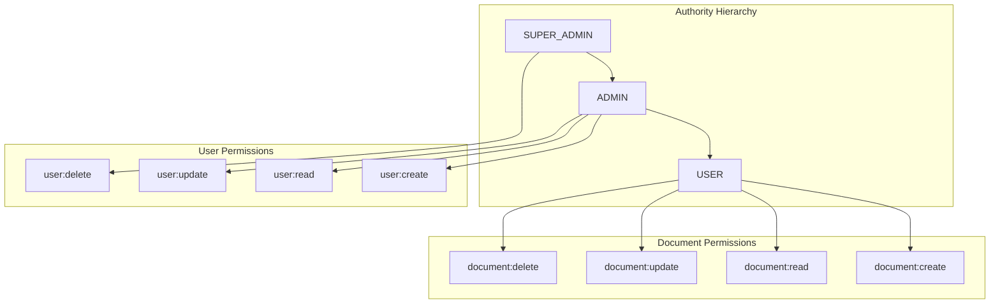

Authorities are defined as enumerations and stored in the database through the `RoleEntity` class. During application startup, predefined roles are initialized if they don't exist.

Sources: [src/main/java/project/brianle/securestorage/Application.java:25-40]()

## Deployment Configuration

The application is containerized using Docker with a multi-container setup:

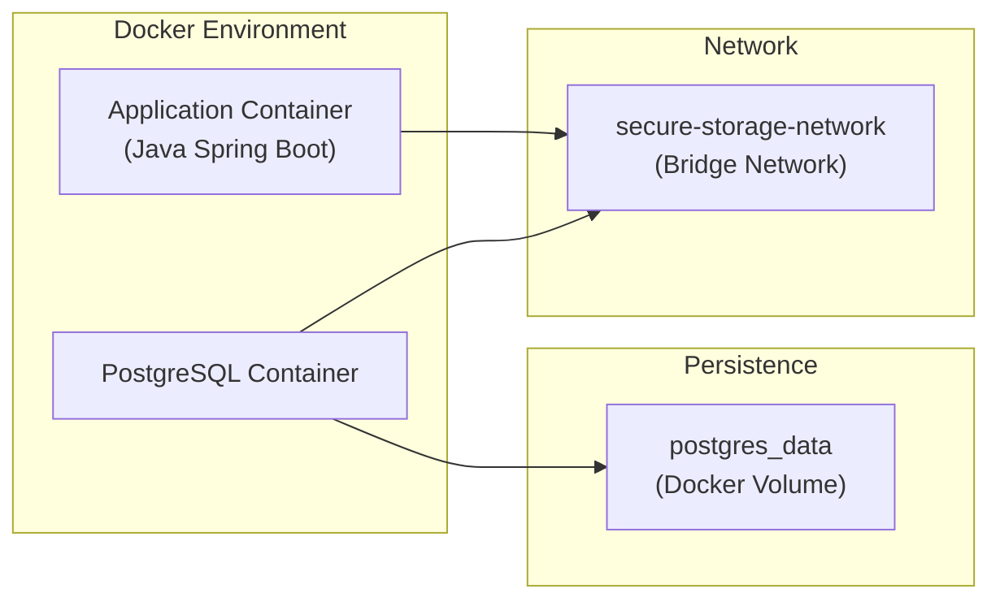

The application is deployed with Docker Compose, configuring both the Spring Boot application and PostgreSQL database containers. The database data is persisted through a Docker volume.

Sources: [docker-compose.yml:1-29]()

## Summary

The secure-storage-back-end provides a comprehensive solution for document management with strong security features. The system leverages modern Java technologies and follows best practices in security design, including JWT-based authentication, secure cookie handling, role-based access control, and multi-factor authentication.

For more detailed information about specific subsystems, refer to:
- [System Architecture](#1.1) - Detailed component relationships and design patterns
- [User Management](#2) - User registration, authentication, and profile management
- [Document Management](#3) - Document uploading, retrieval, and manipulation
- [Security](#4) - In-depth explanation of the security infrastructure19:T3ce9,# System Architecture

<details>
<summary>Relevant source files</summary>

The following files were used as context for generating this wiki page:

- [src/main/java/project/brianle/securestorage/Application.java](src/main/java/project/brianle/securestorage/Application.java)
- [src/main/java/project/brianle/securestorage/constant/Constants.java](src/main/java/project/brianle/securestorage/constant/Constants.java)
- [src/main/java/project/brianle/securestorage/service/impl/JwtServiceImpl.java](src/main/java/project/brianle/securestorage/service/impl/JwtServiceImpl.java)
- [src/main/resources/application.yml](src/main/resources/application.yml)

</details>


## Purpose and Scope

This document describes the overall system architecture of the secure-storage-back-end, including the main components, their relationships, design patterns, and technical implementation details. It provides a comprehensive overview of how the different parts of the system interact to deliver secure document storage functionality.

For specific configuration details, see [Configuration](#1.2). For detailed information about user management flows, see [User Management](#2).

## High-Level Architecture Overview

The secure-storage-back-end follows a multi-layered architecture built on Spring Boot with a strong focus on security. The system implements a clear separation of concerns through the Controller-Service-Repository pattern.

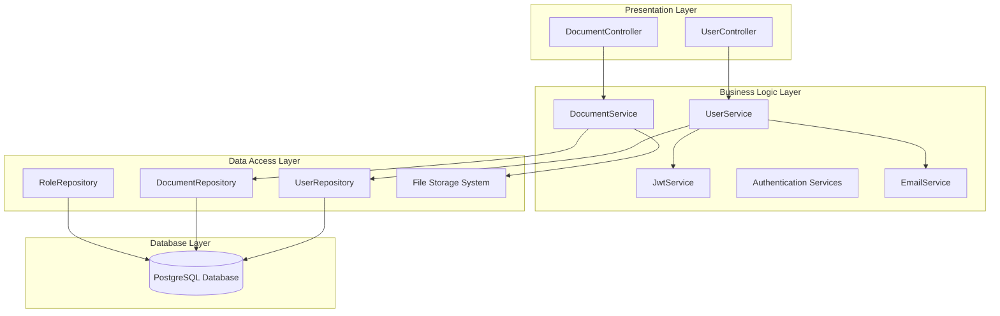

Sources: [src/main/java/project/brianle/securestorage/Application.java](), [src/main/resources/application.yml]()

## Core Architectural Components

### Spring Boot Application Foundation

The application is built upon Spring Boot, with specific customizations for security and persistence. Key frameworks and libraries include:

- Spring Boot core framework
- Spring Data JPA for database operations
- Spring Security for authentication and authorization
- JPA/Hibernate for ORM and database interactions
- JWT for stateless authentication

The main application class enables JPA auditing and asynchronous method execution:

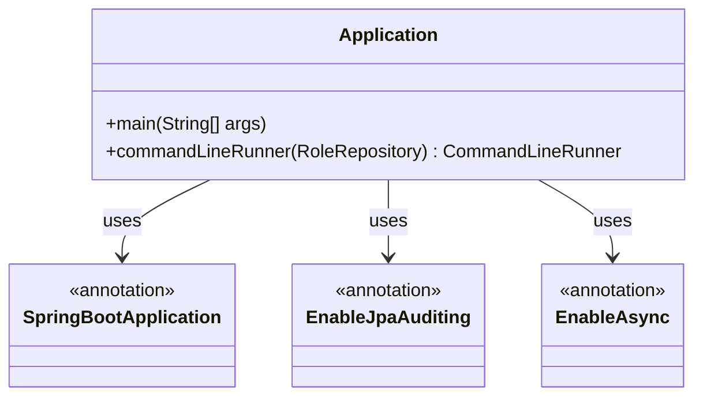

Sources: [src/main/java/project/brianle/securestorage/Application.java:16-41]()

### Security Architecture

The security system is based on JWT (JSON Web Tokens) with custom implementation for enhanced security. The authentication flow involves token generation, validation, and secure cookie management.

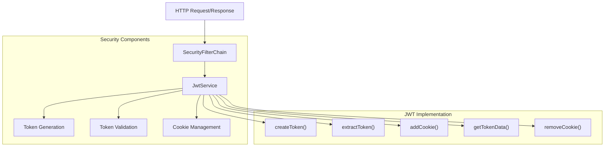

The JWT implementation provides:
- Access tokens (short-lived) and refresh tokens (longer-lived)
- Secure HTTP-only cookies with SameSite attributes
- Token validation with user verification
- Role-based authorities embedded in tokens

Sources: [src/main/java/project/brianle/securestorage/service/impl/JwtServiceImpl.java:42-164](), [src/main/resources/application.yml:65-67]()

### System Constants and Configuration

The system employs centralized configuration for critical constants and application settings:

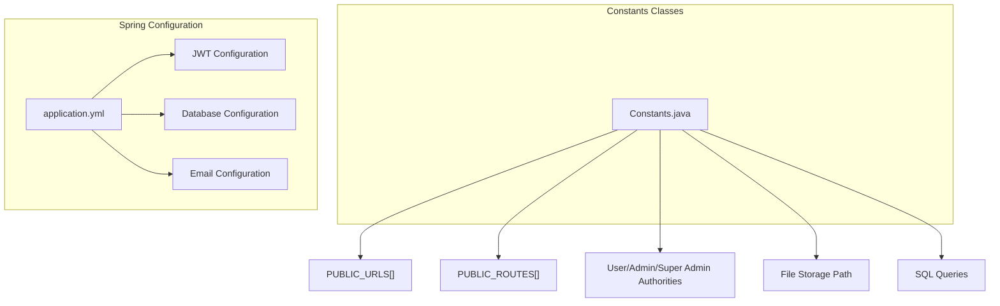

Key constants include:
- Public URLs for unauthenticated access
- Role-based authority definitions
- File storage paths
- Predefined SQL queries for document operations

Sources: [src/main/java/project/brianle/securestorage/constant/Constants.java:3-26](), [src/main/resources/application.yml:1-73]()

## Layered Architecture Details

### Presentation Layer

The presentation layer consists of RESTful controllers that handle HTTP requests:

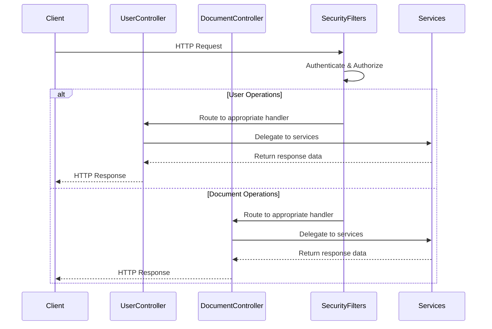

Sources: [src/main/java/project/brianle/securestorage/constant/Constants.java:5-11]()

### Business Logic Layer

The service layer implements core business logic and orchestrates operations between controllers and repositories:

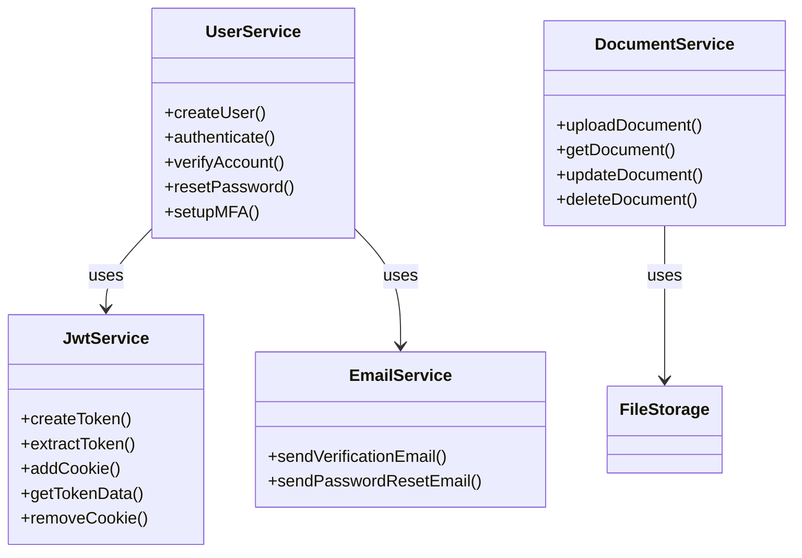

Sources: [src/main/java/project/brianle/securestorage/service/impl/JwtServiceImpl.java:42-164]()

### Data Access Layer

The data access layer provides persistence operations through repositories and direct file system access:

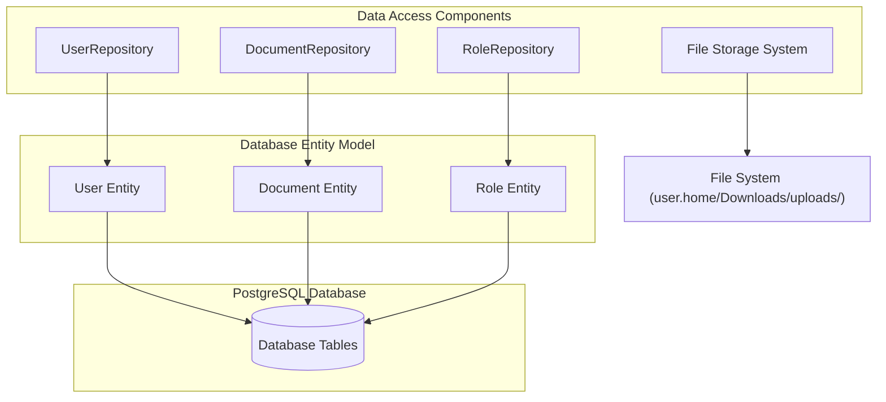

The system uses:
- PostgreSQL for relational data storage
- File system storage for document content
- JPA repositories for database operations

Sources: [src/main/java/project/brianle/securestorage/constant/Constants.java:4](), [src/main/resources/application.yml:11-26]()

## Role-Based Access Control

The system implements a comprehensive role-based access control mechanism:

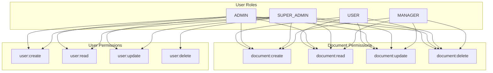

The permissions are defined as constants for each role:

| Role | Permissions |
|------|-------------|
| USER | document:create, document:read, document:update, document:delete |
| ADMIN | user:create, user:read, user:update, document:create, document:read, document:update, document:delete |
| SUPER_ADMIN | user:create, user:read, user:update, user:delete, document:create, document:read, document:update, document:delete |
| MANAGER | document:create, document:read, document:update, document:delete |

Sources: [src/main/java/project/brianle/securestorage/constant/Constants.java:12-21]()

## Request Processing Flow

The following diagram illustrates how requests flow through the system:

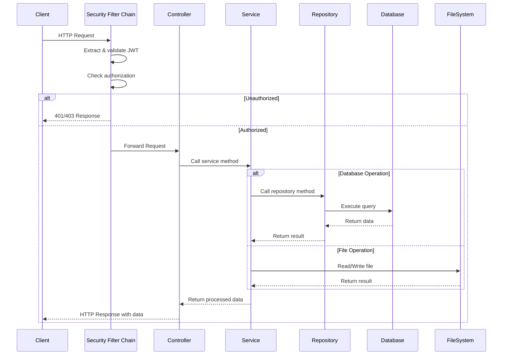

Sources: [src/main/java/project/brianle/securestorage/service/impl/JwtServiceImpl.java:42-164](), [src/main/java/project/brianle/securestorage/constant/Constants.java:5-11]()

## Design Patterns Used

The system employs several architectural and design patterns:

1. **Layered Architecture Pattern**: Separation into presentation, business logic, and data access layers
2. **Repository Pattern**: Abstraction of data access operations
3. **Dependency Injection**: Spring-based dependency management
4. **Functional Programming Pattern**: Extensive use of Java functional interfaces in the JWT service
5. **Builder Pattern**: Used for constructing complex objects like Token and TokenData

Example from JWT service:

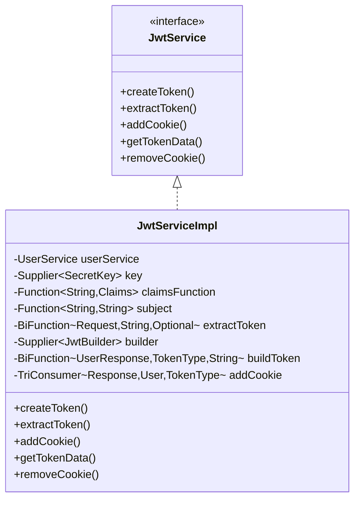

Sources: [src/main/java/project/brianle/securestorage/service/impl/JwtServiceImpl.java:42-164]()

## Asynchronous Processing

The application supports asynchronous processing through Spring's `@EnableAsync` annotation, allowing non-blocking execution of operations like email sending.

Sources: [src/main/java/project/brianle/securestorage/Application.java:17-18]()

## Integration Points

The system integrates with several external systems:

1. **PostgreSQL Database**: For persistent data storage of user accounts, document metadata, and roles
2. **File System**: For physical document storage
3. **Email Service**: For sending verification and notification emails

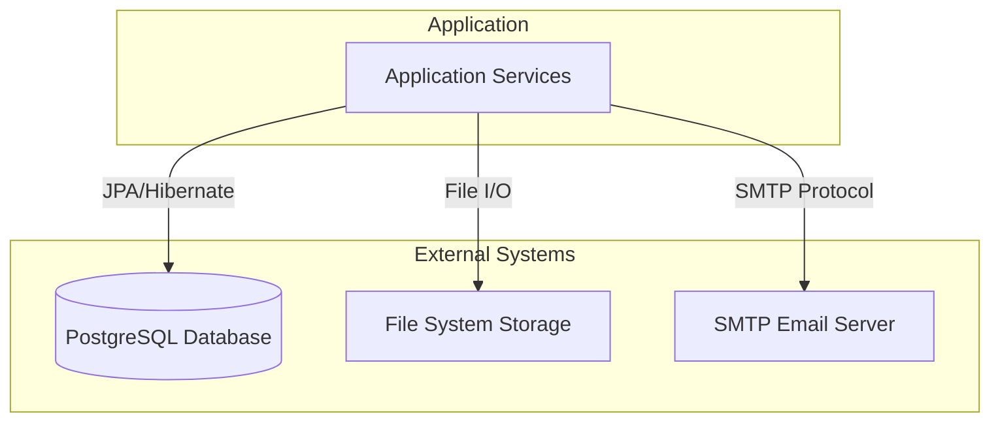

Sources: [src/main/resources/application.yml:11-56](), [src/main/java/project/brianle/securestorage/constant/Constants.java:4]()

## Summary

The secure-storage-back-end implements a robust, multi-layered architecture with strong security features. The system employs industry-standard patterns and practices while providing customized security implementations through JWT. The clear separation of concerns and modular design allow for maintainability and extensibility.

Key architectural decisions include:
- Using PostgreSQL for relational data and file system for document storage
- Implementing JWT-based authentication with secure cookies
- Employing a comprehensive role-based access control system
- Using functional programming patterns for JWT service implementation
- Supporting asynchronous processing for non-blocking operations

Sources: [src/main/java/project/brianle/securestorage/Application.java](), [src/main/resources/application.yml](), [src/main/java/project/brianle/securestorage/service/impl/JwtServiceImpl.java](), [src/main/java/project/brianle/securestorage/constant/Constants.java]()1a:T3734,# Configuration

<details>
<summary>Relevant source files</summary>

The following files were used as context for generating this wiki page:

- [pom.xml](pom.xml)
- [src/main/java/project/brianle/securestorage/constant/Constants.java](src/main/java/project/brianle/securestorage/constant/Constants.java)
- [src/main/java/project/brianle/securestorage/service/EmailService.java](src/main/java/project/brianle/securestorage/service/EmailService.java)
- [src/main/java/project/brianle/securestorage/utils/EmailUtils.java](src/main/java/project/brianle/securestorage/utils/EmailUtils.java)
- [src/main/resources/application.yml](src/main/resources/application.yml)

</details>


This document details the application configuration options, constants, and environmental settings for the secure-storage-back-end system. It provides comprehensive information about how the application can be configured across different environments and explains the key parameters that drive system behavior.

For information about the overall system architecture, see [System Architecture](#1.1).

## Configuration Architecture

The secure-storage-back-end application follows Spring Boot's configuration conventions with three primary configuration components working together to define system behavior:

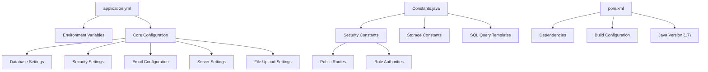

Sources: [src/main/resources/application.yml](), [src/main/java/project/brianle/securestorage/constant/Constants.java](), [pom.xml]()

## Core Application Properties

The primary application configuration is defined in `application.yml` and includes configurations for all major subsystems.

### Database Configuration

```yaml
spring:
  datasource:
    url: jdbc:postgresql://<POSTGRESQL_HOST>:<POSTGRESQL_PORT>/<POSTGRESQL_DATABASE>
    username: <POSTGRESQL_USERNAME>
    password: <POSTGRESQL_PASSWORD>
  jpa:
    open-in-view: false
    database-platform: org.hibernate.dialect.PosgreSQLInnoDBDialect
    generate-ddl: true
    show-sql: true
    hibernate:
      ddl-auto: update
    properties:
      hibernate:
        globally_quoted_identifiers: true
        dialect: org.hibernate.dialect.PostgreSQLDialect
        format_sql: true
```

The application uses PostgreSQL for data persistence. The database connection parameters should be replaced with actual values or environment variables in production environments.

Sources: [src/main/resources/application.yml:11-27]()

### Server Configuration

```yaml
server:
  port: ${CONTAINER_PORT:8080}
  error:
    path: /user/error
    whitelabel:
      enabled: false
```

The server port can be set via the `CONTAINER_PORT` environment variable with a default of 8080. Custom error handling is configured with a specific error path.

Sources: [src/main/resources/application.yml:58-63]()

### File Upload Configuration

```yaml
spring:
  servlet:
    multipart:
      enabled: true
      max-file-size: 1000MB
      max-request-size: 1000MB
```

The file upload limits are configured to support large files (up to 1000MB), which is essential for the document storage functionality.

Sources: [src/main/resources/application.yml:33-37]()

### Email Configuration

```yaml
spring:
  mail:
    host: <EMAIL_HOST>
    port: ${EMAIL_PORT:587}
    username: <EMAIL_ID>
    password: <EMAIL_PASSWORD>
    default-encoding: UTF-8
    properties:
      mail:
        mime:
          charset: UTF
        smtp:
          writetimeout: 10000
          connectiontimeout: 10000
          timeout: 10000
          auth: true
          starttls:
            enable: true
            required: true
    verify:
      host: <VERIFY_EMAIL_HOST>
```

Email configuration is used for sending account verification and password reset emails. The `verify.host` parameter specifies the base URL used in verification links.

Sources: [src/main/resources/application.yml:38-57](), [src/main/java/project/brianle/securestorage/service/EmailService.java](), [src/main/java/project/brianle/securestorage/utils/EmailUtils.java]()

## Security Configuration

### JWT Configuration

```yaml
jwt:
  expiration: 432_000_000  # 5 days in milliseconds
  secret: <JWT_SECRET>
```

The JSON Web Token (JWT) settings define the token expiration time (5 days in milliseconds) and the secret used for token signing. The JWT secret should be set as an environment variable for security.

Sources: [src/main/resources/application.yml:65-67]()

### Public Routes

The application defines URL patterns that are accessible without authentication:

```java
public static final String[] PUBLIC_URLS = { 
    "/user/resetpassword/reset/**", 
    "/user/verify/resetpassword/**", 
    "/user/resetpassword/**", 
    "/user/verify/qrcode/**", 
    "/user/login/**", 
    "/user/verify/account/**", 
    "/user/register/**", 
    "/user/new/password/**", 
    "/user/verify/**", 
    "/user/resetpassword/**", 
    "/user/image/**", 
    "/user/verify/password/**" 
};

public static final String[] PUBLIC_ROUTES = { 
    "/user/resetpassword/reset", 
    "/user/verify/resetpassword", 
    "/user/resetpassword", 
    "/user/verify/qrcode", 
    "/user/stream", 
    "/user/id", 
    "/user/login", 
    "/user/register", 
    "/user/new/password", 
    "/user/verify", 
    "/user/refresh/token", 
    "/user/resetpassword", 
    "/user/image", 
    "/user/verify/account", 
    "/user/verify/password", 
    "/user/verify/code"
};
```

These routes represent endpoints that don't require authentication, such as login, registration, password reset, and account verification.

Sources: [src/main/java/project/brianle/securestorage/constant/Constants.java:5-11]()

### Authentication Flow

The security configuration defines how requests are authenticated and authorized:

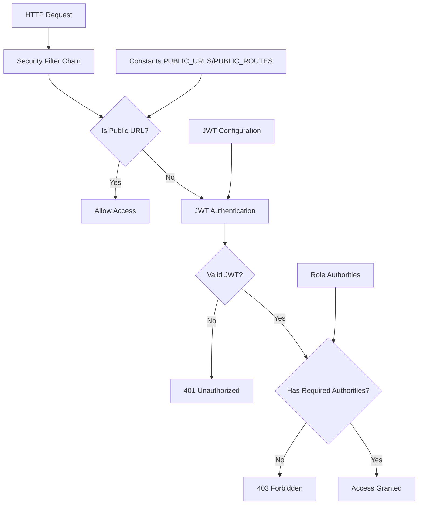

Sources: [src/main/java/project/brianle/securestorage/constant/Constants.java:5-11](), [src/main/resources/application.yml:65-67]()

### Role-Based Access Control

The application implements role-based access control with predefined roles and authorities:

```java
public static final String USER_AUTHORITIES = 
    "document:create,document:read,document:update,document:delete";

public static final String ADMIN_AUTHORITIES = 
    "user:create,user:read,user:update,document:create,document:read,document:update,document:delete";

public static final String SUPER_ADMIN_AUTHORITIES = 
    "user:create,user:read,user:update,user:delete,document:create,document:read,document:update,document:delete";

public static final String MANAGER_AUTHORITIES = 
    "document:create,document:read,document:update,document:delete";
```

Each role has a specific set of permissions that determine what actions the user can perform within the system.

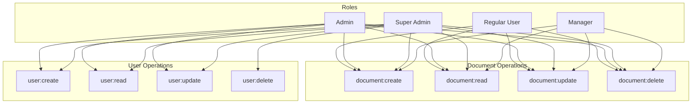

Sources: [src/main/java/project/brianle/securestorage/constant/Constants.java:18-21]()

## Storage Configuration

### File Storage Location

Document files are stored in the filesystem, with the location defined in the Constants class:

```java
public static final String FILE_STORAGE = System.getProperty("user.home") + "/Downloads/uploads/";
```

This path is resolved at runtime based on the user's home directory.

Sources: [src/main/java/project/brianle/securestorage/constant/Constants.java:4]()

### SQL Query Templates

The application uses predefined SQL query templates for document retrieval:

```java
public static final String SELECT_DOCUMENTS_QUERY = "SELECT doc.id, doc.document_id, doc.name, doc.description, doc.uri, doc.icon, doc.size, doc.formatted_size, doc.extension, doc.reference_id, doc.created_at, doc.updated_at, CONCAT(owner.first_name, ' ', owner.last_name) AS owner_name, owner.email AS owner_email, owner.phone AS owner_phone, owner.last_login AS owner_last_login, CONCAT(updater.first_name, ' ', updater.last_name) AS updater_name FROM documents doc JOIN users owner ON owner.id = doc.created_by JOIN users updater ON updater.id = doc.updated_by";

public static final String SELECT_DOCUMENT_QUERY = "SELECT doc.id, doc.document_id, doc.name, doc.description, doc.uri, doc.icon, doc.size, doc.formatted_size, doc.extension, doc.reference_id, doc.created_at, doc.updated_at, CONCAT(owner.first_name, ' ', owner.last_name) AS owner_name, owner.email AS owner_email, owner.phone AS owner_phone, owner.last_login AS owner_last_login, CONCAT(updater.first_name, ' ', updater.last_name) AS updater_name FROM documents doc JOIN users owner ON owner.id = doc.created_by JOIN users updater ON updater.id = doc.updated_by WHERE doc.document_id = ?1";

public static final String SELECT_DOCUMENTS_BY_NAME_QUERY = "SELECT doc.id, doc.document_id, doc.name, doc.description, doc.uri, doc.icon, doc.size, doc.formatted_size, doc.extension, doc.reference_id, doc.created_at, doc.updated_at, CONCAT(owner.first_name, ' ', owner.last_name) AS owner_name, owner.email AS owner_email, owner.phone AS owner_phone, owner.last_login AS owner_last_login, CONCAT(updater.first_name, ' ', updater.last_name) AS updater_name FROM documents doc JOIN users owner ON owner.id = doc.created_by JOIN users updater ON updater.id = doc.updated_by WHERE doc.name ~* :documentName";
```

These complex queries join the documents table with the users table to retrieve document information along with owner and updater details.

Sources: [src/main/java/project/brianle/securestorage/constant/Constants.java:23-25]()

## Environment Variables

The application can be configured using the following environment variables:

| Variable | Description | Default |
|----------|-------------|---------|
| `CONTAINER_PORT` | Server port | 8080 |
| `EMAIL_PORT` | SMTP port | 587 |
| `POSTGRESQL_HOST` | Database host | - |
| `POSTGRESQL_PORT` | Database port | - |
| `POSTGRESQL_DATABASE` | Database name | - |
| `POSTGRESQL_USERNAME` | Database username | - |
| `POSTGRESQL_PASSWORD` | Database password | - |
| `EMAIL_HOST` | SMTP server host | - |
| `EMAIL_ID` | SMTP username | - |
| `EMAIL_PASSWORD` | SMTP password | - |
| `VERIFY_EMAIL_HOST` | Host for verification links | - |
| `JWT_SECRET` | Secret for JWT signing | - |

Sources: [src/main/resources/application.yml]()

## Maven Dependencies

The project uses Maven for dependency management and build configuration. Key dependencies include:

| Dependency | Purpose |
|------------|---------|
| Spring Boot | Core framework (v3.2.2) |
| Spring Data JPA | Database access |
| Spring Security | Authentication and authorization |
| PostgreSQL | Database driver |
| JWT | JSON Web Token implementation |
| TOTP | Time-based One-Time Password for MFA |
| SpringDoc OpenAPI | API documentation |
| Lombok | Reduces boilerplate code |
| Commons-IO | File handling utilities |
| JUnit Jupiter | Testing framework |

The Java version used is 17, as specified in the `pom.xml` properties.

Sources: [pom.xml:29-125]()

## Other System Constants

Additional system-wide constants that affect system behavior:

| Constant | Value | Purpose |
|----------|-------|---------|
| `NINETY_DAYS` | 90 | Used for credential expiration |
| `STRENGTH` | 12 | Password strength parameter for BCrypt |
| `BASE_PATH` | "/**" | Base path for security configuration |
| `FILE_NAME` | "File-Name" | HTTP header name for file operations |
| `LOGIN_PATH` | "/user/login" | Authentication endpoint |
| `ISSUER` | "Secure Storage" | JWT issuer name |
| `EMPTY_VALUE` | "empty" | Default value for empty fields |
| `ROLE_PREFIX` | "ROLE_" | Prefix for role names |
| `AUTHORITY_DELIMITER` | "," | Delimiter for authority strings |

Sources: [src/main/java/project/brianle/securestorage/constant/Constants.java:6-17]()1b:T2d08,# User Management

<details>
<summary>Relevant source files</summary>

The following files were used as context for generating this wiki page:

- [src/main/java/project/brianle/securestorage/controller/UserController.java](src/main/java/project/brianle/securestorage/controller/UserController.java)
- [src/main/java/project/brianle/securestorage/dto/request/RoleRequest.java](src/main/java/project/brianle/securestorage/dto/request/RoleRequest.java)
- [src/main/java/project/brianle/securestorage/enumeration/AccountInfoProperties.java](src/main/java/project/brianle/securestorage/enumeration/AccountInfoProperties.java)
- [src/main/java/project/brianle/securestorage/service/UserService.java](src/main/java/project/brianle/securestorage/service/UserService.java)

</details>


This document provides a technical overview of the User Management subsystem in the secure-storage-back-end application. The subsystem handles all aspects of user accounts including registration, authentication, profile management, password operations, and role-based access control. For specific details about authentication mechanisms, see [Authentication System](#4.1), and for password recovery flows, see [Password Management](#2.4).

## Core Components

The User Management subsystem consists of two primary components:

1. **UserController**: REST API controller that exposes endpoints for user operations
2. **UserService**: Service interface that defines the business logic for user-related operations

### User Controller

The `UserController` handles HTTP requests for user management, with endpoints prefixed by `/user`. It supports operations such as:

- User registration and verification
- Profile management
- Password management
- Role management
- Account state management
- Multi-factor authentication

### User Controller Endpoints Diagram

```mermaid
graph TD
    Client["Client Applications"] --> UserController["UserController"]
    
    UserController -- "POST /user/register" --> createUser["userService.createUser()"]
    UserController -- "GET /user/verify/account" --> verifyAccount["userService.verifyAccount()"]
    UserController -- "PATCH /user/mfa/setup" --> setupMfa["userService.setUpMfa()"]
    UserController -- "PATCH /user/mfa/cancel" --> cancelMfa["userService.cancelMfa()"]
    UserController -- "POST /user/verify/qrcode" --> verifyQrCode["userService.verifyQrCode()"]
    UserController -- "GET /user/profile" --> getProfile["userService.getUserByUserId()"]
    UserController -- "PATCH /user/update" --> updateUser["userService.updateUser()"]
    UserController -- "PATCH /user/photo" --> uploadPhoto["userService.uploadPhoto()"]
    UserController -- "PATCH /user/updatepassword" --> updatePassword["userService.updatePassword()"]
    UserController -- "POST /user/resetpassword" --> resetPassword["userService.resetPassword()"]
    UserController -- "GET /user/verify/password" --> verifyPassword["userService.verifyPassword()"]
    UserController -- "PATCH /user/updaterole" --> updateRole["userService.updateRole()"]
    UserController -- "POST /user/logout" --> logout["logoutHandler.logout()"]
```

Sources: [src/main/java/project/brianle/securestorage/controller/UserController.java:44-314]()

### User Service

The `UserService` interface defines methods for:

- User creation and verification
- Authentication and MFA operations
- Profile management
- Password management
- Role and account state management

Sources: [src/main/java/project/brianle/securestorage/service/UserService.java:1-43]()

## User Lifecycle Management

The system manages users through their entire lifecycle, as shown in the following diagram:

### User Lifecycle Flow Diagram

```mermaid
sequenceDiagram
    participant Client as "Client"
    participant UserController as "UserController"
    participant UserService as "UserService"
    participant EmailService as "EmailService"
    participant JwtService as "JwtService"
    
    Client->>UserController: POST /user/register
    UserController->>UserService: createUser()
    UserService->>EmailService: Send verification email
    
    Client->>UserController: GET /user/verify/account?key=<verification_key>
    UserController->>UserService: verifyAccount(key)
    
    Client->>UserController: Login (handled by Authentication)
    UserController->>UserService: authenticate(credentials)
    UserService->>Client: Return user with MFA status
    
    alt MFA enabled
        Client->>UserController: POST /user/verify/qrcode
        UserController->>UserService: verifyQrCode(userId, code)
        UserService->>JwtService: Generate tokens
        JwtService->>Client: Set JWT cookies
    end
    
    Client->>UserController: GET /user/profile
    UserController->>UserService: getUserByUserId(userId)
    UserService->>Client: Return user profile
    
    Client->>UserController: PATCH /user/update
    UserController->>UserService: updateUser(userId, details)
    UserService->>Client: Return updated user
    
    Client->>UserController: POST /user/logout
    UserController->>LogoutHandler: logout(request, response, authentication)
```

Sources: [src/main/java/project/brianle/securestorage/controller/UserController.java:59-76](), [src/main/java/project/brianle/securestorage/controller/UserController.java:84-115]()

## Registration and Verification

New users register through the `/user/register` endpoint. The registration process:

1. Creates a new user account in an unverified state
2. Sends a verification email with a unique verification key
3. Requires the user to verify their account by clicking the verification link

The verification endpoint (`/user/verify/account`) accepts the verification key and enables the account if the key is valid.

Sources: [src/main/java/project/brianle/securestorage/controller/UserController.java:59-76]()

## Multi-Factor Authentication

The system supports Time-based One-Time Password (TOTP) multi-factor authentication:

1. Users enable MFA via the `/user/mfa/setup` endpoint
2. The system generates a QR code for scanning with authenticator apps
3. Users verify the QR code by providing a valid TOTP code
4. Upon successful verification, MFA is enabled for the account

MFA can be disabled through the `/user/mfa/cancel` endpoint.

Sources: [src/main/java/project/brianle/securestorage/controller/UserController.java:84-102]()

## Role-Based Access Control

The system implements role-based access control with predefined roles:

### Role and Permissions Diagram

```mermaid
graph TD
    UserRole["USER Role"] --> docCreate["document:create"]
    UserRole --> docRead["document:read"]
    UserRole --> docUpdate["document:update"]
    UserRole --> docDelete["document:delete"]
    
    AdminRole["ADMIN Role"] --> docCreate
    AdminRole --> docRead
    AdminRole --> docUpdate
    AdminRole --> docDelete
    AdminRole --> userCreate["user:create"]
    AdminRole --> userRead["user:read"]
    AdminRole --> userUpdate["user:update"]
    
    SuperAdminRole["SUPER_ADMIN Role"] --> docCreate
    SuperAdminRole --> docRead
    SuperAdminRole --> docUpdate
    SuperAdminRole --> docDelete
    SuperAdminRole --> userCreate
    SuperAdminRole --> userRead
    SuperAdminRole --> userUpdate
    SuperAdminRole --> userDelete["user:delete"]
```

Role-based access is enforced through Spring Security's `@PreAuthorize` annotations on controller methods. For example:

```
@PatchMapping("/update")
@PreAuthorize("hasAnyAuthority('user:update') or hasAnyRole('USER', 'ADMIN', 'SUPER_ADMIN')")
public ResponseEntity<Response> update(...)
```

Sources: [src/main/java/project/brianle/securestorage/controller/UserController.java:126-144](), [src/main/java/project/brianle/securestorage/controller/UserController.java:152-196]()

## Account State Management

User accounts can have different states managed through dedicated endpoints:

| State | Endpoint | Description |
|-------|----------|-------------|
| Expired | `/user/setaccountexpired` | Marks account as expired |
| Locked | `/user/setaccountlocked` | Locks account, preventing access |
| Enabled | `/user/setaccountenabled` | Enables or disables account |
| Credential Expired | `/user/setcredentialexpired` | Marks credentials as expired, requiring password change |

Account states are defined in the `AccountInfoProperties` enum:

```
public enum AccountInfoProperties {
    EXPIRED, ENABLED, LOCKED, CREDENTIAL_EXPIRED
}
```

Sources: [src/main/java/project/brianle/securestorage/controller/UserController.java:165-209](), [src/main/java/project/brianle/securestorage/enumeration/AccountInfoProperties.java:1-5]()

## Profile Management

Users can view and update their profiles through:

- `/user/profile`: Retrieves the user's profile information
- `/user/update`: Updates user profile details (name, email, phone, bio)
- `/user/photo`: Uploads or updates user profile photo

Profile photos are stored in the file system with references in the database.

Sources: [src/main/java/project/brianle/securestorage/controller/UserController.java:119-144](), [src/main/java/project/brianle/securestorage/controller/UserController.java:274-297]()

## Password Management

Password operations include:

1. **Update Password**: Logged-in users can update their password via `/user/updatepassword`
2. **Reset Password**: Users can reset forgotten passwords through:
   - Request reset: `/user/resetpassword` (sends email with reset link)
   - Verify reset: `/user/verify/password` (validates reset key)
   - Set new password: `/user/resetpassword/reset` (updates to new password)

Sources: [src/main/java/project/brianle/securestorage/controller/UserController.java:211-259]()

## Security Considerations

The User Management subsystem implements several security measures:

1. **Protected Routes**: Most endpoints are protected with role-based authorization
2. **Email Verification**: Required before account activation
3. **Multi-Factor Authentication**: Optional TOTP-based MFA
4. **JWT Auth Cookies**: Secure HTTP-only cookies for tokens

Sources: [src/main/java/project/brianle/securestorage/controller/UserController.java:85-115](), [src/main/java/project/brianle/securestorage/controller/UserController.java:305-309]()

## API Summary

| Endpoint | Method | Purpose | Authorization |
|----------|--------|---------|--------------|
| `/user/register` | POST | Register new user | Public |
| `/user/verify/account` | GET | Verify user account | Public |
| `/user/mfa/setup` | PATCH | Enable MFA | Authenticated User |
| `/user/mfa/cancel` | PATCH | Disable MFA | Authenticated User |
| `/user/verify/qrcode` | POST | Verify MFA QR code | Public |
| `/user/profile` | GET | Get user profile | Authenticated User |
| `/user/update` | PATCH | Update user information | Authenticated User |
| `/user/updatepassword` | PATCH | Update password | Authenticated User |
| `/user/resetpassword` | POST | Request password reset | Public |
| `/user/verify/password` | GET | Verify password reset key | Public |
| `/user/resetpassword/reset` | POST | Set new password after reset | Public |
| `/user/logout` | POST | Logout user | Authenticated User |
| `/user` | GET | Get all users | Admin only |
| `/user/updaterole` | PATCH | Update user role | Admin only |
| `/user/photo` | PATCH | Upload profile photo | Authenticated User |
| `/user/image/{filename}` | GET | Retrieve profile photo | Public |
| `/user/setaccount*` | PATCH | Manage account states | Admin only |

Sources: [src/main/java/project/brianle/securestorage/controller/UserController.java:44-314]()1c:T3c28,# User Registration and Authentication

<details>
<summary>Relevant source files</summary>

The following files were used as context for generating this wiki page:

- [src/main/java/project/brianle/securestorage/controller/UserController.java](src/main/java/project/brianle/securestorage/controller/UserController.java)
- [src/main/java/project/brianle/securestorage/exceptions/CustomExceptionHandler.java](src/main/java/project/brianle/securestorage/exceptions/CustomExceptionHandler.java)
- [src/main/java/project/brianle/securestorage/service/impl/EmailServiceImpl.java](src/main/java/project/brianle/securestorage/service/impl/EmailServiceImpl.java)
- [src/main/java/project/brianle/securestorage/service/impl/UserServiceImpl.java](src/main/java/project/brianle/securestorage/service/impl/UserServiceImpl.java)

</details>


## Purpose and Scope

This document details the user registration and authentication system within the Secure Storage Backend application. It covers the full lifecycle of user accounts including registration, email verification, authentication, and password management.

For information about Multi-Factor Authentication specifically, see [Multi-Factor Authentication](#2.2).

## Overview

The user registration and authentication system provides secure account creation and verification processes, credentials management, and various authentication flows including optional Multi-Factor Authentication (MFA).

```mermaid
flowchart TD
    subgraph "Registration and Verification"
        Register["Registration Request"]
        Verify["Account Verification"]
        Register --> |"1. Creates user"| UserDB[(PostgreSQL)]
        Register --> |"2. Sends email"| Email["Verification Email"]
        Email --> |"Contains verification link"| Verify
        Verify --> |"Updates account status"| UserDB
    end

    subgraph "Authentication"
        Login["Login Request"]
        Auth["Authentication"]
        MFA["MFA Verification (if enabled)"]
        Token["JWT Tokens"]

        Login --> Auth
        Auth --> |"Check credentials"| UserDB
        Auth --> |"If MFA enabled"| MFA
        MFA --> |"Verify code"| Token
        Auth --> |"If MFA disabled"| Token
    end

    subgraph "Password Management"
        ResetReq["Reset Password Request"]
        ResetVerify["Verify Reset Link"]
        NewPass["Set New Password"]
        
        ResetReq --> |"Sends email"| ResetEmail["Reset Password Email"]
        ResetEmail --> ResetVerify
        ResetVerify --> NewPass
        NewPass --> |"Updates"| UserDB
    end
```

Sources: [src/main/java/project/brianle/securestorage/controller/UserController.java:53-76](), [src/main/java/project/brianle/securestorage/service/impl/UserServiceImpl.java:63-87]()

## User Registration Process

### Registration Flow

The registration process begins when a user submits their information through the registration endpoint.

```mermaid
sequenceDiagram
    participant Client
    participant UserController
    participant UserService
    participant DB as "PostgreSQL"
    participant EmailService

    Client->>UserController: POST /user/register (firstName, lastName, email, password)
    UserController->>UserService: createUser(firstName, lastName, email, password)
    UserService->>DB: Save User Entity
    UserService->>DB: Save Credential Entity
    UserService->>DB: Save Confirmation Entity
    UserService->>EmailService: Publish Registration Event
    EmailService-->>Client: Send verification email
    UserController-->>Client: 201 Created Response
```

Sources: [src/main/java/project/brianle/securestorage/controller/UserController.java:59-63](), [src/main/java/project/brianle/securestorage/service/impl/UserServiceImpl.java:63-71]()

### Registration Implementation Details

1. The `UserController` exposes the `/user/register` endpoint which accepts user registration details
2. The controller delegates to `UserService.createUser()` method to process the request
3. The service creates three related entities:
   - `UserEntity`: Stores user profile information
   - `CredentialEntity`: Stores the hashed password
   - `ConfirmationEntity`: Contains a verification key for account activation
4. An email event is published, triggering the email service to send a verification email

**Key Components:**

| Component | Responsibility |
|-----------|----------------|
| `UserController` | Exposes REST endpoints for user registration |
| `UserServiceImpl` | Contains business logic for user creation |
| `BCryptPasswordEncoder` | Securely hashes user passwords |
| `EmailServiceImpl` | Sends verification emails |
| `ConfirmationRepository` | Stores account verification tokens |

Sources: [src/main/java/project/brianle/securestorage/controller/UserController.java:59-63](), [src/main/java/project/brianle/securestorage/service/impl/UserServiceImpl.java:63-71]()

## Account Verification

### Verification Flow

After registration, users must verify their account by clicking a link sent to their email address.

```mermaid
sequenceDiagram
    participant User
    participant Browser
    participant UserController
    participant UserService
    participant DB as "PostgreSQL"

    User->>Browser: Click verification link with key
    Browser->>UserController: GET /user/verify/account?key={verificationKey}
    UserController->>UserService: verifyAccount(key)
    UserService->>DB: Find confirmation by key
    UserService->>DB: Set user.enabled = true
    UserService->>DB: Delete confirmation entity
    UserController-->>Browser: 200 OK Response
    Browser-->>User: Display verification success
```

Sources: [src/main/java/project/brianle/securestorage/controller/UserController.java:71-76](), [src/main/java/project/brianle/securestorage/service/impl/UserServiceImpl.java:80-87]()

### Verification Implementation Details

1. The verification link contains a unique key parameter
2. The `UserController.verifyAccount()` method handles the verification request
3. The service uses the key to locate the corresponding confirmation entity
4. Once found, the user's account is marked as enabled
5. The confirmation entity is deleted to prevent reuse of the verification link

Sources: [src/main/java/project/brianle/securestorage/controller/UserController.java:71-76](), [src/main/java/project/brianle/securestorage/service/impl/UserServiceImpl.java:80-87]()

## Authentication

The authentication system uses JWT (JSON Web Tokens) for secure user sessions. The system has mechanisms for handling failed authentication attempts and account locking.

### Authentication Flow

```mermaid
flowchart TD
    Login["Login Request"] --> AuthFilter["Authentication Filter"]
    AuthFilter --> |"1. Validate credentials"| UserService["UserService.authenticate()"]
    UserService --> |"2. Check account status"| AccountStatus["Account Status Check"]
    AccountStatus --> |"3a. If account enabled & not locked"| SuccessPath["Successful Authentication Path"]
    AccountStatus --> |"3b. If account disabled/locked"| FailPath["Failed Authentication Path"]
    
    SuccessPath --> |"4a. Check if MFA enabled"| MFACheck{"MFA Enabled?"}
    MFACheck --> |"Yes"| MFAFlow["Request MFA Code"]
    MFACheck --> |"No"| TokenGen["Generate JWT Tokens"]
    MFAFlow --> |"Verify code"| TokenGen
    TokenGen --> |"Set in Cookies"| Response["Authentication Response"]
    
    FailPath --> |"4b. Increment login attempts"| AttemptCheck{"Attempts > 5?"}
    AttemptCheck --> |"Yes"| LockAccount["Lock Account"]
    AttemptCheck --> |"No"| ErrorResponse["Error Response"]
    LockAccount --> ErrorResponse
```

Sources: [src/main/java/project/brianle/securestorage/controller/UserController.java:110-116](), [src/main/java/project/brianle/securestorage/service/impl/UserServiceImpl.java:90-113](), [src/main/java/project/brianle/securestorage/service/impl/UserServiceImpl.java:154-159]()

### Authentication Implementation Details

1. **Login Attempt Tracking**:
   - The system tracks failed login attempts through the `updateLoginAttempt` method
   - After 5 failed attempts, the account is automatically locked
   - Successful login resets the counter and updates the last login timestamp

2. **Multi-Factor Authentication**:
   - If MFA is enabled for a user, they must provide a verification code
   - The code is verified using the TOTP (Time-based One-Time Password) algorithm
   - Upon successful verification, JWT tokens are generated and set as cookies

3. **Exception Handling**:
   - The system provides detailed error messages for various authentication failures
   - `CustomExceptionHandler` handles specific authentication exceptions like:
     - `BadCredentialsException`: Invalid username or password
     - `DisabledException`: Account not verified/disabled
     - `LockedException`: Account locked due to too many failed attempts
     - `CredentialsExpiredException`: Password expired and needs reset

Sources: [src/main/java/project/brianle/securestorage/controller/UserController.java:110-116](), [src/main/java/project/brianle/securestorage/service/impl/UserServiceImpl.java:90-113](), [src/main/java/project/brianle/securestorage/exceptions/CustomExceptionHandler.java:104-120]()

## Password Management

The system provides comprehensive password management functionality including password updates and resets.

### Password Reset Flow (For Forgotten Passwords)

```mermaid
sequenceDiagram
    participant User
    participant UserController
    participant UserService
    participant EmailService
    participant DB as "PostgreSQL"
    
    User->>UserController: POST /user/resetpassword (email)
    UserController->>UserService: resetPassword(email)
    UserService->>DB: Find user by email
    UserService->>DB: Create/Get confirmation entity
    UserService->>EmailService: Send reset password email
    EmailService-->>User: Email with reset link
    
    User->>UserController: GET /user/verify/password?key={resetKey}
    UserController->>UserService: verifyPassword(key)
    UserService->>DB: Validate reset key
    UserController-->>User: Show reset password form
    
    User->>UserController: POST /user/resetpassword/reset (userId, newPassword, confirmNewPassword)
    UserController->>UserService: updateResetPassword(userId, newPassword, confirmNewPassword)
    UserService->>DB: Update password
    UserController-->>User: Password reset success
```

Sources: [src/main/java/project/brianle/securestorage/controller/UserController.java:231-259](), [src/main/java/project/brianle/securestorage/service/impl/UserServiceImpl.java:162-190]()

### Password Update Flow (For Logged-in Users)

```mermaid
sequenceDiagram
    participant User
    participant UserController
    participant UserService
    participant DB as "PostgreSQL"
    
    User->>UserController: PATCH /user/updatepassword (currentPassword, newPassword, confirmNewPassword)
    UserController->>UserService: updatePassword(userId, currentPassword, newPassword, confirmNewPassword)
    UserService->>DB: Verify current password
    UserService->>DB: Update password if verification successful
    UserController-->>User: Password update success
```

Sources: [src/main/java/project/brianle/securestorage/controller/UserController.java:217-222](), [src/main/java/project/brianle/securestorage/service/impl/UserServiceImpl.java:227-236]()

### Password Management Implementation Details

1. **Password Reset Process**:
   - User requests password reset by providing their email
   - System validates the email and sends a reset link
   - User clicks the link and is prompted to enter a new password
   - System verifies password requirements and updates the credential

2. **Password Update Process**:
   - Logged-in users can update their password by providing current and new passwords
   - System verifies the current password before allowing the update
   - Password is stored as a BCrypt hash for security

3. **Security Considerations**:
   - Password reset links are single-use only
   - Password complexity validation is enforced
   - Confirmation is required to ensure accurate password entry

Sources: [src/main/java/project/brianle/securestorage/controller/UserController.java:217-259](), [src/main/java/project/brianle/securestorage/service/impl/UserServiceImpl.java:162-236]()

## Email Verification System

The system sends two types of emails to users:

1. **Account Verification Emails**
   - Sent after registration to verify user email ownership
   - Contains a unique verification link

2. **Password Reset Emails**
   - Sent when a user requests a password reset
   - Contains a secure link to reset their password

### Email Service Implementation

```mermaid
classDiagram
    class EmailService {
        <<interface>>
        +sendNewAccountEmail(name, email, key)
        +sendPasswordResetEmail(name, email, key)
    }
    
    class EmailServiceImpl {
        -JavaMailSender sender
        -String host
        -String fromEmail
        +sendNewAccountEmail(name, email, key)
        +sendPasswordResetEmail(name, email, key)
    }
    
    class UserEvent {
        -UserEntity user
        -EventType eventType
        -Map~String, Object~ data
    }
    
    EmailService <|-- EmailServiceImpl
    UserEvent --> EmailServiceImpl : triggers
```

**Email Implementation Notes:**
- Email sending is done asynchronously to prevent blocking the main thread
- The system uses Spring's `JavaMailSender` to send simple text emails
- Email templates are generated using utility methods in `EmailUtils`
- The host URL is configurable through application properties

Sources: [src/main/java/project/brianle/securestorage/service/impl/EmailServiceImpl.java:1-59]()

## Error Handling for Authentication

The system provides comprehensive error handling for authentication and user management operations.

```mermaid
flowchart TD
    Error["Authentication Error"] --> Handler["CustomExceptionHandler"]
    
    Handler --> BadCred["BadCredentialsException\n(Invalid username/password)"]
    Handler --> Locked["LockedException\n(Account locked)"]
    Handler --> Disabled["DisabledException\n(Account not verified)"]
    Handler --> CredExp["CredentialsExpiredException\n(Password expired)"]
    Handler --> Custom["CustomException\n(Application-specific errors)"]
    
    BadCred --> Response["400 Bad Request Response"]
    Locked --> Response
    Disabled --> Response
    CredExp --> Response
    Custom --> Response
```

**Error Handling Notes:**
- Specific exceptions are mapped to appropriate error responses
- Error messages are user-friendly while maintaining security
- Login attempt tracking prevents brute force attacks
- The system logs all authentication failures for monitoring

Sources: [src/main/java/project/brianle/securestorage/exceptions/CustomExceptionHandler.java:62-120]()

## Integration with Other System Components

The user registration and authentication system integrates with other components of the secure storage application:

1. **Security Layer**: Authentication results are used by the security filter chain to enforce access controls.
2. **Document Management**: User identity drives document access permissions and ownership.
3. **Profile Management**: Authenticated users can manage their profile information.

For more details on these integrations, see:
- [Authentication System](#4.1)
- [Authorization and Access Control](#4.2)
- [User Profile Management](#2.3)1d:T296d,# Multi-Factor Authentication

<details>
<summary>Relevant source files</summary>

The following files were used as context for generating this wiki page:

- [src/main/java/project/brianle/securestorage/controller/UserController.java](src/main/java/project/brianle/securestorage/controller/UserController.java)
- [src/main/java/project/brianle/securestorage/security/CustomAuthenticationToken.java](src/main/java/project/brianle/securestorage/security/CustomAuthenticationToken.java)
- [src/main/java/project/brianle/securestorage/service/impl/UserServiceImpl.java](src/main/java/project/brianle/securestorage/service/impl/UserServiceImpl.java)
- [src/main/java/project/brianle/securestorage/utils/UserUtils.java](src/main/java/project/brianle/securestorage/utils/UserUtils.java)

</details>


## Purpose and Scope

This document details the Multi-Factor Authentication (MFA) implementation in the secure-storage-back-end system. It covers the TOTP (Time-based One-Time Password) implementation, setup process, verification workflow, and associated API endpoints. For information about the general authentication flow, see [Authentication System](#4.1).

## MFA Overview

The system implements a TOTP-based second factor authentication using the `dev.samstevens.totp` library. This provides an additional security layer beyond standard username/password authentication.

### Key Features

- TOTP-based second factor authentication
- QR code generation for easy setup with authenticator apps
- Optional MFA enrollment (users can enable/disable)
- 30-second time window for code validity
- 6-digit verification codes
- SHA1 hashing algorithm for code generation

Sources: [src/main/java/project/brianle/securestorage/utils/UserUtils.java:60-82]()

## MFA Components

```mermaid
graph TD
    subgraph "Controller Layer"
        UC["UserController"]
    end
    
    subgraph "Service Layer"
        US["UserService"]
        USI["UserServiceImpl"]
    end
    
    subgraph "Utility Layer"
        UU["UserUtils"]
        qrDataFunction["qrDataFunction"]
        qrCodeImageUri["qrCodeImageUri"]
        qrCodeSecret["qrCodeSecret"]
    end
    
    subgraph "TOTP Library Components"
        TOTPLib["dev.samstevens.totp"]
        QRGen["ZxingPngQrGenerator"]
        SecretGen["DefaultSecretGenerator"] 
        CodeGen["DefaultCodeGenerator"]
        CodeVer["CodeVerifier"]
        TimeP["SystemTimeProvider"]
    end
    
    subgraph "Data Layer"
        UE["UserEntity"]
    end
    
    UC --"setup MFA"--> US
    US --"implements"--> USI
    USI --"generates QR code"--> UU
    UU --"uses"--> qrDataFunction
    UU --"uses"--> qrCodeImageUri
    UU --"uses"--> qrCodeSecret
    
    qrDataFunction --"creates"--> TOTPLib
    qrCodeImageUri --"generates"--> QRGen
    qrCodeSecret --"uses"--> SecretGen
    
    USI --"verifies code"--> CodeVer
    CodeVer --"uses"--> CodeGen
    CodeVer --"uses"--> TimeP
    
    USI --"updates MFA status"--> UE
```

Sources: 
- [src/main/java/project/brianle/securestorage/controller/UserController.java:84-116]()
- [src/main/java/project/brianle/securestorage/service/impl/UserServiceImpl.java:134-159]()
- [src/main/java/project/brianle/securestorage/utils/UserUtils.java:60-82]()

## MFA Setup Process

```mermaid
sequenceDiagram
    participant Client
    participant UserController
    participant UserServiceImpl
    participant UserUtils
    participant TOTPLibrary
    participant UserRepository
    
    Client->>UserController: Request MFA setup (PATCH /user/mfa/setup)
    UserController->>UserServiceImpl: setUpMfa(userId)
    UserServiceImpl->>UserUtils: Generate QR code secret
    UserUtils->>TOTPLibrary: Generate secret key
    TOTPLibrary-->>UserUtils: Return secret key
    UserServiceImpl->>UserUtils: Generate QR code image URI
    UserUtils->>TOTPLibrary: Create QR data
    TOTPLibrary-->>UserUtils: Return QR code data
    UserUtils-->>UserServiceImpl: Return QR code image URI
    UserServiceImpl->>UserRepository: Update user with QR code URI and secret
    UserRepository-->>UserServiceImpl: Save successful
    UserServiceImpl-->>UserController: Return updated user information
    UserController-->>Client: Return QR code image for scanning
    
    Client->>UserController: Verify QR code (POST /user/verify/qrcode)
    UserController->>UserServiceImpl: verifyQrCode(userId, qrCode)
    UserServiceImpl->>TOTPLibrary: Verify code is valid
    TOTPLibrary-->>UserServiceImpl: Verification result
    UserServiceImpl-->>UserController: Return verification result
    UserController-->>Client: Return success and authentication tokens
```

Sources:
- [src/main/java/project/brianle/securestorage/controller/UserController.java:84-89]()
- [src/main/java/project/brianle/securestorage/controller/UserController.java:110-116]()
- [src/main/java/project/brianle/securestorage/service/impl/UserServiceImpl.java:134-142]()
- [src/main/java/project/brianle/securestorage/service/impl/UserServiceImpl.java:155-159]()

## MFA Authentication Flow

When a user with MFA enabled attempts to log in, the system implements the following authentication flow:

```mermaid
sequenceDiagram
    participant Client
    participant AuthenticationFilter
    participant AuthenticationProvider
    participant UserService
    participant TOTPVerifier
    
    Client->>AuthenticationFilter: Login attempt with username/password
    AuthenticationFilter->>AuthenticationProvider: Authenticate credentials
    AuthenticationProvider->>UserService: Validate credentials
    UserService-->>AuthenticationProvider: Credentials valid, MFA required
    AuthenticationProvider-->>AuthenticationFilter: Return partial authentication
    AuthenticationFilter-->>Client: Request MFA code
    
    Client->>UserService: Submit MFA code (POST /user/verify/qrcode)
    UserService->>TOTPVerifier: Verify TOTP code
    TOTPVerifier-->>UserService: Code verification result
    
    alt Code Valid
        UserService-->>Client: Complete authentication, provide JWT tokens
    else Code Invalid
        UserService-->>Client: Authentication failed, retry required
    end
```

Sources:
- [src/main/java/project/brianle/securestorage/controller/UserController.java:110-116]()
- [src/main/java/project/brianle/securestorage/service/impl/UserServiceImpl.java:155-159]()
- [src/main/java/project/brianle/securestorage/service/impl/UserServiceImpl.java:281-290]()

## API Endpoints

The system provides the following API endpoints for MFA management:

| Endpoint | Method | Description | Authorization Required | 
|----------|--------|-------------|------------------------|
| `/user/mfa/setup` | PATCH | Enables MFA and generates QR code | `user:update` or `ADMIN`/`SUPER_ADMIN` role |
| `/user/mfa/cancel` | PATCH | Disables MFA for the user | `user:update` or `ADMIN`/`SUPER_ADMIN` role |
| `/user/verify/qrcode` | POST | Verifies the TOTP code during setup or login | None (used during authentication) |

Sources:
- [src/main/java/project/brianle/securestorage/controller/UserController.java:84-116]()

## Technical Implementation

### TOTP Configuration

The system uses the following TOTP configuration:

| Parameter | Value | Description |
|-----------|-------|-------------|
| Issuer | From Constants.ISSUER | The application identifier in authenticator apps |
| Algorithm | SHA1 | Hashing algorithm for code generation |
| Digits | 6 | Number of digits in generated codes |
| Period | 30 seconds | Time window for which each code is valid |

Sources:
- [src/main/java/project/brianle/securestorage/utils/UserUtils.java:60-67]()

### QR Code Generation

The QR code generation process combines several components:

1. Secret generation: `DefaultSecretGenerator` produces a secure random secret
2. QR data creation: `qrDataFunction` builds the TOTP URI specification 
3. QR image generation: `ZxingPngQrGenerator` renders the actual QR code image
4. Data URI conversion: Converts the image to a base64-encoded data URI for display

```java
// Secret generation
Supplier<String> qrCodeSecret = () -> new DefaultSecretGenerator().generate();

// QR data function
BiFunction<String, String, QrData> qrDataFunction = (email, qrCodeSecret) -> new QrData.Builder()
    .issuer(ISSUER)
    .label(email)
    .secret(qrCodeSecret)
    .algorithm(HashingAlgorithm.SHA1)
    .digits(6)
    .period(30)
    .build();
```

Sources:
- [src/main/java/project/brianle/securestorage/utils/UserUtils.java:60-82]()

### Code Verification

The `verifyCode` method authenticates TOTP codes using the following components:

1. `SystemTimeProvider`: Provides current time for code validation
2. `DefaultCodeGenerator`: Generates the expected code for comparison
3. `DefaultCodeVerifier`: Combines the above to verify code validity

```java
private boolean verifyCode(String qrCode, String qrCodeSecret) {
    TimeProvider timeProvider = new SystemTimeProvider();
    CodeGenerator codeGenerator = new DefaultCodeGenerator();
    CodeVerifier codeVerifier = new DefaultCodeVerifier(codeGenerator, timeProvider);
    if(codeVerifier.isValidCode(qrCodeSecret, qrCode)) {
        return true;
    } else {
        throw new CustomException("Invalid QR code. Please try again.");
    }
}
```

Sources:
- [src/main/java/project/brianle/securestorage/service/impl/UserServiceImpl.java:281-290]()

### User Entity MFA Storage

The `UserEntity` class stores the following MFA-related fields:

| Field | Type | Description |
|-------|------|-------------|
| mfa | boolean | Indicates whether MFA is enabled for the user |
| qrCodeSecret | String | The TOTP secret key (empty if MFA disabled) |
| qrCodeImageUri | String | Data URI of the QR code image (empty if MFA disabled) |

Sources:
- [src/main/java/project/brianle/securestorage/service/impl/UserServiceImpl.java:134-152]()

## Security Considerations

1. **Secret Storage**: The TOTP secret is stored in the database and should be protected with appropriate encryption.

2. **Token Handling**: After successful MFA verification, the system issues both access and refresh JWT tokens in secure HTTP-only cookies:
   ```java
   jwtService.addCookie(response, user, ACCESS);
   jwtService.addCookie(response, user, REFRESH);
   ```

3. **MFA Bypass Prevention**: The API endpoints for MFA management require proper authorization to prevent unauthorized changes to MFA settings.

Sources:
- [src/main/java/project/brianle/securestorage/controller/UserController.java:113-114]()
- [src/main/java/project/brianle/securestorage/controller/UserController.java:85-86]()
- [src/main/java/project/brianle/securestorage/controller/UserController.java:98-99]()1e:T2f71,# User Profile Management

<details>
<summary>Relevant source files</summary>

The following files were used as context for generating this wiki page:

- [src/main/java/project/brianle/securestorage/controller/UserController.java](src/main/java/project/brianle/securestorage/controller/UserController.java)
- [src/main/java/project/brianle/securestorage/dto/request/RoleRequest.java](src/main/java/project/brianle/securestorage/dto/request/RoleRequest.java)
- [src/main/java/project/brianle/securestorage/enumeration/AccountInfoProperties.java](src/main/java/project/brianle/securestorage/enumeration/AccountInfoProperties.java)
- [src/main/java/project/brianle/securestorage/service/UserService.java](src/main/java/project/brianle/securestorage/service/UserService.java)
- [src/main/java/project/brianle/securestorage/service/impl/UserServiceImpl.java](src/main/java/project/brianle/securestorage/service/impl/UserServiceImpl.java)

</details>


## Purpose and Scope

This document details the User Profile Management functionality in the secure-storage-back-end application. It covers user profile retrieval, updating user information, role management, account status controls, and profile photo management. For information about user registration and authentication, see [User Registration and Authentication](#2.1). For password-related operations, see [Password Management](#2.4).

## Overview

The User Profile Management system provides APIs for retrieving, modifying, and administering user profiles in the application. It includes functionality for updating personal information, managing roles, controlling account status (locked, expired, enabled), and handling profile photos.

```mermaid
graph TD
    subgraph "User Profile Management Components"
        UserController["UserController"] --> UserService["UserService"]
        UserService --> UserRepository["UserRepository"]
        
        subgraph "Profile Operations"
            GetProfile["Get Profile"]
            UpdateProfile["Update Profile"]
            UploadPhoto["Upload Photo"]
            GetPhoto["Get Photo"]
        end
        
        subgraph "Admin Operations"
            UpdateRole["Update Role"]
            SetAccountStatus["Set Account Status"]
        end
        
        GetProfile --> UserController
        UpdateProfile --> UserController
        UploadPhoto --> UserController
        GetPhoto --> UserController
        
        UpdateRole --> UserController
        SetAccountStatus --> UserController
    end
```

Sources: [src/main/java/project/brianle/securestorage/controller/UserController.java:119-296](), [src/main/java/project/brianle/securestorage/service/UserService.java:15-42]()

## User Profile Data Model

The system stores user profile information in the database through the `UserEntity` class. The user profile consists of basic personal information, security settings, and references to roles and credentials.

```mermaid
classDiagram
    class UserEntity {
        Long id
        String userId
        String firstName
        String lastName
        String email
        String phone
        String bio
        String imageUrl
        boolean enabled
        boolean accountNonLocked
        boolean accountNonExpired
        int loginAttempts
        LocalDateTime lastLogin
        boolean mfa
        String qrCodeSecret
        String qrCodeImageUri
        RoleEntity role
    }
    
    class RoleEntity {
        String name
        Set<Authority> authorities
    }
    
    class CredentialEntity {
        String password
        LocalDateTime updatedAt
        UserEntity userEntity
    }
    
    UserEntity "1" --> "1" RoleEntity: has
    CredentialEntity "1" --> "1" UserEntity: belongs to
```

Sources: [src/main/java/project/brianle/securestorage/service/impl/UserServiceImpl.java:111-135](), [src/main/java/project/brianle/securestorage/service/impl/UserServiceImpl.java:193-202]()

## Profile Retrieval

### Getting User Profile

Authenticated users can retrieve their profile information through the profile endpoint.

```mermaid
sequenceDiagram
    participant Client
    participant UserController as "UserController"
    participant UserService as "UserService"
    participant UserRepository as "UserRepository"
    
    Client->>UserController: GET /user/profile
    Note over UserController: PreAuthorize("hasAnyAuthority('user:read') or hasAnyRole('USER', 'ADMIN', 'SUPER_ADMIN')")
    UserController->>UserService: getUserByUserId(userPrinciple.getUserId())
    UserService->>UserRepository: findUserByUserId(userId)
    UserRepository-->>UserService: UserEntity
    UserService-->>UserController: UserResponse
    UserController-->>Client: Profile data
```

Sources: [src/main/java/project/brianle/securestorage/controller/UserController.java:119-130](), [src/main/java/project/brianle/securestorage/service/impl/UserServiceImpl.java:116-119]()

## Profile Update Operations

### Updating User Information

Users can update their profile information including first name, last name, email, phone, and bio.

```mermaid
sequenceDiagram
    participant Client
    participant UserController as "UserController"
    participant UserService as "UserService"
    participant UserRepository as "UserRepository"
    
    Client->>UserController: PATCH /user/update
    Note over UserController: PreAuthorize("hasAnyAuthority('user:update') or hasAnyRole('USER', 'ADMIN', 'SUPER_ADMIN')")
    UserController->>UserService: updateUser(userId, firstName, lastName, email, phone, bio)
    UserService->>UserRepository: findUserByUserId(userId)
    UserRepository-->>UserService: UserEntity
    Note over UserService: Update user fields
    UserService->>UserRepository: save(userEntity)
    UserService-->>UserController: Updated UserResponse
    UserController-->>Client: Updated profile data
```

Sources: [src/main/java/project/brianle/securestorage/controller/UserController.java:132-144](), [src/main/java/project/brianle/securestorage/service/impl/UserServiceImpl.java:193-202]()

## Role Management

### Updating User Role

Administrators can change user roles (e.g., from USER to ADMIN).

```mermaid
sequenceDiagram
    participant Admin as "Admin"
    participant UserController as "UserController"
    participant UserService as "UserService"
    participant UserRepository as "UserRepository"
    participant RoleRepository as "RoleRepository"
    
    Admin->>UserController: PATCH /user/updaterole
    Note over UserController: PreAuthorize("hasAnyAuthority('user:update') or hasAnyRole('ADMIN', 'SUPER_ADMIN')")
    UserController->>UserService: updateRole(userId, role)
    UserService->>UserRepository: findUserByUserId(userId)
    UserRepository-->>UserService: UserEntity
    UserService->>RoleRepository: findByNameIgnoreCase(roleName)
    RoleRepository-->>UserService: RoleEntity
    UserService->>UserRepository: save(userEntity)
    UserController-->>Admin: Role updated confirmation
```

Sources: [src/main/java/project/brianle/securestorage/controller/UserController.java:146-157](), [src/main/java/project/brianle/securestorage/service/impl/UserServiceImpl.java:205-209]()

## Account Status Management

The system provides granular control over account statuses, allowing administrators to toggle specific account properties.

### Account Status Operations

Administrators can manage the following account properties:

| Status Property | Description | Method |
|-----------------|-------------|--------|
| Account Expired | Controls whether a user's account is expired | `setAccountExpired()` |
| Account Locked | Controls whether a user's account is locked | `setAccountLocked()` |
| Account Enabled | Controls whether a user's account is enabled | `setAccountEnabled()` |
| Credential Expired | Controls whether a user's credentials (password) are expired | `setCredentialExpired()` |

```mermaid
flowchart LR
    Admin[Admin] --> Controller["UserController"]
    Controller --> Service["UserService"]
    Service --> Repository["UserRepository"]
    
    subgraph "Account Status Endpoints"
        Expired["PATCH /user/setaccountexpired"]
        Locked["PATCH /user/setaccountlocked"]
        Enabled["PATCH /user/setaccountenabled"]
        CredExpired["PATCH /user/setcredentialexpired"]
    end
    
    subgraph "AccountInfoProperties Enum"
        EXPIRED["EXPIRED"]
        LOCKED["LOCKED"]
        ENABLED["ENABLED"]
        CREDENTIAL_EXPIRED["CREDENTIAL_EXPIRED"]
    end
    
    Expired --> Controller
    Locked --> Controller
    Enabled --> Controller
    CredExpired --> Controller
    
    Controller --> setAccountInfo["setAccountInfo(userId, accountInfoProperty)"]
    setAccountInfo --> Service
    Service --> Switch["Switch on accountInfoProperty"]
    Switch --> EXPIRED
    Switch --> LOCKED
    Switch --> ENABLED
    Switch --> CREDENTIAL_EXPIRED
```

Sources: [src/main/java/project/brianle/securestorage/controller/UserController.java:159-209](), [src/main/java/project/brianle/securestorage/service/impl/UserServiceImpl.java:212-225](), [src/main/java/project/brianle/securestorage/enumeration/AccountInfoProperties.java:1-5]()

## Profile Photo Management

The User Profile Management system provides functionality for uploading and retrieving profile photos.

### Photo Upload Process

```mermaid
sequenceDiagram
    participant Client
    participant UserController as "UserController"
    participant UserService as "UserService"
    participant FileSystem as "File System Storage"
    participant UserRepository as "UserRepository"
    
    Client->>UserController: PATCH /user/photo
    Note over UserController: PreAuthorize("hasAnyAuthority('user:update') or hasAnyRole('ADMIN', 'SUPER_ADMIN')")
    UserController->>UserService: uploadPhoto(userId, MultipartFile)
    UserService->>UserService: photoFunction.apply(userId, file)
    Note over UserService: Generate filename: userId + ".png"
    UserService->>FileSystem: Copy file to storage location
    UserService->>UserService: Generate photo URL
    UserService->>UserRepository: save(userEntity) with new imageUrl
    UserService-->>UserController: Return photo URL
    UserController-->>Client: Photo upload confirmation with URL
```

### Photo Retrieval Process

```mermaid
sequenceDiagram
    participant Client
    participant UserController as "UserController"
    participant FileSystem as "File System Storage"
    
    Client->>UserController: GET /user/image/{filename}
    UserController->>FileSystem: Read file bytes from FILE_STORAGE path
    FileSystem-->>UserController: Return file bytes
    UserController-->>Client: Return image (PNG/JPEG)
```

Sources: [src/main/java/project/brianle/securestorage/controller/UserController.java:274-297](), [src/main/java/project/brianle/securestorage/service/impl/UserServiceImpl.java:239-245](), [src/main/java/project/brianle/securestorage/service/impl/UserServiceImpl.java:259-271]()

## Authorization and Access Control

User Profile Management operations are secured with Spring Security's `@PreAuthorize` annotations that enforce role-based access control.

| Operation | Required Authority/Role |
|-----------|-------------------------|
| Get Profile | `user:read` or `USER`, `ADMIN`, `SUPER_ADMIN` roles |
| Update Profile | `user:update` or `USER`, `ADMIN`, `SUPER_ADMIN` roles |
| Update Role | `user:update` or `ADMIN`, `SUPER_ADMIN` roles |
| Set Account Status | `user:update` or `ADMIN`, `SUPER_ADMIN` roles |
| Upload Photo | `user:update` or `ADMIN`, `SUPER_ADMIN` roles |

Sources: [src/main/java/project/brianle/securestorage/controller/UserController.java:125-141](), [src/main/java/project/brianle/securestorage/controller/UserController.java:152-205]()

## Integration with Authentication System

The profile management system works closely with the authentication system. When performing operations that could affect authentication (such as changing roles or account status), the system ensures proper security checks are in place.

For MFA-related profile operations, see [Multi-Factor Authentication](#2.2).

Sources: [src/main/java/project/brianle/securestorage/controller/UserController.java:84-102]()1f:T2e3e,# Password Management

<details>
<summary>Relevant source files</summary>

The following files were used as context for generating this wiki page:

- [src/main/java/project/brianle/securestorage/controller/UserController.java](src/main/java/project/brianle/securestorage/controller/UserController.java)
- [src/main/java/project/brianle/securestorage/dto/request/EmailRequest.java](src/main/java/project/brianle/securestorage/dto/request/EmailRequest.java)
- [src/main/java/project/brianle/securestorage/dto/request/ResetPasswordRequest.java](src/main/java/project/brianle/securestorage/dto/request/ResetPasswordRequest.java)
- [src/main/java/project/brianle/securestorage/dto/request/UpdatePasswordRequest.java](src/main/java/project/brianle/securestorage/dto/request/UpdatePasswordRequest.java)
- [src/main/java/project/brianle/securestorage/service/impl/UserServiceImpl.java](src/main/java/project/brianle/securestorage/service/impl/UserServiceImpl.java)

</details>


## Purpose and Scope

This document provides a detailed overview of the password management functionalities in the secure storage backend system. It covers both authenticated password updates and unauthenticated password reset workflows. For information about user authentication and login, see [User Registration and Authentication](#2.1), and for MFA setup, see [Multi-Factor Authentication](#2.2).

## Overview

The password management subsystem provides secure mechanisms for users to:

1. Update their password when authenticated
2. Reset their password when they've forgotten it

These workflows are implemented with secure verification mechanisms, including email-based verification for password resets.

```mermaid
graph TD
    subgraph "Password Management"
        PU["Password Update"] --> |"Authenticated"| PWC["Password & Confirmation Check"]
        PWC --> PDU["Password Database Update"]
        
        PR["Password Reset"] --> |"Unauthenticated"| EM["Email Verification"]
        EM --> |"Verification Key"| PV["Password Verification"]
        PV --> |"Success"| PWN["Password Reset Form"]
        PWN --> PDU
    end
    
    subgraph "Security Services"
        ENC["BCryptPasswordEncoder"] --- PDU
        EMAIL["Email Service"] --- EM
    end
    
    subgraph "Database"
        USER[("User Entity")]
        CRED[("Credential Entity")]
        CONF[("Confirmation Entity")]
        
        USER --- CRED
        USER --- CONF
    end
    
    PDU --> CRED
    EM --> CONF
```

Sources:
- [src/main/java/project/brianle/securestorage/controller/UserController.java:211-259]()
- [src/main/java/project/brianle/securestorage/service/impl/UserServiceImpl.java:162-236]()

## Password Update Flow

Authenticated users can update their passwords by providing their current password along with the new password.

```mermaid
sequenceDiagram
    participant "Client" as C
    participant "UserController" as UC
    participant "UserService" as US
    participant "BCryptPasswordEncoder" as ENC
    participant "CredentialRepository" as CR
    
    C->>UC: PATCH /user/updatepassword
    Note over C,UC: With UpdatePasswordRequest payload
    UC->>US: updatePassword(userId, currentPassword, newPassword, confirmNewPassword)
    US->>US: getUserEntityByUserId(userId)
    US->>US: verifyAccountStatus(userEntity)
    US->>US: getUserCredentialById(userId)
    US->>ENC: matches(currentPassword, storedPassword)
    
    alt Passwords don't match
        US-->>UC: throw "Passwords don't match" exception
        UC-->>C: 400 Bad Request
    else Current password incorrect
        US-->>UC: throw "Existing password is incorrect" exception
        UC-->>C: 400 Bad Request
    else Success
        US->>ENC: encode(newPassword)
        US->>CR: save(credentialEntity)
        US-->>UC: Success
        UC-->>C: 200 OK with success message
    end
```

### Password Update Process

1. The client sends an authenticated PATCH request to `/user/updatepassword` with:
   - Current password
   - New password
   - Confirmation of new password

2. The system verifies:
   - That the new password and confirmation match
   - That the current password is correct (by comparing with the hashed stored password)
   - That the user account is in a valid state (not locked, expired, etc.)

3. If all validations pass, the password is updated in the database.

Sources:
- [src/main/java/project/brianle/securestorage/controller/UserController.java:211-222]()
- [src/main/java/project/brianle/securestorage/service/impl/UserServiceImpl.java:227-236]()
- [src/main/java/project/brianle/securestorage/dto/request/UpdatePasswordRequest.java:1-18]()

## Password Reset Flow

For users who have forgotten their passwords, the system provides a secure reset workflow:

```mermaid
sequenceDiagram
    participant "Client" as C
    participant "UserController" as UC
    participant "UserService" as US
    participant "ConfirmationRepository" as CR
    participant "EmailService" as ES
    participant "CredentialRepository" as CRE
    
    C->>UC: POST /user/resetpassword
    Note over C,UC: With email address
    UC->>US: resetPassword(email)
    US->>US: getUserEntityByEmail(email)
    US->>US: getUserConfirmation(user)
    
    alt Confirmation exists
        US->>ES: publishEvent(UserEvent with RESETPASSWORD type)
    else Confirmation doesn't exist
        US->>CR: save(new ConfirmationEntity)
        US->>ES: publishEvent(UserEvent with RESETPASSWORD type)
    end
    
    ES-->>C: Email with password reset link
    
    C->>UC: GET /user/verify/password?key=verificationKey
    UC->>US: verifyPassword(key)
    US->>CR: findByKey(key)
    US->>US: verifyAccountStatus(userEntity)
    US->>CR: delete(confirmationEntity)
    US-->>UC: Return user info
    UC-->>C: 200 OK with user data
    
    C->>UC: POST /user/resetpassword/reset
    Note over C,UC: With userId, newPassword, confirmNewPassword
    UC->>US: updateResetPassword(userId, newPassword, confirmNewPassword)
    
    alt Passwords don't match
        US-->>UC: throw "Passwords don't match" exception
        UC-->>C: 400 Bad Request
    else Success
        US->>US: getUserEntityByUserId(userId)
        US->>US: getUserCredentialById(userId)
        US->>CRE: save updated credentials
        US-->>UC: Success
        UC-->>C: 200 OK with success message
    end
```

### Password Reset Process

The password reset process consists of three main steps:

1. **Request Reset**:
   - User submits their email via the `/user/resetpassword` endpoint
   - System sends a password reset email with a verification link containing a unique key

2. **Verify Reset Request**:
   - User clicks the link in the email, making a request to `/user/verify/password?key=<verification_key>`
   - System verifies the key and returns user information for the reset form

3. **Complete Reset**:
   - User submits new password via `/user/resetpassword/reset` with:
     - User ID (obtained from previous step)
     - New password
     - Confirmation of new password
   - System updates the user's password if validations pass

Sources:
- [src/main/java/project/brianle/securestorage/controller/UserController.java:224-259]()
- [src/main/java/project/brianle/securestorage/service/impl/UserServiceImpl.java:162-190]()
- [src/main/java/project/brianle/securestorage/dto/request/EmailRequest.java:1-16]()
- [src/main/java/project/brianle/securestorage/dto/request/ResetPasswordRequest.java:1-18]()

## Implementation Details

### Controller Endpoints

The password management functionality is exposed through the following REST endpoints in `UserController`:

| Endpoint | Method | Description | Authorization |
|----------|--------|-------------|--------------|
| `/user/updatepassword` | PATCH | Update password for authenticated user | Requires authentication with 'user:update' authority |
| `/user/resetpassword` | POST | Request password reset via email | Public endpoint |
| `/user/verify/password` | GET | Verify password reset key from email | Public endpoint |
| `/user/resetpassword/reset` | POST | Complete password reset with new password | Public endpoint |

Sources:
- [src/main/java/project/brianle/securestorage/controller/UserController.java:211-259]()

### Service Methods

The `UserServiceImpl` class implements the following methods for password management:

| Method | Description |
|--------|-------------|
| `updatePassword` | Updates password for authenticated user with validation |
| `resetPassword` | Initiates password reset process and sends email |
| `verifyPassword` | Verifies password reset key from email |
| `updateResetPassword` | Updates password after reset verification |

Sources:
- [src/main/java/project/brianle/securestorage/service/impl/UserServiceImpl.java:162-190]()
- [src/main/java/project/brianle/securestorage/service/impl/UserServiceImpl.java:227-236]()

### Data Models

Password operations use the following request DTOs:

1. **UpdatePasswordRequest** - For authenticated password updates:
   - `currentPassword` - User's current password
   - `newPassword` - Desired new password
   - `confirmNewPassword` - Confirmation of new password

2. **EmailRequest** - For initiating password reset:
   - `email` - User's registered email address

3. **ResetPasswordRequest** - For completing password reset:
   - `userId` - User's ID (obtained from verification step)
   - `newPassword` - Desired new password
   - `confirmNewPassword` - Confirmation of new password

Sources:
- [src/main/java/project/brianle/securestorage/dto/request/UpdatePasswordRequest.java:1-18]()
- [src/main/java/project/brianle/securestorage/dto/request/EmailRequest.java:1-16]()
- [src/main/java/project/brianle/securestorage/dto/request/ResetPasswordRequest.java:1-18]()

## Security Considerations

The password management system implements several security measures:

1. **Password Hashing** - Passwords are hashed using BCrypt before storage
2. **Verification Keys** - One-time verification keys for password reset
3. **Email Verification** - Reset links are sent to the user's registered email
4. **Confirmation Check** - New passwords must be confirmed to prevent typos
5. **Current Password Verification** - Current password is verified before updates
6. **Account Status Verification** - Password operations check if the account is not locked, expired, or disabled

```mermaid
graph TD
    subgraph "Security Measures"
        PH["Password Hashing"]
        VK["One-time Verification Keys"]
        EV["Email Verification"]
        CC["Password Confirmation"]
        CP["Current Password Verification"]
        AS["Account Status Validation"]
    end
    
    subgraph "Password Operations"
        PU["Password Update"]
        PR["Password Reset"]
    end
    
    PU --> PH
    PU --> CC
    PU --> CP
    PU --> AS
    
    PR --> PH
    PR --> VK
    PR --> EV
    PR --> CC
    PR --> AS
```

Sources:
- [src/main/java/project/brianle/securestorage/service/impl/UserServiceImpl.java:162-236]()
- [src/main/java/project/brianle/securestorage/controller/UserController.java:211-259]()

## Integration Points

The password management subsystem integrates with several other components:

- **User Service** - Core service managing user entities and operations
- **Email Service** - Used for sending password reset emails (via events)
- **Confirmation Repository** - Stores verification keys for password resets
- **Credential Repository** - Stores user password information
- **Account Utilities** - Verifies account status before password operations

These integrations ensure that password operations are secure, verified, and properly synchronized with the user management system.

Sources:
- [src/main/java/project/brianle/securestorage/service/impl/UserServiceImpl.java:54-61]()
- [src/main/java/project/brianle/securestorage/service/impl/UserServiceImpl.java:162-172]()20:T28ad,# Document Management

<details>
<summary>Relevant source files</summary>

The following files were used as context for generating this wiki page:

- [src/main/java/project/brianle/securestorage/controller/DocumentController.java](src/main/java/project/brianle/securestorage/controller/DocumentController.java)
- [src/main/java/project/brianle/securestorage/service/impl/DocumentServiceImpl.java](src/main/java/project/brianle/securestorage/service/impl/DocumentServiceImpl.java)

</details>


## Purpose and Scope
The Document Management system provides functionality for securely handling documents within the application. It offers a complete solution for uploading, storing, retrieving, searching, updating, and downloading documents with appropriate access controls.

For information about user authentication that secures these operations, see [Authentication System](#4.1). For details on the permission system that restricts access, see [Authorization and Access Control](#4.2).

## System Architecture

The Document Management subsystem follows a layered architecture with clear separation of concerns:

```mermaid
graph TD
    subgraph "Client Layer"
        Client["Client Applications"]
    end
    
    subgraph "API Layer"
        DC["DocumentController"]
    end
    
    subgraph "Service Layer"
        DS["DocumentService"]
    end
    
    subgraph "Data Access Layer"
        DR["DocumentRepository"]
    end
    
    subgraph "Storage Layer"
        FS["FileSystem Storage"]
        DB[(PostgreSQL)]
    end
    
    Client -->|"HTTP Requests"| DC
    DC -->|"delegates operations"| DS
    DS -->|"CRUD operations"| DR
    DS -->|"file operations"| FS
    DR -->|"persists metadata"| DB
```

Sources: [src/main/java/project/brianle/securestorage/controller/DocumentController.java:37-38](), [src/main/java/project/brianle/securestorage/service/impl/DocumentServiceImpl.java:36-39]()

## Document Data Model

Documents in the system have two main components:
1. **Metadata** - Stored in the PostgreSQL database (document properties)
2. **File Content** - Stored in the filesystem

```mermaid
classDiagram
    class DocumentEntity {
        String documentId
        String name
        String description
        String extension
        String uri
        String formattedSize
        String icon
        UserEntity owner
    }
    
    class UserEntity {
        String userId
        String firstName
        String lastName
        String email
    }
    
    class IDocument {
        <<interface>>
        String getDocumentId()
        String getName()
        String getDescription()
        String getExtension()
        String getUri()
        String getFormattedSize()
        String getIcon()
    }
    
    DocumentEntity --|> IDocument : implements
    DocumentEntity --> UserEntity : owner
```

Sources: [src/main/java/project/brianle/securestorage/service/impl/DocumentServiceImpl.java:60-69]()

## API Endpoints

The Document Management system exposes the following RESTful endpoints:

| HTTP Method | Endpoint | Description | Required Permission |
|-------------|----------|-------------|---------------------|
| POST | /documents/upload | Upload multiple documents | document:update |
| GET | /documents | Retrieve all documents with pagination | document:read |
| GET | /documents/search | Search documents by name | document:read |
| GET | /documents/{documentId} | Get document by ID | document:read |
| PATCH | /documents | Update document metadata | document:update |
| GET | /documents/download/{documentName} | Download a document | document:read |

Sources: [src/main/java/project/brianle/securestorage/controller/DocumentController.java:47-127]()

## Core Operations

### Document Upload Process

```mermaid
sequenceDiagram
    participant "Client" as Client
    participant "DocumentController" as DC
    participant "DocumentService" as DS
    participant "DocumentRepository" as DR
    participant "FileSystem" as FS
    
    Client->>DC: POST /documents/upload
    DC->>DS: saveDocuments(userId, documents)
    loop For each document
        DS->>DS: Generate UUID documentId
        DS->>DS: Extract metadata
        DS->>DR: save(documentEntity)
        DS->>FS: Files.copy(inputStream, path)
    end
    DS-->>DC: Return DocumentResponse objects
    DC-->>Client: Return HTTP 201 Created
```

The upload process includes:
1. Controller receives multipart files and authenticated user information
2. Service generates unique IDs and extracts metadata from files
3. Metadata is saved to the database via the repository
4. File content is copied to the filesystem storage location
5. Response with document details is returned to the client

Sources: [src/main/java/project/brianle/securestorage/controller/DocumentController.java:47-52](), [src/main/java/project/brianle/securestorage/service/impl/DocumentServiceImpl.java:52-79]()

### Document Retrieval and Search

Documents can be retrieved in several ways:
- Paginated listing of all documents
- Search by document name
- Direct retrieval by document ID

```mermaid
sequenceDiagram
    participant "Client" as Client
    participant "DocumentController" as DC
    participant "DocumentService" as DS
    participant "DocumentRepository" as DR
    
    alt Get All Documents
        Client->>DC: GET /documents?page=0&size=5
        DC->>DS: getDocuments(page, size)
        DS->>DR: findDocuments(PageRequest)
    else Search Documents
        Client->>DC: GET /documents/search?name=report&page=0&size=5
        DC->>DS: getDocuments(page, size, name)
        DS->>DR: findDocumentsByName(name, PageRequest)
    else Get Document by ID
        Client->>DC: GET /documents/{documentId}
        DC->>DS: getDocumentByDocumentId(documentId)
        DS->>DR: findDocumentByDocumentId(documentId)
    end
    DR-->>DS: Return document data
    DS-->>DC: Return document data
    DC-->>Client: Return HTTP 200 OK with results
```

Sources: [src/main/java/project/brianle/securestorage/controller/DocumentController.java:60-96](), [src/main/java/project/brianle/securestorage/service/impl/DocumentServiceImpl.java:41-49](), [src/main/java/project/brianle/securestorage/service/impl/DocumentServiceImpl.java:106-108]()

### Document Update

The system allows updating document metadata (name and description):

```mermaid
sequenceDiagram
    participant "Client" as Client
    participant "DocumentController" as DC
    participant "DocumentService" as DS
    participant "DocumentRepository" as DR
    participant "FileSystem" as FS
    
    Client->>DC: PATCH /documents
    DC->>DS: updateDocument(documentId, name, description)
    DS->>DR: findByDocumentId(documentId)
    DR-->>DS: Return DocumentEntity
    
    alt If name changed
        DS->>FS: Files.move(oldPath, newPath)
    end
    
    DS->>DR: save(updatedEntity)
    DS->>DR: findDocumentByDocumentId(documentId)
    DR-->>DS: Return updated document
    DS-->>DC: Return updated document
    DC-->>Client: Return HTTP 200 OK
```

When the document name is updated, the document file is renamed in the filesystem to maintain consistency between the database metadata and the actual file.

Sources: [src/main/java/project/brianle/securestorage/controller/DocumentController.java:104-109](), [src/main/java/project/brianle/securestorage/service/impl/DocumentServiceImpl.java:82-94]()

### Document Download

```mermaid
sequenceDiagram
    participant "Client" as Client
    participant "DocumentController" as DC
    participant "DocumentService" as DS
    participant "FileSystem" as FS
    
    Client->>DC: GET /documents/download/{documentName}
    DC->>DS: getResource(documentName)
    DS->>FS: Resolve file path
    
    alt File exists
        FS-->>DS: Return file as Resource
        DS-->>DC: Return Resource
        DC->>DC: Set Content-Type and headers
        DC-->>Client: Return file for download
    else File not found
        FS-->>DS: Throw CustomException
        DS-->>DC: Propagate exception
        DC-->>Client: Return HTTP 404 Not Found
    end
```

The download process:
1. Controller receives request with document name
2. Service resolves the file path in storage
3. If the file exists, it's returned as a Resource with appropriate content type
4. If the file doesn't exist, a custom exception is thrown

Sources: [src/main/java/project/brianle/securestorage/controller/DocumentController.java:118-127](), [src/main/java/project/brianle/securestorage/service/impl/DocumentServiceImpl.java:111-119]()

## Security Implementation

All document operations enforce security at multiple levels:

1. **Authentication**: All endpoints require a valid authenticated user session

2. **Authorization**: Each endpoint is secured with appropriate permissions:
   ```
   document:read  - Required for viewing and downloading
   document:update - Required for uploading and modifying
   ```

3. **Role-Based Access**: Admin roles (`ADMIN`, `SUPER_ADMIN`) have access to all operations

4. **Input Validation**: Document file names are validated to prevent path traversal attacks

5. **Error Handling**: Custom exceptions are used for secure error responses

Sources: [src/main/java/project/brianle/securestorage/controller/DocumentController.java:48](), [src/main/java/project/brianle/securestorage/controller/DocumentController.java:61](), [src/main/java/project/brianle/securestorage/controller/DocumentController.java:76](), [src/main/java/project/brianle/securestorage/controller/DocumentController.java:92](), [src/main/java/project/brianle/securestorage/controller/DocumentController.java:105](), [src/main/java/project/brianle/securestorage/controller/DocumentController.java:119]()

## Implementation Details

### Storage Configuration

Documents are stored in a filesystem location defined by the `FILE_STORAGE` constant, with metadata stored in PostgreSQL.

### Document Response Format

When document information is returned to clients, it follows a structured format that includes:
- Document ID
- Name
- Description
- File extension
- URI
- Formatted file size
- Icon (based on file type)
- Owner information

For file-specific operations, the system uses the following utilities:
- File size formatting with `byteCountToDisplaySize`
- Extension extraction with `getExtension`
- Path normalization with `cleanPath`

Sources: [src/main/java/project/brianle/securestorage/service/impl/DocumentServiceImpl.java:55-76]()21:T2df0,# Document Upload and Storage

<details>
<summary>Relevant source files</summary>

The following files were used as context for generating this wiki page:

- [src/main/java/project/brianle/securestorage/controller/DocumentController.java](src/main/java/project/brianle/securestorage/controller/DocumentController.java)
- [src/main/java/project/brianle/securestorage/dto/IDocument.java](src/main/java/project/brianle/securestorage/dto/IDocument.java)
- [src/main/java/project/brianle/securestorage/dto/response/DocumentResponse.java](src/main/java/project/brianle/securestorage/dto/response/DocumentResponse.java)
- [src/main/java/project/brianle/securestorage/entity/DocumentEntity.java](src/main/java/project/brianle/securestorage/entity/DocumentEntity.java)
- [src/main/java/project/brianle/securestorage/service/DocumentService.java](src/main/java/project/brianle/securestorage/service/DocumentService.java)
- [src/main/java/project/brianle/securestorage/service/impl/DocumentServiceImpl.java](src/main/java/project/brianle/securestorage/service/impl/DocumentServiceImpl.java)

</details>


This document details the document upload and storage subsystem of the secure-storage-back-end application. It covers the processes, components, and data flow involved in securely uploading and storing documents in the system.

For information about retrieving and downloading stored documents, see [Document Retrieval and Download](#3.2).

## Overview

The document upload and storage system provides functionality for users to securely upload documents to the application, where they are stored in a file system with metadata maintained in a database. The system supports multiple file formats and includes security controls to ensure only authorized users can upload documents.

```mermaid
flowchart TD
    User("User")
    Client("Client Application")
    Controller["DocumentController"]
    Service["DocumentService"]
    DB[(PostgreSQL)]
    FileSystem[("FileSystem Storage")]
    
    User -->|"Upload File(s)"| Client
    Client -->|"POST /documents/upload"| Controller
    Controller -->|"saveDocuments(userId, documents)"| Service
    Service -->|"save(documentEntity)"| DB
    Service -->|"Files.copy(document, path)"| FileSystem
    
    subgraph "Document Upload Flow"
    Controller
    Service
    end
```

Sources: [src/main/java/project/brianle/securestorage/controller/DocumentController.java:47-52](), [src/main/java/project/brianle/securestorage/service/impl/DocumentServiceImpl.java:52-79]()

## Document Upload Process

### Controller Layer

The `DocumentController` exposes a REST endpoint that handles document upload requests:

```mermaid
classDiagram
    class DocumentController {
        -DocumentService documentService
        +saveDocument(UserResponse user, List~MultipartFile~ documents, HttpServletRequest request): ResponseEntity~Response~
    }
    
    class DocumentService {
        +saveDocuments(String userId, List~MultipartFile~ documents): Collection~DocumentResponse~
    }
    
    DocumentController --> DocumentService : uses
```

Sources: [src/main/java/project/brianle/securestorage/controller/DocumentController.java:47-52](), [src/main/java/project/brianle/securestorage/service/DocumentService.java:15]()

The document upload endpoint:
- Path: `/documents/upload`
- HTTP Method: POST
- Required Role/Authority: `document:update` OR role `ADMIN` or `SUPER_ADMIN`
- Request Parameters: List of files (`MultipartFile`)
- Authentication: Requires authenticated user

The controller extracts the authenticated user information and delegates to the service layer to process the uploaded files.

### Service Layer

The `DocumentServiceImpl` class handles the core logic for document storage:

1. Validates incoming files
2. Creates `DocumentEntity` objects with metadata
3. Stores files in the file system
4. Persists metadata to the database

```mermaid
sequenceDiagram
    participant C as "DocumentController"
    participant S as "DocumentServiceImpl"
    participant UR as "UserRepository"
    participant DR as "DocumentRepository"
    participant FS as "FileSystem"
    
    C->>S: saveDocuments(userId, documents)
    S->>UR: findUserByUserId(userId)
    UR-->>S: UserEntity
    
    loop For each document
        S->>S: Validate filename
        S->>S: Create DocumentEntity
        S->>DR: save(documentEntity)
        DR-->>S: Saved DocumentEntity
        S->>FS: Files.copy(document.getInputStream(), path)
        S->>S: Create DocumentResponse
    end
    
    S-->>C: Collection<DocumentResponse>
```

Sources: [src/main/java/project/brianle/securestorage/service/impl/DocumentServiceImpl.java:52-79]()

The service layer performs several important functions:
- File validation to prevent path traversal attacks
- Generation of unique document IDs (UUID)
- File size formatting for display
- File extension extraction and icon assignment
- File storage with conflict resolution (REPLACE_EXISTING)

## Storage Implementation

### File System Storage

Documents are stored in the file system at a location defined by the `FILE_STORAGE` constant. The implementation uses Java NIO's `Path` and `Files` APIs for file operations:

- Files are stored with their original names
- When storing files with duplicate names, existing files are replaced
- File paths are normalized to prevent path traversal attacks

The storage path is resolved as follows:
```java
var storage = Paths.get(FILE_STORAGE).toAbsolutePath().normalize();
```

Sources: [src/main/java/project/brianle/securestorage/service/impl/DocumentServiceImpl.java:55-56](), [src/main/java/project/brianle/securestorage/service/impl/DocumentServiceImpl.java:71]()

### Database Storage

Document metadata is stored in the `documents` table, represented by the `DocumentEntity` class:

```mermaid
classDiagram
    class DocumentEntity {
        -String documentId
        -String name
        -String description
        -String uri
        -long size
        -String formattedSize
        -String icon
        -String extension
        -UserEntity owner
    }
    
    class UserEntity {
        -Long id
        -String userId
        -String firstName
        -String lastName
        -String email
    }
    
    DocumentEntity "many" --> "1" UserEntity : owner
```

Sources: [src/main/java/project/brianle/securestorage/entity/DocumentEntity.java:16-32]()

The `DocumentEntity` extends `Auditable`, which provides automatic tracking of:
- Created timestamp
- Last updated timestamp
- User who created the entity
- User who last updated the entity

### Data Transfer Objects

The system uses two primary DTOs for document data:

1. `IDocument` interface - Defines the contract for document data projection from the repository
2. `DocumentResponse` class - Used to return document data to the client

```mermaid
classDiagram
    class IDocument {
        <<interface>>
        +getId(): Long
        +getDocument_Id(): String
        +getName(): String
        +getDescription(): String
        +getUri(): String
        +getIcon(): String
        +getSize(): long
        +getFormatter_Size(): String
        +getExtension(): String
        +getReference_Id(): String
        +getCreated_At(): LocalDateTime
        +getUpdated_At(): LocalDateTime
        +getOwner_Name(): String
        +getOwner_Email(): String
        +getOwner_Phone(): String
        +getOwner_Last_Login(): LocalDateTime
        +getUpdater_Name(): String
    }
    
    class DocumentResponse {
        -Long id
        -String documentId
        -String name
        -String description
        -String uri
        -long size
        -String formattedSize
        -String icon
        -String extension
        -String referenceId
        -LocalDateTime createdAt
        -LocalDateTime updatedAt
        -String ownerName
        -String ownerEmail
        -String ownerPhone
        -String ownerLastLogin
        -String updaterName
    }
```

Sources: [src/main/java/project/brianle/securestorage/dto/IDocument.java:3-52](), [src/main/java/project/brianle/securestorage/dto/response/DocumentResponse.java:5-30]()

## Security Controls

### Authorization

The document upload functionality implements role-based access control through Spring Security's `@PreAuthorize` annotation:

```java
@PreAuthorize("hasAnyAuthority('document:update') or hasAnyRole('ADMIN', 'SUPER_ADMIN')")
```

This ensures that only users with the `document:update` authority or with `ADMIN`/`SUPER_ADMIN` roles can upload documents.

Sources: [src/main/java/project/brianle/securestorage/controller/DocumentController.java:48]()

### Owner Association

Each uploaded document is associated with the user who uploaded it through the `owner` relationship in the `DocumentEntity`:

```java
UserEntity userEntity = userRepository.findUserByUserId(userId).get();
// ...
var documentEntity = DocumentEntity
    .builder()
    .documentId(UUID.randomUUID().toString())
    .name(filename)
    .owner(userEntity)
    // other properties...
    .build();
```

This association ensures proper attribution and allows for owner-based access control if needed.

Sources: [src/main/java/project/brianle/securestorage/service/impl/DocumentServiceImpl.java:54](), [src/main/java/project/brianle/securestorage/service/impl/DocumentServiceImpl.java:60-69]()

## Error Handling

The document upload process includes error handling for various scenarios:

- Invalid filenames: Rejects filenames containing path traversal sequences
- Storage failures: Wraps I/O exceptions in a custom exception
- Database errors: Transaction management ensures data consistency

```java
if("..".contains(filename)) throw new CustomException(String.format("Invalid file name: %s", filename));
```

All exceptions are wrapped in a `CustomException` which is then handled by the application's exception handling infrastructure.

Sources: [src/main/java/project/brianle/securestorage/service/impl/DocumentServiceImpl.java:59](), [src/main/java/project/brianle/securestorage/service/impl/DocumentServiceImpl.java:76-78]()

## API Response Format

Upon successful document upload, the system returns a standardized response format:

```json
{
  "timestamp": "2023-10-15T12:34:56",
  "data": {
    "documents": [
      {
        "documentId": "uuid-string",
        "name": "example.pdf",
        "description": null,
        "uri": "/documents/example.pdf",
        "size": 1024,
        "formattedSize": "1 KB",
        "icon": "pdf",
        "extension": "pdf",
        "createdAt": "2023-10-15T12:34:56",
        "updatedAt": "2023-10-15T12:34:56",
        "ownerName": "John Doe",
        "ownerEmail": "john@example.com"
      }
    ]
  },
  "message": "Document(s) uploaded successfully.",
  "status": "CREATED",
  "statusCode": 201
}
```

Sources: [src/main/java/project/brianle/securestorage/controller/DocumentController.java:51]()

## Document Update Process

In addition to uploading new documents, the system allows updating existing documents:

```mermaid
flowchart TD
    C["DocumentController.updateDocument()"]
    S["DocumentService.updateDocument()"]
    R["DocumentRepository"]
    FS["FileSystem"]
    
    C -->|"documentId, name, description"| S
    S -->|"findByDocumentId(documentId)"| R
    R -->|"DocumentEntity"| S
    S -->|"Files.move(oldPath, newPath)"| FS
    S -->|"save(documentEntity)"| R
```

The update process:
1. Finds the existing document by ID
2. Renames the file in the file system if the name has changed
3. Updates the document metadata in the database
4. Returns the updated document information

Sources: [src/main/java/project/brianle/securestorage/controller/DocumentController.java:104-109](), [src/main/java/project/brianle/securestorage/service/impl/DocumentServiceImpl.java:82-94]()22:T3264,# Document Retrieval and Download

<details>
<summary>Relevant source files</summary>

The following files were used as context for generating this wiki page:

- [src/main/java/project/brianle/securestorage/controller/DocumentController.java](src/main/java/project/brianle/securestorage/controller/DocumentController.java)
- [src/main/java/project/brianle/securestorage/dto/request/UpdateDocumentRequest.java](src/main/java/project/brianle/securestorage/dto/request/UpdateDocumentRequest.java)
- [src/main/java/project/brianle/securestorage/repository/DocumentRepository.java](src/main/java/project/brianle/securestorage/repository/DocumentRepository.java)
- [src/main/java/project/brianle/securestorage/service/impl/DocumentServiceImpl.java](src/main/java/project/brianle/securestorage/service/impl/DocumentServiceImpl.java)

</details>


## Purpose and Scope

This document describes the functionality, implementation, and usage of document retrieval and download capabilities in the secure storage system. It covers the API endpoints for document listing, searching, individual document retrieval, and file download operations. For information about document upload and storage processes, see [Document Upload and Storage](#3.1).

## Document Retrieval Flow

The document retrieval system follows a standard layered architecture pattern with controllers handling HTTP requests, services implementing business logic, and repositories accessing data storage.

```mermaid
sequenceDiagram
    participant "Client" as Client
    participant "DocumentController" as DocController
    participant "DocumentService" as DocService
    participant "DocumentRepository" as DocRepo
    participant "FileSystem" as FileStorage
    participant "Database" as DB

    alt Get All Documents
        Client->>DocController: GET /documents?page=0&size=5
        DocController->>DocService: getDocuments(page, size)
        DocService->>DocRepo: findDocuments(PageRequest)
        DocRepo->>DB: Execute SELECT_DOCUMENTS_QUERY
        DB-->>DocRepo: Document data
        DocRepo-->>DocService: Page<IDocument>
        DocService-->>DocController: Page<IDocument>
        DocController-->>Client: DocumentResponse JSON
    else Search Documents
        Client->>DocController: GET /documents/search?name=file&page=0&size=5
        DocController->>DocService: getDocuments(page, size, name)
        DocService->>DocRepo: findDocumentsByName(name, PageRequest)
        DocRepo->>DB: Execute SELECT_DOCUMENTS_BY_NAME_QUERY
        DB-->>DocRepo: Filtered document data
        DocRepo-->>DocService: Page<IDocument>
        DocService-->>DocController: Page<IDocument>
        DocController-->>Client: DocumentResponse JSON
    else Get Document by ID
        Client->>DocController: GET /documents/{documentId}
        DocController->>DocService: getDocumentByDocumentId(documentId)
        DocService->>DocRepo: findDocumentByDocumentId(documentId)
        DocRepo->>DB: Execute SELECT_DOCUMENT_QUERY
        DB-->>DocRepo: Document data
        DocRepo-->>DocService: IDocument
        DocService-->>DocController: IDocument
        DocController-->>Client: DocumentResponse JSON
    else Download Document
        Client->>DocController: GET /documents/download/{documentName}
        DocController->>DocService: getResource(documentName)
        DocService->>FileStorage: Resolve file path
        FileStorage-->>DocService: File as Resource
        DocService-->>DocController: Resource
        DocController-->>Client: File download with headers
    end
```

Sources: [src/main/java/project/brianle/securestorage/controller/DocumentController.java:60-127](), [src/main/java/project/brianle/securestorage/service/impl/DocumentServiceImpl.java:41-119]()

## API Endpoints for Document Retrieval

The secure storage system provides several REST endpoints for document retrieval and download operations. All endpoints are secured with role-based access control.

### Document Listing

```
GET /documents?page=0&size=5
```

This endpoint retrieves a paginated list of all documents in the system.

**Authorization Required**: `document:read` permission or `ADMIN`/`SUPER_ADMIN` role

**Request Parameters**:
- `page` (default: 0) - Page number for pagination
- `size` (default: 5) - Number of documents per page

**Response**: JSON containing a list of document metadata

Sources: [src/main/java/project/brianle/securestorage/controller/DocumentController.java:60-67]()

### Document Search

```
GET /documents/search?name=filename&page=0&size=5
```

This endpoint searches for documents by name with pagination support.

**Authorization Required**: `document:read` permission or `ADMIN`/`SUPER_ADMIN` role

**Request Parameters**:
- `name` - Search term for document name
- `page` (default: 0) - Page number for pagination
- `size` (default: 5) - Number of documents per page

**Response**: JSON containing a list of matching document metadata

Sources: [src/main/java/project/brianle/securestorage/controller/DocumentController.java:75-83]()

### Retrieve Single Document

```
GET /documents/{documentId}
```

This endpoint retrieves a single document by its unique identifier.

**Authorization Required**: `document:read` permission or `ADMIN`/`SUPER_ADMIN` role

**Path Parameters**:
- `documentId` - Unique identifier of the document

**Response**: JSON containing the document metadata

Sources: [src/main/java/project/brianle/securestorage/controller/DocumentController.java:91-96]()

### Document Download

```
GET /documents/download/{documentName}
```

This endpoint allows downloading the document file.

**Authorization Required**: `document:read` permission or `ADMIN`/`SUPER_ADMIN` role

**Path Parameters**:
- `documentName` - Name of the document to download

**Response**: Binary file data with appropriate content-type and content-disposition headers

Sources: [src/main/java/project/brianle/securestorage/controller/DocumentController.java:118-127]()

## Implementation Details

### Document Repository

The document retrieval operations are supported by the `DocumentRepository` interface, which provides specialized queries for document retrieval.

```mermaid
classDiagram
    class DocumentRepository {
        +findDocuments(Pageable) Page~IDocument~
        +findDocumentsByName(String, Pageable) Page~IDocument~
        +findDocumentByDocumentId(String) Optional~IDocument~
        +findByDocumentId(String) Optional~DocumentEntity~
    }
    
    class IDocument {
        <<interface>>
        +getDocumentId() String
        +getName() String
        +getUri() String
        +getExtension() String
        +getFormattedSize() String
        +getIcon() String
        +getCreatedAt() LocalDateTime
        +getModifiedAt() LocalDateTime
    }
    
    class DocumentEntity {
        -Long id
        -String documentId
        -String name
        -String description
        -String uri
        -String extension
        -String formattedSize
        -String icon
        -UserEntity owner
    }
    
    DocumentRepository ..> IDocument : returns
    DocumentRepository ..> DocumentEntity : finds
```

The repository uses custom SQL queries defined as constants in the application to retrieve document data efficiently.

Sources: [src/main/java/project/brianle/securestorage/repository/DocumentRepository.java:1-28]()

### Document Service Implementation

The `DocumentServiceImpl` class implements the business logic for document retrieval and download operations.

Key methods include:

1. **Document Listing**: `getDocuments(int page, int size)` retrieves paginated documents from the repository.

2. **Document Search**: `getDocuments(int page, int size, String name)` searches for documents by name with pagination.

3. **Document Retrieval by ID**: `getDocumentByDocumentId(String documentId)` retrieves a specific document by its unique ID.

4. **Document Resource Retrieval**: `getResource(String documentName)` resolves the physical file and returns it as a Spring `Resource` for download.

Sources: [src/main/java/project/brianle/securestorage/service/impl/DocumentServiceImpl.java:41-119]()

### Document Download Process

The download process involves:

1. The client requests a document download by providing the document name
2. The controller delegates to the service layer to retrieve the document as a Resource
3. The service resolves the file path in the storage location
4. The system verifies the file exists and returns it as a UrlResource
5. The controller adds appropriate headers for content disposition and content type
6. The file is streamed to the client

```mermaid
flowchart TB
    A["Client Request: /documents/download/{documentName}"]
    B["DocumentController.downloadDocument()"]
    C["DocumentService.getResource()"]
    D["Resolve File Path"]
    E["Check File Exists"]
    F["Create UrlResource"]
    G["Set HTTP Headers"]
    H["Return Resource to Client"]
    
    A --> B
    B --> C
    C --> D
    D --> E
    E -->|"File Found"| F
    E -->|"File Not Found"| I["Throw CustomException"]
    F --> B
    B --> G
    G --> H
    
    classDef controller fill:#f9f9f9,stroke:#333,stroke-width:1px;
    classDef service fill:#f9f9f9,stroke:#333,stroke-width:1px;
    classDef fileOps fill:#f9f9f9,stroke:#333,stroke-width:1px;
    
    class B controller;
    class C,F service;
    class D,E fileOps;
```

Sources: [src/main/java/project/brianle/securestorage/controller/DocumentController.java:118-127](), [src/main/java/project/brianle/securestorage/service/impl/DocumentServiceImpl.java:110-119]()

## Security Considerations

All document retrieval operations are secured with Spring Security's `@PreAuthorize` annotations, requiring users to have either:

- The `document:read` permission, or
- The `ADMIN` or `SUPER_ADMIN` role

This ensures only authorized users can view or download documents. The system authenticates users via JWT tokens and validates their permissions before processing any document retrieval request.

```mermaid
flowchart TB
    A["Client Request"]
    B["Security Filter Chain"]
    C["JWT Validation"]
    D["Authorization Check"]
    E{"Has Permission?"}
    F["Document Controller"]
    G["Process Request"]
    H["Access Denied"]
    
    A --> B
    B --> C
    C --> D
    D --> E
    E -->|"Yes"| F
    E -->|"No"| H
    F --> G
    
    classDef security fill:#f9f9f9,stroke:#333,stroke-width:1px;
    classDef controller fill:#f9f9f9,stroke:#333,stroke-width:1px;
    
    class B,C,D,E security;
    class F,G controller;
```

Sources: [src/main/java/project/brianle/securestorage/controller/DocumentController.java:60-127]()

## Error Handling

The document retrieval system handles several error conditions:

1. **Document Not Found**: When a document doesn't exist, a `CustomException` is thrown with an appropriate message.

2. **Download Failures**: If the system cannot download a document due to file access issues, a `CustomException` is thrown.

3. **Unauthorized Access**: If a user lacks the required permissions, the security layer prevents access before reaching the controller.

Error handling in the service layer ensures that appropriate exceptions are thrown and can be caught by global exception handlers to return meaningful error responses to clients.

Sources: [src/main/java/project/brianle/securestorage/service/impl/DocumentServiceImpl.java:96-119]()

## Data Model

Document retrieval operates on the following data model:

| Entity/Interface | Description | Key Fields |
|------------------|-------------|------------|
| `IDocument` | Interface representing document metadata | documentId, name, uri, extension, formattedSize, icon |
| `DocumentEntity` | JPA entity for document storage | id, documentId, name, description, uri, extension, formattedSize, icon, owner |
| `DocumentResponse` | DTO for returning document data to clients | Contains document metadata formatted for API responses |

The system uses projection via the `IDocument` interface to efficiently retrieve only the necessary document metadata from the database without loading the entire entity.

Sources: [src/main/java/project/brianle/securestorage/repository/DocumentRepository.java:1-28]()

## Pagination Support

All document listing and search operations support pagination to efficiently handle large numbers of documents. The system:

1. Accepts `page` and `size` parameters to control pagination
2. Uses Spring Data's `Pageable` and `PageRequest` objects
3. Returns paginated results with metadata about total elements and pages
4. Sorts results by document name by default

This ensures optimal performance even with large document collections and prevents overwhelming the client with too much data at once.

Sources: [src/main/java/project/brianle/securestorage/controller/DocumentController.java:60-83](), [src/main/java/project/brianle/securestorage/service/impl/DocumentServiceImpl.java:41-49]()23:T2b87,# Security

<details>
<summary>Relevant source files</summary>

The following files were used as context for generating this wiki page:

- [src/main/java/project/brianle/securestorage/security/FilterChainConfiguration.java](src/main/java/project/brianle/securestorage/security/FilterChainConfiguration.java)
- [src/main/java/project/brianle/securestorage/security/SwaggerConfiguration.java](src/main/java/project/brianle/securestorage/security/SwaggerConfiguration.java)

</details>


## Purpose and Scope

This document provides a comprehensive overview of the security architecture implemented in the Secure Storage backend application. It covers the authentication mechanisms, authorization controls, security filters, exception handling, and other security-related components. For specific details about user authentication flows and multi-factor authentication, see [User Registration and Authentication](#2.1) and [Multi-Factor Authentication](#2.2).

## Security Architecture Overview

The Secure Storage system implements a robust security architecture built on Spring Security, with JWT-based authentication, role-based access control, and stateless session management. The security model is designed to protect both user accounts and stored documents while maintaining a seamless user experience.

```mermaid
flowchart TD
    subgraph "Security Filter Chain"
        A["HTTP Request"] --> B["CORS Filter"]
        B --> C["Custom Authentication Filter"]
        C --> D["Custom Authorization Filter"]
        D --> E["Role-Based Access Control"]
        E --> F["Protected Resources"]
    end

    subgraph "Authentication Components"
        G["JWT Service"] <--> C
        G <--> D
        H["Authentication Manager"] <--> C
        I["User Service"] <--> H
    end

    subgraph "Exception Handling"
        J["CustomAccessDeniedHandler"] <--> E
        K["CustomAuthenticationEntryPoint"] <--> C
    end
```

Sources: [src/main/java/project/brianle/securestorage/security/FilterChainConfiguration.java:36-56]()

## Filter Chain Configuration

The security filter chain serves as the entry point for all security-related processing in the application. It configures CSRF protection, CORS settings, session management, exception handling, and request authorization.

Key components of the filter chain configuration:

| Component | Description |
|-----------|-------------|
| CSRF Protection | Disabled, as the system uses JWT-based authentication |
| CORS Configuration | Configured to allow specific origins, headers, and methods |
| Session Management | Set to STATELESS, as authentication state is maintained via JWT |
| Exception Handling | Custom handlers for access denied and authentication failures |
| Authorization Rules | Defines public routes and permission-based access rules |

The filter chain is configured in `FilterChainConfiguration` class which defines access rules:

- Public URLs (defined in Constants.PUBLIC_URLS) are accessible without authentication
- Document deletion requires the "document:delete" authority
- User deletion requires the "user:delete" authority
- All other requests require authentication

```mermaid
graph TD
    A["HTTP Request"] --> B{"Public URL?"}
    B -->|"Yes"| C["Allow Access"]
    B -->|"No"| D{"Authenticated?"}
    D -->|"No"| E["CustomAuthenticationEntryPoint"]
    D -->|"Yes"| F{"Has Required\nAuthority?"}
    F -->|"No"| G["CustomAccessDeniedHandler"]
    F -->|"Yes"| H["Allow Access to\nProtected Resource"]

    style A fill:white,stroke:black
    style B fill:white,stroke:black
    style C fill:white,stroke:black
    style D fill:white,stroke:black
    style E fill:white,stroke:black
    style F fill:white,stroke:black
    style G fill:white,stroke:black
    style H fill:white,stroke:black
```

Sources: [src/main/java/project/brianle/securestorage/security/FilterChainConfiguration.java:36-56]()

## CORS Configuration

The application implements a custom CORS configuration to control cross-origin requests. This is particularly important as the frontend application runs on a different origin than the backend API.

Key aspects of the CORS configuration:

- Allows requests from http://localhost:5173 (development frontend server)
- Supports credentials (cookies) for cross-origin requests
- Allows specific HTTP methods: GET, POST, PUT, PATCH, DELETE, OPTIONS
- Configures allowed and exposed headers including authorization headers
- Sets maximum age of pre-flight requests to 3600 seconds (1 hour)

Sources: [src/main/java/project/brianle/securestorage/security/FilterChainConfiguration.java:58-70]()

## Authentication System

The application uses JWT (JSON Web Token) based authentication, implementing a stateless authentication model. This means the server doesn't need to store session information, as all necessary authentication data is contained within the token itself.

### JWT Authentication Flow

```mermaid
sequenceDiagram
    participant Client
    participant AuthFilter as "CustomAuthenticationFilter"
    participant AuthManager as "AuthenticationManager"
    participant UserService
    participant JwtService
    
    Client->>AuthFilter: Login Request
    AuthFilter->>AuthManager: Authenticate Credentials
    AuthManager->>UserService: Validate User
    
    alt MFA Enabled
        UserService-->>Client: Request MFA Code
        Client->>AuthFilter: Submit MFA Code
        AuthFilter->>UserService: Verify Code
    end
    
    UserService-->>AuthManager: Authentication Result
    AuthManager-->>AuthFilter: Authentication Object
    AuthFilter->>JwtService: Generate JWT Tokens
    JwtService-->>AuthFilter: Access & Refresh Tokens
    AuthFilter-->>Client: Set Secure HTTP-only Cookies
    
    Note over Client,JwtService: For subsequent requests
    Client->>AuthFilter: Request with JWT Cookie
    AuthFilter->>JwtService: Validate Token
    JwtService-->>AuthFilter: Validation Result
    AuthFilter->>Client: Access Protected Resource
```

### Token Management

The JWT implementation includes several security features:

1. **Dual Token System**:
   - Access token: Short-lived token for API access
   - Refresh token: Longer-lived token used to obtain new access tokens

2. **Secure Storage**:
   - Tokens are stored in HTTP-only cookies to prevent JavaScript access
   - Cookies are marked secure in production environments

3. **Token Validation**:
   - Signature verification
   - Expiration time validation
   - Token type validation

Sources: Based on system architecture diagrams and security requirements

## Authorization and Access Control

The application implements Role-Based Access Control (RBAC) with fine-grained permissions. This is managed through authority strings that represent specific allowed operations.

### Permission Structure

The permission system follows a resource:operation pattern:

| Permission | Description |
|------------|-------------|
| user:create | Ability to create users |
| user:read | Ability to read user data |
| user:update | Ability to update user data |
| user:delete | Ability to delete users |
| document:create | Ability to create documents |
| document:read | Ability to read documents |
| document:update | Ability to update documents |
| document:delete | Ability to delete documents |

### Role Hierarchy

```mermaid
graph TD
    A["Super Admin"] -->|"has all\npermissions"| B["Admin"]
    B -->|"has limited\npermissions"| C["User"]
    
    subgraph "Super Admin Permissions"
        SA1["user:create"]
        SA2["user:read"]
        SA3["user:update"]
        SA4["user:delete"]
        SA5["document:create"]
        SA6["document:read"]
        SA7["document:update"]
        SA8["document:delete"]
    end
    
    subgraph "Admin Permissions"
        A1["user:create"]
        A2["user:read"]
        A3["user:update"]
        A5["document:create"]
        A6["document:read"]
        A7["document:update"]
        A8["document:delete"]
    end
    
    subgraph "User Permissions"
        U5["document:create"]
        U6["document:read"]
        U7["document:update"]
        U8["document:delete"]
    end
    
    A --> SA1
    A --> SA2
    A --> SA3
    A --> SA4
    A --> SA5
    A --> SA6
    A --> SA7
    A --> SA8
    
    B --> A1
    B --> A2
    B --> A3
    B --> A5
    B --> A6
    B --> A7
    B --> A8
    
    C --> U5
    C --> U6
    C --> U7
    C --> U8
```

The application enforces authorization at two levels:

1. **URL-based authorization**: Defined in the security filter chain configuration
2. **Method-level authorization**: Using Spring's `@PreAuthorize` annotations on service methods

Sources: [src/main/java/project/brianle/securestorage/security/FilterChainConfiguration.java:45-53]()

## Error Handling and Security Exceptions

The security system implements custom exception handlers to provide clear, secure responses for security-related issues.

### Custom Security Handlers

1. **CustomAccessDeniedHandler**: Handles authorization failures when an authenticated user attempts to access a resource they don't have permission for

2. **CustomAuthenticationEntryPoint**: Handles authentication failures when an unauthenticated user attempts to access a protected resource

These handlers ensure that security-related errors return appropriate HTTP status codes and error messages without exposing sensitive system information.

```mermaid
flowchart TD
    A["Security Exception"] --> B{"Authentication\nor Authorization?"}
    B -->|"Authentication"| C["CustomAuthenticationEntryPoint"]
    B -->|"Authorization"| D["CustomAccessDeniedHandler"]
    C --> E["HTTP 401 Unauthorized\nResponse"]
    D --> F["HTTP 403 Forbidden\nResponse"]
    E --> G["Client"]
    F --> G
```

Sources: [src/main/java/project/brianle/securestorage/security/FilterChainConfiguration.java:41-44]()

## API Documentation Security

The application provides API documentation through Swagger/OpenAPI, which is configured to be publicly accessible. The Swagger UI and API documentation endpoints are explicitly permitted in the security configuration to allow developers to explore the API without authentication.

Sources: [src/main/java/project/brianle/securestorage/security/FilterChainConfiguration.java:48](), [src/main/java/project/brianle/securestorage/security/SwaggerConfiguration.java:13-24]()

## Security Best Practices

The Secure Storage application follows several security best practices:

1. **Stateless Authentication**: Using JWT tokens eliminates server-side session storage
2. **Secure Cookies**: HTTP-only, secure cookies prevent client-side access to tokens
3. **Fine-grained Permissions**: Detailed permission model for precise access control
4. **CORS Protection**: Specific CORS configuration to prevent unauthorized cross-origin requests
5. **Method Security**: Using Spring Security's method-level security annotations
6. **Custom Error Handling**: Secure error responses that don't leak implementation details

These practices work together to create a robust security framework that protects both user data and system functionality.

Sources: Based on system architecture diagrams and security implementation24:T2e4c,# Authentication System

<details>
<summary>Relevant source files</summary>

The following files were used as context for generating this wiki page:

- [src/main/java/project/brianle/securestorage/dto/request/QrCodeRequest.java](src/main/java/project/brianle/securestorage/dto/request/QrCodeRequest.java)
- [src/main/java/project/brianle/securestorage/security/CustomAuthenticationFilter.java](src/main/java/project/brianle/securestorage/security/CustomAuthenticationFilter.java)
- [src/main/java/project/brianle/securestorage/security/CustomAuthenticationProvider.java](src/main/java/project/brianle/securestorage/security/CustomAuthenticationProvider.java)
- [src/main/java/project/brianle/securestorage/security/CustomAuthorizationFilter.java](src/main/java/project/brianle/securestorage/security/CustomAuthorizationFilter.java)
- [src/main/java/project/brianle/securestorage/security/CustomHttpConfigurer.java](src/main/java/project/brianle/securestorage/security/CustomHttpConfigurer.java)

</details>


## Purpose and Scope

This document details the JWT-based authentication system implemented in the secure storage backend. It covers the authentication flow, filter chain configuration, token management, and integration with Spring Security. For information about the authorization and access control mechanisms that work alongside authentication, see [Authorization and Access Control](#4.2).

## Authentication Architecture Overview

The authentication system is built on Spring Security with custom components to handle JWT-based authentication. It implements a stateless authentication model where tokens are stored in HTTP-only cookies.

```mermaid
graph TD
    subgraph "Authentication Components"
        AuthProvider["CustomAuthenticationProvider"]
        AuthFilter["CustomAuthenticationFilter"]
        AuthzFilter["CustomAuthorizationFilter"]
        UserService["UserService"]
        JwtService["JwtService"]
    end

    subgraph "Authentication Flow"
        Login["Login Request"] --> AuthFilter
        AuthFilter --> AuthProvider
        AuthProvider --> UserService
        UserService --> Validation["Account Validation"]
        Validation --> TokenGen["Token Generation"]
        TokenGen --> JwtService
        JwtService --> Cookies["Set HTTP-only Cookies"]
    end

    subgraph "Authorization Flow"
        Request["API Request"] --> AuthzFilter
        AuthzFilter --> ExtractToken["Extract JWT Token"]
        ExtractToken --> JwtService
        JwtService --> ValidateToken["Validate Token"]
        ValidateToken --> |"Valid"| SetContext["Set SecurityContext"]
        ValidateToken --> |"Invalid"| TryRefresh["Try Refresh Token"]
        TryRefresh --> |"Valid"| NewToken["Generate New Access Token"]
        TryRefresh --> |"Invalid"| Unauthorized["Unauthorized"]
    end
```

Sources: [src/main/java/project/brianle/securestorage/security/CustomAuthenticationProvider.java](), [src/main/java/project/brianle/securestorage/security/CustomAuthenticationFilter.java](), [src/main/java/project/brianle/securestorage/security/CustomAuthorizationFilter.java]()

## Authentication Filter Chain

The authentication system is implemented through a filter chain that processes incoming requests. These filters work together to authenticate users and authorize access to protected resources.

```mermaid
sequenceDiagram
    participant Client as "Client"
    participant AuthzFilter as "CustomAuthorizationFilter"
    participant AuthFilter as "CustomAuthenticationFilter"
    participant AuthProvider as "CustomAuthenticationProvider"
    participant JwtSvc as "JwtService"
    participant UserSvc as "UserService"
    participant SecCtx as "SecurityContext"
    
    Note over Client, SecCtx: Login Flow
    Client->>AuthFilter: POST /user/login (credentials)
    AuthFilter->>UserSvc: updateLoginAttempt(email, LOGIN_ATTEMPT)
    AuthFilter->>AuthProvider: authenticate(email, password)
    AuthProvider->>UserSvc: getUserByEmail(email)
    AuthProvider->>UserSvc: getUserCredentialById(id)
    AuthProvider->>AuthProvider: validate account status
    AuthProvider->>AuthProvider: verify password
    AuthProvider-->>AuthFilter: Authentication object
    
    alt MFA Enabled
        AuthFilter-->>Client: Return user with MFA flag
        Client->>AuthFilter: Submit MFA code
    else MFA Not Enabled
        AuthFilter->>JwtSvc: addCookie(ACCESS_TOKEN)
        AuthFilter->>JwtSvc: addCookie(REFRESH_TOKEN)
        AuthFilter-->>Client: Return authenticated user
    end
    
    Note over Client, SecCtx: Subsequent Request Flow
    Client->>AuthzFilter: Request with cookies
    AuthzFilter->>JwtSvc: extractToken(ACCESS_TOKEN)
    
    alt Valid Access Token
        JwtSvc-->>AuthzFilter: TokenData with user info
        AuthzFilter->>SecCtx: Set Authentication
    else Invalid Access Token
        AuthzFilter->>JwtSvc: extractToken(REFRESH_TOKEN)
        alt Valid Refresh Token
            JwtSvc-->>AuthzFilter: TokenData with user info
            AuthzFilter->>JwtSvc: createToken(user, ACCESS)
            JwtSvc-->>AuthzFilter: New access token
            AuthzFilter->>SecCtx: Set Authentication
        else Invalid Refresh Token
            AuthzFilter->>SecCtx: Clear Context
            AuthzFilter-->>Client: Unauthorized
        end
    end
```

Sources: [src/main/java/project/brianle/securestorage/security/CustomHttpConfigurer.java:22-32](), [src/main/java/project/brianle/securestorage/security/CustomAuthenticationFilter.java:44-56](), [src/main/java/project/brianle/securestorage/security/CustomAuthorizationFilter.java:36-58]()

## Key Components

### CustomAuthenticationProvider

The `CustomAuthenticationProvider` handles the authentication logic, verifying user credentials and account status.

Key responsibilities:
- Validates user credentials against stored credentials
- Checks account status (locked, disabled, expired)
- Returns authenticated token or throws appropriate exceptions

```java
public Authentication authenticate(Authentication authentication) throws AuthenticationException {
    CustomAuthenticationToken authenticationToken = (CustomAuthenticationToken) authentication;
    UserResponse user = userService.getUserByEmail(authenticationToken.getEmail());
    
    CredentialEntity userCredential = userService.getUserCredentialById(user.getId());
    CustomUserDetails customerUserDetails = new CustomUserDetails(user, userCredential);
    validAccount.accept(customerUserDetails);
    
    if(encoder.matches(authenticationToken.getPassword(), customerUserDetails.getPassword())){
        return CustomAuthenticationToken.authenticated(user, customerUserDetails.getAuthorities());
    } else {
        throw new BadCredentialsException("Email and/or password incorrect. Please try again");
    }
}
```

Sources: [src/main/java/project/brianle/securestorage/security/CustomAuthenticationProvider.java:22-37]()

### CustomAuthenticationFilter

The `CustomAuthenticationFilter` processes login requests and manages the authentication workflow:

- Intercepts POST requests to `/user/login`
- Extracts credentials from the request
- Delegates authentication to the authentication manager
- Issues JWT tokens upon successful authentication
- Handles MFA requirements

Sources: [src/main/java/project/brianle/securestorage/security/CustomAuthenticationFilter.java:44-79]()

### CustomAuthorizationFilter

The `CustomAuthorizationFilter` validates JWT tokens on each request:

- Extracts access token from cookies
- Validates token authenticity and expiration
- Sets authentication context if token is valid
- Falls back to refresh token if access token is invalid
- Skips public routes defined in `PUBLIC_ROUTES` constant

Sources: [src/main/java/project/brianle/securestorage/security/CustomAuthorizationFilter.java:36-71]()

### Token Handling

The system uses two types of JWT tokens:

| Token Type | Purpose | Storage | Lifecycle |
|------------|---------|---------|-----------|
| Access Token | Short-lived token for API access | HTTP-only cookie | Expires quickly (typically minutes to hours) |
| Refresh Token | Long-lived token to refresh access tokens | HTTP-only cookie | Longer expiration (typically days) |

When an access token expires, the system automatically tries to use the refresh token to issue a new access token without requiring re-authentication.

## Authentication Flow

### Login Process

1. User submits email and password to `/user/login`
2. `CustomAuthenticationFilter` captures the request and updates login attempt counter
3. `CustomAuthenticationProvider` validates credentials and account status
4. If MFA is enabled, user is prompted for MFA code
5. Upon successful authentication:
   - Access and refresh tokens are generated
   - Tokens are stored in HTTP-only cookies
   - User information is returned

### Token Validation

The token validation process occurs on every protected request:

1. `CustomAuthorizationFilter` extracts the access token from cookies
2. If access token is valid:
   - User identity and authorities are extracted
   - Authentication is set in the security context
3. If access token is invalid or missing:
   - Refresh token is extracted and validated
   - If refresh token is valid, a new access token is generated
   - If refresh token is invalid, the request is rejected

## Multi-Factor Authentication Integration

For users with MFA enabled, the authentication flow includes additional steps:

1. After initial credential verification, the system checks if MFA is enabled
2. If enabled, instead of generating tokens, the server responds with the user object containing an MFA flag
3. The client must submit a valid TOTP code using the `QrCodeRequest` object
4. After successful MFA verification, tokens are generated and authentication completes

The `QrCodeRequest` contains:
- `userId`: The ID of the user attempting to authenticate
- `qrCode`: The TOTP code from the user's authenticator app

Sources: [src/main/java/project/brianle/securestorage/dto/request/QrCodeRequest.java:11-16](), [src/main/java/project/brianle/securestorage/security/CustomAuthenticationFilter.java:61-62]()

## Account Validation

The authentication provider implements several security checks to validate user accounts:

```java
private final Consumer<CustomUserDetails> validAccount = userPrincipal -> {
    if(!userPrincipal.isAccountNonLocked()) { throw new LockedException("Your account is currently locked"); }
    if(!userPrincipal.isEnabled()) { throw new DisabledException("Your account is currently disabled"); }
    if(!userPrincipal.isCredentialsNonExpired()) { throw new CredentialsExpiredException("Your password has expired. Please update your password"); }
    if(!userPrincipal.isAccountNonExpired()) { throw new DisabledException("Your account has expired. Please contact administrator"); }
};
```

These checks prevent authentication for accounts that are:
- Locked (typically after multiple failed login attempts)
- Disabled (by administrators or during email verification)
- Expired (accounts with a limited lifespan)
- Using expired credentials (passwords that must be periodically changed)

Sources: [src/main/java/project/brianle/securestorage/security/CustomAuthenticationProvider.java:44-49]()

## Security Configuration Integration

The authentication components are integrated into Spring Security through `CustomHttpConfigurer`, which:
1. Registers the `CustomAuthenticationProvider` with Spring Security
2. Adds `CustomAuthorizationFilter` before the `UsernamePasswordAuthenticationFilter`
3. Adds `CustomAuthenticationFilter` after the `UsernamePasswordAuthenticationFilter`

This ensures that all requests go through the proper authentication and authorization checks in the correct order.

Sources: [src/main/java/project/brianle/securestorage/security/CustomHttpConfigurer.java:22-32]()25:T2bf8,# Authorization and Access Control

<details>
<summary>Relevant source files</summary>

The following files were used as context for generating this wiki page:

- [src/main/java/project/brianle/securestorage/constant/Constants.java](src/main/java/project/brianle/securestorage/constant/Constants.java)
- [src/main/java/project/brianle/securestorage/security/FilterChainConfiguration.java](src/main/java/project/brianle/securestorage/security/FilterChainConfiguration.java)
- [src/main/java/project/brianle/securestorage/security/SwaggerConfiguration.java](src/main/java/project/brianle/securestorage/security/SwaggerConfiguration.java)

</details>


This document details the authorization and access control mechanisms implemented in the Secure Storage Backend system. It covers role-based access control (RBAC), permission enforcement, and the security configuration that governs access to resources. For information about the authentication system and JWT token handling, see [Authentication System](#4.1).

## 1. Overview

The authorization system ensures that authenticated users can only access resources and perform actions they have permission for. The system implements a granular role-based access control model with hierarchical permissions.

```mermaid
flowchart TD
    A["Authentication"] --> B["Authorization"]
    B --> C["URL-Based Access Control"]
    B --> D["Method-Level Security"]
    B --> E["Role-Based Permissions"]
    
    subgraph "Security Filter Chain"
        C
        F["Request Filtering"]
    end
    
    subgraph "Permission Enforcement"
        D
        E
    end
```

Sources: [src/main/java/project/brianle/securestorage/security/FilterChainConfiguration.java:27-56](). [src/main/java/project/brianle/securestorage/constant/Constants.java:12-21]().

## 2. Role-Based Access Control Model

The system defines a hierarchical role structure with progressive permission levels. Each role has a specific set of authorities that determine what actions users with that role can perform.

```mermaid
graph TD
    subgraph "Role Hierarchy and Authorities"
        User["Regular User"] --> |"has"| UA["USER_AUTHORITIES<br>document:create<br>document:read<br>document:update<br>document:delete"]
        Admin["Admin"] --> |"has"| AA["ADMIN_AUTHORITIES<br>document:create,read,update,delete<br>user:create,read,update"]
        SuperAdmin["Super Admin"] --> |"has"| SA["SUPER_ADMIN_AUTHORITIES<br>document:create,read,update,delete<br>user:create,read,update,delete"]
        Manager["Manager"] --> |"has"| MA["MANAGER_AUTHORITIES<br>Same as USER_AUTHORITIES"]
    end
    
    subgraph "Authority Format"
        Auth["Authority"] --> |"format"| Format["resource:operation"]
        Format --> Examples["Examples:<br>document:create<br>user:delete"]
    end
```

Sources: [src/main/java/project/brianle/securestorage/constant/Constants.java:12-21]().

### 2.1 Authority Structure

Authorities follow a standard format of `resource:operation`:

| Resource  | Operations         | Description                              |
|-----------|-------------------|------------------------------------------|
| document  | create            | Ability to upload new documents           |
|           | read              | Ability to view and download documents    |
|           | update            | Ability to modify existing documents      |
|           | delete            | Ability to remove documents               |
| user      | create            | Ability to create new user accounts       |
|           | read              | Ability to view user information          |
|           | update            | Ability to modify user accounts           |
|           | delete            | Ability to delete user accounts           |

Each role is assigned a predefined set of authorities:

| Role        | Authority Constant         | Granted Authorities                                                         |
|-------------|----------------------------|-----------------------------------------------------------------------------|
| User        | USER_AUTHORITIES           | document:create, document:read, document:update, document:delete            |
| Admin       | ADMIN_AUTHORITIES          | USER_AUTHORITIES + user:create, user:read, user:update                      |
| Super Admin | SUPER_ADMIN_AUTHORITIES    | ADMIN_AUTHORITIES + user:delete                                             |
| Manager     | MANAGER_AUTHORITIES        | Same as USER_AUTHORITIES                                                    |

Sources: [src/main/java/project/brianle/securestorage/constant/Constants.java:12-21]().

## 3. Authorization Mechanisms

The system uses multiple complementary mechanisms to enforce authorization.

### 3.1 Security Filter Chain

The `SecurityFilterChain` configuration defines URL-based access control rules, serving as the first line of authorization enforcement.

```mermaid
sequenceDiagram
    participant Client as "Client"
    participant FilterChain as "SecurityFilterChain"
    participant AuthorizationFilter as "Authorization Logic"
    participant Resource as "Protected Resource"
    
    Client->>FilterChain: HTTP Request
    FilterChain->>FilterChain: Check if URL is in PUBLIC_URLS
    
    alt URL is public
        FilterChain->>Resource: Allow access
    else URL requires authorization
        FilterChain->>AuthorizationFilter: Check authorities
        
        alt Has required authority
            AuthorizationFilter->>Resource: Grant access
        else Missing authority
            AuthorizationFilter->>Client: 403 Forbidden (AccessDeniedHandler)
        end
    end
```

Sources: [src/main/java/project/brianle/securestorage/security/FilterChainConfiguration.java:36-56]().

### 3.2 URL-Based Authorization

The system defines explicit rules in the `SecurityFilterChain` for specific URL patterns:

| URL Pattern              | HTTP Method | Required Authority   | Description                     |
|--------------------------|-------------|----------------------|---------------------------------|
| `/user/delete/**`        | DELETE      | user:delete          | Delete user accounts            |
| `/document/delete/**`    | DELETE      | document:delete      | Delete documents                |
| PUBLIC_URLS              | ANY         | none (permitAll)     | Public access endpoints         |
| Actuator, Swagger, etc.  | ANY         | none (permitAll)     | API documentation and monitoring|
| All other endpoints      | ANY         | authenticated        | Must be authenticated           |

The system uses the `customAccessDeniedHandler` to handle access denied scenarios with appropriate HTTP responses.

Sources: [src/main/java/project/brianle/securestorage/security/FilterChainConfiguration.java:45-53]().

### 3.3 Method-Level Security

In addition to URL-based security, the application uses Spring's `@EnableMethodSecurity` annotation to enable method-level authorization through annotations in the service and controller layers.

```mermaid
flowchart TD
    A["@EnableMethodSecurity"] --> B["Method-Level Authorization"]
    B --> C["@PreAuthorize"]
    B --> D["@PostAuthorize"]
    B --> E["@Secured"]
    
    subgraph "Common Annotations"
        C --> C1["@PreAuthorize('hasAuthority(\"document:delete\")')"]
        D --> D1["@PostAuthorize('returnObject.owner == authentication.name')"]
    end
```

The `@EnableMethodSecurity` annotation is configured in the `FilterChainConfiguration` class, enabling the use of these annotations throughout the application.

Sources: [src/main/java/project/brianle/securestorage/security/FilterChainConfiguration.java:29]().

## 4. Configuration Structure

The authorization system's configuration is centralized in the `FilterChainConfiguration` class, which sets up:

1. The security filter chain
2. Exception handling for authorization failures
3. URL-based authorization rules
4. CORS configuration

```mermaid
classDiagram
    class FilterChainConfiguration {
        -CustomAccessDeniedHandler customAccessDeniedHandler
        -CustomAuthenticationEntryPoint customAuthenticationEntryPoint
        -CustomHttpConfigurer customHttpConfigurer
        +SecurityFilterChain securityFilterChain(HttpSecurity)
        +CorsConfigurationSource corsConfigurationSource()
    }
    
    class Constants {
        +PUBLIC_URLS[]
        +USER_AUTHORITIES
        +ADMIN_AUTHORITIES
        +SUPER_ADMIN_AUTHORITIES
        +MANAGER_AUTHORITIES
    }
    
    FilterChainConfiguration --> Constants : uses
```

Key authorization-related constants are defined in the `Constants` class, including:
- Public URLs exempt from authorization (`PUBLIC_URLS`)
- Authority sets for different roles

Sources: [src/main/java/project/brianle/securestorage/security/FilterChainConfiguration.java:27-71](). [src/main/java/project/brianle/securestorage/constant/Constants.java:3-26]().

## 5. Integration with Authentication

The authorization system works in tandem with the authentication system (see [Authentication System](#4.1)). After authentication, the JWT token includes the user's authorities, which are used by the authorization system to enforce access control.

```mermaid
sequenceDiagram
    participant Client as "Client"
    participant Auth as "Authentication"
    participant JWT as "JWT Token"
    participant Authz as "Authorization"
    participant Resource as "Protected Resource"
    
    Client->>Auth: Authenticate (username/password)
    Auth->>Auth: Validate credentials
    Auth->>JWT: Generate token with authorities
    JWT->>Client: Return JWT token
    
    Client->>Authz: Request with JWT token
    Authz->>JWT: Extract and verify authorities
    
    alt Authorized
        Authz->>Resource: Grant access
        Resource->>Client: Return requested resource
    else Unauthorized
        Authz->>Client: 403 Forbidden
    end
```

Sources: [src/main/java/project/brianle/securestorage/security/FilterChainConfiguration.java:36-56](). [src/main/java/project/brianle/securestorage/constant/Constants.java:12-21]().

## 6. Documentation Access Control

The system allows public access to API documentation through Swagger, enabling developers to explore the API without authentication:

```
.requestMatchers("/actuator/**", "/swagger-ui/**", "/swagger-ui.html", "/v3/api-docs/**", "/api-docs/**").permitAll()
```

This is configured in the `FilterChainConfiguration` class and supported by the `SwaggerConfiguration` class.

Sources: [src/main/java/project/brianle/securestorage/security/FilterChainConfiguration.java:48](). [src/main/java/project/brianle/securestorage/security/SwaggerConfiguration.java:10-24]().

## 7. Summary

The authorization and access control system in the Secure Storage Backend provides:

1. A hierarchical role-based access control model
2. Granular permissions based on resource and operation type
3. Multiple enforcement mechanisms:
   - URL-based access control
   - Method-level security annotations
4. Seamless integration with the authentication system
5. Centralized configuration for easy management

This multi-layered approach ensures that users can only access resources and perform actions appropriate to their role, providing robust security for the application.26:T3ca0,# Error Handling and Security Exceptions

<details>
<summary>Relevant source files</summary>

The following files were used as context for generating this wiki page:

- [src/main/java/project/brianle/securestorage/handler/CustomAccessDeniedHandler.java](src/main/java/project/brianle/securestorage/handler/CustomAccessDeniedHandler.java)
- [src/main/java/project/brianle/securestorage/handler/CustomAuthenticationEntryPoint.java](src/main/java/project/brianle/securestorage/handler/CustomAuthenticationEntryPoint.java)
- [src/main/java/project/brianle/securestorage/handler/CustomLogoutHandler.java](src/main/java/project/brianle/securestorage/handler/CustomLogoutHandler.java)
- [src/main/java/project/brianle/securestorage/utils/AccountUtils.java](src/main/java/project/brianle/securestorage/utils/AccountUtils.java)
- [src/main/java/project/brianle/securestorage/utils/RequestUtils.java](src/main/java/project/brianle/securestorage/utils/RequestUtils.java)

</details>


## Purpose and Scope

This document describes the error handling and security exception management system implemented in the secure-storage-back-end application. It covers how the application handles various security-related exceptions, provides standardized error responses, and integrates with Spring Security's exception handling mechanisms.

For information about the authentication system itself, see [Authentication System](#4.1). For details on authorization and access control, see [Authorization and Access Control](#4.2).

## Error Handling Architecture

The application implements a comprehensive error handling architecture that intercepts exceptions at different levels of the security filter chain and provides consistent, informative responses to clients.

```mermaid
flowchart TD
    Request["HTTP Request"] --> FilterChain["Security Filter Chain"]
    FilterChain --> Protected["Protected Resource"]
    
    subgraph "Exception Handling"
        direction TB
        AuthExc["Authentication Exception"] --> AuthEntryPoint["CustomAuthenticationEntryPoint"]
        AccessExc["Access Denied Exception"] --> AccessHandler["CustomAccessDeniedHandler"]
        CustomExc["Custom Exception"] --> GeneralHandler["General Exception Handler"]
    end
    
    FilterChain -- "Authentication Failure" --> AuthExc
    FilterChain -- "Authorization Failure" --> AccessExc
    Protected -- "Business Logic Exception" --> CustomExc
    
    AuthEntryPoint --> RequestUtils["RequestUtils.handleErrorResponse()"]
    AccessHandler --> RequestUtils
    GeneralHandler --> RequestUtils
    
    RequestUtils --> Response["Standardized JSON Response"]
```

Sources: [src/main/java/project/brianle/securestorage/handler/CustomAuthenticationEntryPoint.java](), [src/main/java/project/brianle/securestorage/handler/CustomAccessDeniedHandler.java](), [src/main/java/project/brianle/securestorage/utils/RequestUtils.java]()

## Standardized Error Response Structure

All error responses follow a consistent format to ensure clients can reliably parse and handle errors. The response structure is defined by the `Response` class and constructed by utility methods in `RequestUtils`.

| Field           | Description                                           | Example                              |
|-----------------|-------------------------------------------------------|--------------------------------------|
| timestamp       | Time when the error occurred                          | `2023-04-12T15:30:45.123`            |
| statusCode      | HTTP status code                                      | `403`                                |
| path            | Request URI that caused the error                     | `/api/documents/123`                 |
| status          | HTTP status enum value                                | `FORBIDDEN`                          |
| message         | User-friendly error message                           | `You do not have enough permission`  |
| exception       | Root cause exception message (for debugging)          | `Access is denied`                   |
| data            | Additional data related to the error (usually empty)  | `{}`                                 |

Sources: [src/main/java/project/brianle/securestorage/utils/RequestUtils.java:53-56](), [src/main/java/project/brianle/securestorage/utils/RequestUtils.java:77-79](), [src/main/java/project/brianle/securestorage/utils/RequestUtils.java:81-85]()

## Exception Handlers

The application implements custom handlers for different types of security exceptions.

### Custom Authentication Entry Point

The `CustomAuthenticationEntryPoint` handles authentication failures that occur when an unauthenticated user attempts to access a protected resource. This typically results in a 401 UNAUTHORIZED response.

```mermaid
sequenceDiagram
    participant Client
    participant Filter as "Security Filter Chain"
    participant EntryPoint as "CustomAuthenticationEntryPoint"
    participant Utils as "RequestUtils"
    
    Client->>Filter: Request protected resource (no/invalid auth)
    Filter->>EntryPoint: commence(request, response, exception)
    EntryPoint->>Utils: handleErrorResponse(request, response, exception)
    Utils->>Client: 401 Unauthorized JSON response
```

Sources: [src/main/java/project/brianle/securestorage/handler/CustomAuthenticationEntryPoint.java]()

### Custom Access Denied Handler

The `CustomAccessDeniedHandler` handles authorization failures that occur when an authenticated user attempts to access a resource they don't have permission for. This typically results in a 403 FORBIDDEN response.

```mermaid
sequenceDiagram
    participant Client
    participant Filter as "Security Filter Chain"
    participant Handler as "CustomAccessDeniedHandler"
    participant Utils as "RequestUtils"
    
    Client->>Filter: Request protected resource (insufficient permissions)
    Filter->>Handler: handle(request, response, exception)
    Handler->>Utils: handleErrorResponse(request, response, exception)
    Utils->>Client: 403 Forbidden JSON response
```

Sources: [src/main/java/project/brianle/securestorage/handler/CustomAccessDeniedHandler.java]()

### Custom Logout Handler

The `CustomLogoutHandler` manages the logout process, ensuring that authentication tokens are properly invalidated by removing cookies.

```mermaid
sequenceDiagram
    participant Client
    participant Handler as "CustomLogoutHandler"
    participant Context as "SecurityContextLogoutHandler"
    participant JwtService
    
    Client->>Handler: logout request
    Handler->>Context: logout(request, response, authentication)
    Handler->>JwtService: removeCookie(request, response, "access_token")
    Handler->>JwtService: removeCookie(request, response, "refresh_token")
    Handler->>Client: Successful logout response
```

Sources: [src/main/java/project/brianle/securestorage/handler/CustomLogoutHandler.java]()

## Error Handling Utilities

The application centralizes error handling logic in the `RequestUtils` class, which provides methods for generating standardized error responses.

### Exception to Status Code Mapping

The application maps different types of exceptions to appropriate HTTP status codes:

| Exception Type                      | HTTP Status Code | Description                                 |
|-------------------------------------|------------------|---------------------------------------------|
| AccessDeniedException               | 403 FORBIDDEN    | User lacks permission for the resource      |
| InsufficientAuthenticationException | 401 UNAUTHORIZED | User is not properly authenticated          |
| MismatchedInputException            | 400 BAD_REQUEST  | Invalid request format/data                 |
| DisabledException                   | 400 BAD_REQUEST  | Account is disabled                         |
| LockedException                     | 400 BAD_REQUEST  | Account is locked                           |
| BadCredentialsException             | 400 BAD_REQUEST  | Invalid credentials provided                |
| CredentialsExpiredException         | 400 BAD_REQUEST  | User credentials have expired               |
| CustomException                     | 400 BAD_REQUEST  | Application-specific business rule violation|
| Other exceptions                    | 500 SERVER_ERROR | Unexpected server error                     |

Sources: [src/main/java/project/brianle/securestorage/utils/RequestUtils.java:58-75]()

### Error Response Generation

The `handleErrorResponse` method in `RequestUtils` determines the appropriate status code for an exception and generates a standardized error response with a user-friendly message.

```mermaid
flowchart TD
    Start["handleErrorResponse()"] --> CheckType{"Exception Type?"}
    
    CheckType -->|"AccessDeniedException"| Forbidden["Generate 403 FORBIDDEN response"]
    CheckType -->|"InsufficientAuthenticationException"| Unauthorized["Generate 401 UNAUTHORIZED response"]
    CheckType -->|"MismatchedInputException"| BadRequest1["Generate 400 BAD_REQUEST response"]
    CheckType -->|"DisabledException, LockedException, BadCredentialsException, etc."| BadRequest2["Generate 400 BAD_REQUEST response"]
    CheckType -->|"Other exceptions"| ServerError["Generate 500 INTERNAL_SERVER_ERROR response"]
    
    Forbidden --> GenerateResponse["Create Response object with appropriate message"]
    Unauthorized --> GenerateResponse
    BadRequest1 --> GenerateResponse
    BadRequest2 --> GenerateResponse
    ServerError --> GenerateResponse
    
    GenerateResponse --> WriteOutput["Write JSON response to output stream"]
    WriteOutput --> End["Return"]
```

Sources: [src/main/java/project/brianle/securestorage/utils/RequestUtils.java:43-52](), [src/main/java/project/brianle/securestorage/utils/RequestUtils.java:58-75]()

## Account Validation

The application includes utility methods for verifying account status in `AccountUtils`. These methods check if a user account is enabled, not expired, and not locked.

```mermaid
flowchart TD
    Start["verifyAccountStatus(userEntity)"] --> CheckEnabled{"Is account enabled?"}
    
    CheckEnabled -->|"No"| EnabledExc["Throw CustomException: 'Account is disabled'"]
    CheckEnabled -->|"Yes"| CheckExpired{"Is account expired?"}
    
    CheckExpired -->|"Yes"| ExpiredExc["Throw CustomException: 'Account is expired'"]
    CheckExpired -->|"No"| CheckLocked{"Is account locked?"}
    
    CheckLocked -->|"Yes"| LockedExc["Throw CustomException: 'Account is locked'"]
    CheckLocked -->|"No"| End["Return (account valid)"]
```

Sources: [src/main/java/project/brianle/securestorage/utils/AccountUtils.java]()

## Custom Exception Class

The application defines a `CustomException` class for application-specific exceptions. This class extends the standard Java `RuntimeException` and is used for business rule violations and application-specific error conditions.

Custom exceptions are caught by the error handling system and mapped to appropriate HTTP status codes, typically 400 BAD_REQUEST for client errors.

Sources: [src/main/java/project/brianle/securestorage/utils/RequestUtils.java:68-70](), [src/main/java/project/brianle/securestorage/utils/AccountUtils.java:8-10]()

## Error Handling Integration with Spring Security

The error handling system is integrated with Spring Security through custom implementations of security interfaces. These custom implementations are registered in the security configuration to handle specific types of exceptions.

```mermaid
classDiagram
    class AccessDeniedHandler {
        <<interface>>
        +handle(request, response, exception)
    }
    
    class AuthenticationEntryPoint {
        <<interface>>
        +commence(request, response, exception)
    }
    
    class LogoutHandler {
        <<interface>>
        +logout(request, response, authentication)
    }
    
    class CustomAccessDeniedHandler {
        +handle(request, response, exception)
    }
    
    class CustomAuthenticationEntryPoint {
        +commence(request, response, exception)
    }
    
    class CustomLogoutHandler {
        -JwtService jwtService
        +logout(request, response, authentication)
    }
    
    class RequestUtils {
        +handleErrorResponse(request, response, exception)
        +getResponse(request, data, message, status)
        +handleErrorResponse(message, exception, request, status)
        -getErrorResponse(request, response, exception, status)
    }
    
    AccessDeniedHandler <|-- CustomAccessDeniedHandler
    AuthenticationEntryPoint <|-- CustomAuthenticationEntryPoint
    LogoutHandler <|-- CustomLogoutHandler
    
    CustomAccessDeniedHandler --> RequestUtils
    CustomAuthenticationEntryPoint --> RequestUtils
```

Sources: [src/main/java/project/brianle/securestorage/handler/CustomAccessDeniedHandler.java](), [src/main/java/project/brianle/securestorage/handler/CustomAuthenticationEntryPoint.java](), [src/main/java/project/brianle/securestorage/handler/CustomLogoutHandler.java]()

## End-to-End Error Handling Flow

The following diagram illustrates the complete flow of error handling from the client request to the response:

```mermaid
sequenceDiagram
    participant Client
    participant Security as "Spring Security Filter Chain"
    participant Controller as "Controller"
    participant Service as "Service Layer"
    participant Handler as "Exception Handlers"
    participant Utils as "RequestUtils"
    
    Client->>Security: HTTP Request
    
    alt Authentication Exception
        Security->>Handler: Authentication fails
        Handler->>Utils: handleErrorResponse()
        Utils->>Client: 401 Unauthorized JSON response
    else Authorization Exception
        Security->>Controller: Request passes authentication
        Controller->>Security: Check authorization
        Security->>Handler: Authorization fails
        Handler->>Utils: handleErrorResponse()
        Utils->>Client: 403 Forbidden JSON response
    else Business Logic Exception
        Security->>Controller: Request passes security
        Controller->>Service: Process request
        Service->>Controller: Throw CustomException
        Controller->>Handler: Exception propagates
        Handler->>Utils: handleErrorResponse()
        Utils->>Client: 400 Bad Request JSON response
    else Unexpected Exception
        Security->>Controller: Request passes security
        Controller->>Service: Process request
        Service->>Controller: Throw unexpected exception
        Controller->>Handler: Exception propagates
        Handler->>Utils: handleErrorResponse()
        Utils->>Client: 500 Internal Server Error JSON response
    end
```

Sources: [src/main/java/project/brianle/securestorage/utils/RequestUtils.java](), [src/main/java/project/brianle/securestorage/handler/CustomAccessDeniedHandler.java](), [src/main/java/project/brianle/securestorage/handler/CustomAuthenticationEntryPoint.java]()

## Summary

The application implements a robust error handling system that:

1. Provides consistent, standardized error responses
2. Maps different types of exceptions to appropriate HTTP status codes
3. Integrates with Spring Security's exception handling mechanism
4. Includes custom handlers for authentication and authorization failures
5. Offers utility methods for account validation and error response generation

This comprehensive approach ensures that clients receive informative error messages while maintaining security best practices and protecting sensitive information.27:T391c,# Data Model

<details>
<summary>Relevant source files</summary>

The following files were used as context for generating this wiki page:

- [src/main/java/project/brianle/securestorage/dto/IDocument.java](src/main/java/project/brianle/securestorage/dto/IDocument.java)
- [src/main/java/project/brianle/securestorage/dto/response/DocumentResponse.java](src/main/java/project/brianle/securestorage/dto/response/DocumentResponse.java)
- [src/main/java/project/brianle/securestorage/entity/Auditable.java](src/main/java/project/brianle/securestorage/entity/Auditable.java)
- [src/main/java/project/brianle/securestorage/entity/ConfirmationEntity.java](src/main/java/project/brianle/securestorage/entity/ConfirmationEntity.java)
- [src/main/java/project/brianle/securestorage/entity/CredentialEntity.java](src/main/java/project/brianle/securestorage/entity/CredentialEntity.java)
- [src/main/java/project/brianle/securestorage/entity/DocumentEntity.java](src/main/java/project/brianle/securestorage/entity/DocumentEntity.java)
- [src/main/java/project/brianle/securestorage/service/DocumentService.java](src/main/java/project/brianle/securestorage/service/DocumentService.java)

</details>


## Purpose and Scope

This document describes the data model of the Secure Storage backend system, detailing the database entities, their relationships, and how they support the system's functionality. The data model forms the foundation for both user management and document storage features, and implements auditing capabilities throughout the system.

For details on how the data model is used in the User Management subsystem, see [User Management](#2). For information about how documents are processed and stored, see [Document Management](#3).

## Entity Hierarchy

The data model follows a consistent inheritance pattern where all database entities extend a common `Auditable` base class that provides standard fields for tracking entity creation, modification, and ownership.

```mermaid
classDiagram
    class Auditable {
        <<abstract>>
        +Long id
        +String referenceId
        +Long createdBy
        +Long updatedBy
        +LocalDateTime createdAt
        +LocalDateTime updatedAt
        +beforePersist()
        +beforeUpdate()
    }
    
    class UserEntity {
        +String email
        +String firstName
        +String lastName
        +String phoneNumber
        +boolean isAccountNonExpired
        +boolean isAccountNonLocked
        +boolean isCredentialsNonExpired
        +boolean isEnabled
        +boolean isVerified
        +LocalDateTime lastLoginDate
        +List~RoleEntity~ roles
        +List~DocumentEntity~ documents
    }
    
    class CredentialEntity {
        +String password
        +UserEntity userEntity
    }
    
    class ConfirmationEntity {
        +String key
        +UserEntity userEntity
    }
    
    class DocumentEntity {
        +String documentId
        +String name
        +String description
        +String uri
        +long size
        +String formattedSize
        +String icon
        +String extension
        +UserEntity owner
    }
    
    Auditable <|-- UserEntity
    Auditable <|-- CredentialEntity
    Auditable <|-- ConfirmationEntity
    Auditable <|-- DocumentEntity
    
    UserEntity "1" -- "1" CredentialEntity
    UserEntity "1" -- "1" ConfirmationEntity
    UserEntity "1" -- "*" DocumentEntity
```

Sources: [src/main/java/project/brianle/securestorage/entity/Auditable.java:20-59](), [src/main/java/project/brianle/securestorage/entity/CredentialEntity.java:17-32](), [src/main/java/project/brianle/securestorage/entity/ConfirmationEntity.java:20-34](), [src/main/java/project/brianle/securestorage/entity/DocumentEntity.java:16-33]()

## Base Audit Entity

The `Auditable` abstract class forms the foundation of the entity hierarchy, providing standard tracking fields for all database entities:

| Field | Type | Description | Constraints |
|-------|------|-------------|------------|
| id | Long | Primary key | Auto-generated via sequence |
| referenceId | String | UUID for external reference | Auto-generated |
| createdBy | Long | User ID who created the record | Not null |
| updatedBy | Long | User ID who last updated the record | Not null |
| createdAt | LocalDateTime | Creation timestamp | Not null, immutable |
| updatedAt | LocalDateTime | Last update timestamp | Not null |

The class uses JPA's entity listeners and lifecycle callbacks to automatically maintain audit fields:

- `@PrePersist`: Sets creation and update timestamps and user IDs before initial save
- `@PreUpdate`: Updates the update timestamp and user ID before any subsequent save

Sources: [src/main/java/project/brianle/securestorage/entity/Auditable.java:20-59]()

## User Domain Entities

The user domain consists of three main entities that work together to manage user accounts:

```mermaid
erDiagram
    USERS {
        long id PK
        string referenceId
        string email
        string firstName
        string lastName
        string phoneNumber
        boolean isAccountNonExpired
        boolean isAccountNonLocked
        boolean isCredentialsNonExpired
        boolean isEnabled
        boolean isVerified
        datetime lastLoginDate
        long createdBy
        long updatedBy
        datetime createdAt
        datetime updatedAt
    }
    
    CREDENTIALS {
        long id PK
        string referenceId
        string password
        long user_id FK
        long createdBy
        long updatedBy
        datetime createdAt
        datetime updatedAt
    }
    
    CONFIRMATIONS {
        long id PK
        string referenceId
        string key
        long user_id FK
        long createdBy
        long updatedBy
        datetime createdAt
        datetime updatedAt
    }
    
    USERS ||--o| CREDENTIALS : "has"
    USERS ||--o| CONFIRMATIONS : "has"
```

Sources: [src/main/java/project/brianle/securestorage/entity/CredentialEntity.java:17-32](), [src/main/java/project/brianle/securestorage/entity/ConfirmationEntity.java:20-34]()

### UserEntity

The `UserEntity` class (inferred from relationships) is the core entity for user management, storing personal information and account status flags:

| Field | Type | Description |
|-------|------|-------------|
| email | String | User's email address, unique identifier |
| firstName | String | User's first name |
| lastName | String | User's last name |
| phoneNumber | String | User's phone number |
| isAccountNonExpired | boolean | Whether the account is not expired |
| isAccountNonLocked | boolean | Whether the account is not locked |
| isCredentialsNonExpired | boolean | Whether the credentials are not expired |
| isEnabled | boolean | Whether the account is enabled |
| isVerified | boolean | Whether the account is verified |
| lastLoginDate | LocalDateTime | Last successful login timestamp |
| roles | List<RoleEntity> | User's assigned roles |

### CredentialEntity

The `CredentialEntity` class stores user authentication credentials, separate from the user entity for security reasons:

| Field | Type | Description |
|-------|------|-------------|
| password | String | Encrypted password |
| userEntity | UserEntity | One-to-one reference to associated user |

The separation of credentials from user details follows security best practices, ensuring that password data is stored separately and can be managed with different access controls.

Sources: [src/main/java/project/brianle/securestorage/entity/CredentialEntity.java:17-32]()

### ConfirmationEntity

The `ConfirmationEntity` class is used for email verification and possibly password reset:

| Field | Type | Description |
|-------|------|-------------|
| key | String | UUID verification key |
| userEntity | UserEntity | One-to-one reference to associated user |

During user registration, a confirmation entity is created with a random UUID key which is sent to the user's email. When the user clicks the verification link, the system validates the key and updates the user's verification status.

Sources: [src/main/java/project/brianle/securestorage/entity/ConfirmationEntity.java:20-34]()

## Document Domain Entities

The document domain centers around the `DocumentEntity` class:

```mermaid
erDiagram
    USERS {
        long id PK
        string referenceId
    }
    
    DOCUMENTS {
        long id PK
        string referenceId
        string documentId UK
        string name
        string description
        string uri
        long size
        string formattedSize
        string icon
        string extension
        long user_id FK
        long createdBy
        long updatedBy
        datetime createdAt
        datetime updatedAt
    }
    
    USERS ||--o{ DOCUMENTS : "owns"
```

Sources: [src/main/java/project/brianle/securestorage/entity/DocumentEntity.java:16-33]()

### DocumentEntity

The `DocumentEntity` class stores metadata about uploaded documents:

| Field | Type | Description | Constraints |
|-------|------|-------------|------------|
| documentId | String | Unique document identifier | Not null, unique, immutable |
| name | String | Document name (filename) | |
| description | String | User-provided document description | |
| uri | String | Storage path/URI | |
| size | long | Document size in bytes | |
| formattedSize | String | Human-readable size (e.g., "2.5 MB") | |
| icon | String | Icon identifier for UI | |
| extension | String | File extension | |
| owner | UserEntity | Reference to user who owns the document | Foreign key |

The document entity tracks both the technical attributes of a file (size, extension, storage path) and presentation details (name, description, formatted size, icon).

Sources: [src/main/java/project/brianle/securestorage/entity/DocumentEntity.java:16-33]()

## Document Data Transfer Objects

The system uses Data Transfer Objects (DTOs) to transfer document data between layers without exposing entity internals:

### IDocument Interface

The `IDocument` interface defines the structure for document data transfer:

| Method | Return Type | Description |
|--------|-------------|-------------|
| getId() | Long | Get document entity ID |
| getDocument_Id() | String | Get unique document identifier |
| getName() | String | Get document name |
| getDescription() | String | Get document description |
| getUri() | String | Get storage URI |
| getSize() | long | Get size in bytes |
| getFormatter_Size() | String | Get formatted size string |
| getIcon() | String | Get icon identifier |
| getExtension() | String | Get file extension |
| getReference_Id() | String | Get reference ID |
| getCreated_At() | LocalDateTime | Get creation timestamp |
| getUpdated_At() | LocalDateTime | Get update timestamp |
| getOwner_Name() | String | Get document owner's name |
| getOwner_Email() | String | Get document owner's email |
| getOwner_Phone() | String | Get document owner's phone |
| getOwner_Last_Login() | LocalDateTime | Get owner's last login time |
| getUpdater_Name() | String | Get name of user who last updated |

The interface includes both document properties and related user information, enabling rich document listings that include owner details.

Sources: [src/main/java/project/brianle/securestorage/dto/IDocument.java:7-52]()

### DocumentResponse

The `DocumentResponse` class is a concrete DTO for returning document information to clients:

| Field | Type | Description |
|-------|------|-------------|
| id | Long | Document entity ID |
| documentId | String | Unique document identifier |
| name | String | Document name |
| description | String | Document description |
| uri | String | Storage URI |
| size | long | Size in bytes |
| formattedSize | String | Formatted size string |
| icon | String | Icon identifier |
| extension | String | File extension |
| referenceId | String | Reference ID |
| createdAt | LocalDateTime | Creation timestamp |
| updatedAt | LocalDateTime | Update timestamp |
| ownerName | String | Document owner's name |
| ownerEmail | String | Document owner's email |
| ownerPhone | String | Document owner's phone |
| ownerLastLogin | String | Owner's last login time |
| updaterName | String | Name of user who last updated |

Sources: [src/main/java/project/brianle/securestorage/dto/response/DocumentResponse.java:7-30]()

## Data Flow Patterns

The following diagram illustrates how data flows between entities in the system:

```mermaid
flowchart TD
    subgraph "User Registration"
        direction TB
        A["Client"] -->|"Registration Request"| B["UserService"]
        B -->|"Create"| C["UserEntity"]
        B -->|"Create"| D["CredentialEntity"]
        B -->|"Create"| E["ConfirmationEntity"]
        E -->|"Generate"| F["Confirmation Email"]
        F -->|"Send"| A
    end
    
    subgraph "Document Management" 
        direction TB
        G["Client"] -->|"Upload Document"| H["DocumentService"]
        H -->|"Create"| I["DocumentEntity"]
        I -->|"Associate with"| C
        G -->|"Request Document"| H
        H -->|"Retrieve"| I
        H -->|"Map to"| J["DocumentResponse"]
        J -->|"Return"| G
    end
```

Sources: [src/main/java/project/brianle/securestorage/service/DocumentService.java:12-21](), [src/main/java/project/brianle/securestorage/dto/response/DocumentResponse.java:7-30]()

## Entity Relationships

The entity relationship model of the system shows how the various entities interact:

```mermaid
graph TD
    subgraph "Core Entities"
        UserEntity["UserEntity\n- Core user information\n- Account status flags"]
        DocumentEntity["DocumentEntity\n- Document metadata\n- Storage information"]
    end

    subgraph "Supporting Entities"
        CredentialEntity["CredentialEntity\n- Password storage"]
        ConfirmationEntity["ConfirmationEntity\n- Email verification"]
    end

    UserEntity -->|"one-to-one"| CredentialEntity
    UserEntity -->|"one-to-one"| ConfirmationEntity
    UserEntity -->|"one-to-many"| DocumentEntity

    subgraph "Base Class"
        Auditable["Auditable\n- ID generation\n- Creation tracking\n- Update tracking"]
    end

    Auditable -->|"extends"| UserEntity
    Auditable -->|"extends"| DocumentEntity
    Auditable -->|"extends"| CredentialEntity
    Auditable -->|"extends"| ConfirmationEntity
```

Sources: [src/main/java/project/brianle/securestorage/entity/Auditable.java:20-59](), [src/main/java/project/brianle/securestorage/entity/CredentialEntity.java:17-32](), [src/main/java/project/brianle/securestorage/entity/ConfirmationEntity.java:20-34](), [src/main/java/project/brianle/securestorage/entity/DocumentEntity.java:16-33]()28:T2d1f,# User-Related Entities

<details>
<summary>Relevant source files</summary>

The following files were used as context for generating this wiki page:

- [src/main/java/project/brianle/securestorage/entity/Auditable.java](src/main/java/project/brianle/securestorage/entity/Auditable.java)
- [src/main/java/project/brianle/securestorage/entity/ConfirmationEntity.java](src/main/java/project/brianle/securestorage/entity/ConfirmationEntity.java)
- [src/main/java/project/brianle/securestorage/entity/CredentialEntity.java](src/main/java/project/brianle/securestorage/entity/CredentialEntity.java)
- [src/main/java/project/brianle/securestorage/repository/ConfirmationRepository.java](src/main/java/project/brianle/securestorage/repository/ConfirmationRepository.java)
- [src/main/java/project/brianle/securestorage/repository/CredentialRepository.java](src/main/java/project/brianle/securestorage/repository/CredentialRepository.java)
- [src/main/java/project/brianle/securestorage/repository/RoleRepository.java](src/main/java/project/brianle/securestorage/repository/RoleRepository.java)
- [src/main/java/project/brianle/securestorage/repository/UserRepository.java](src/main/java/project/brianle/securestorage/repository/UserRepository.java)

</details>


## Purpose and Scope

This document details the user-related entities in the secure storage system and their relationships within the data model. It focuses on the core entities that represent users, their credentials, confirmation mechanisms, roles, and the common auditing functionality they share. For information about document-related entities, see [Document Entities](#5.2).

## Entity Inheritance Structure

The user-related entities in the system follow a common inheritance pattern, with a base abstract class providing auditing capabilities.

```mermaid
classDiagram
    Auditable <|-- UserEntity
    Auditable <|-- CredentialEntity
    Auditable <|-- ConfirmationEntity
    Auditable <|-- RoleEntity

    class Auditable {
        <<abstract>>
        +Long id
        +String referenceId
        +Long createdBy
        +Long updatedBy
        +LocalDateTime createdAt
        +LocalDateTime updatedAt
        +beforePersist()
        +beforeUpdate()
    }
    
    class UserEntity {
        +String userId
        +String firstName
        +String lastName
        +String email
        +boolean isEmailVerified
        +boolean isAccountNonExpired
        +boolean isAccountNonLocked
        +boolean isCredentialsNonExpired
        +boolean isEnabled
        +boolean isMfaEnabled
        +Set~RoleEntity~ roles
    }
    
    class CredentialEntity {
        +String password
        +UserEntity userEntity
    }
    
    class ConfirmationEntity {
        +String key
        +UserEntity userEntity
    }
    
    class RoleEntity {
        +String name
        +Set~UserEntity~ users
    }
```

Sources: [src/main/java/project/brianle/securestorage/entity/Auditable.java:15-59](), [src/main/java/project/brianle/securestorage/entity/CredentialEntity.java:9-32](), [src/main/java/project/brianle/securestorage/entity/ConfirmationEntity.java:11-34]()

## Base Entity: Auditable

The `Auditable` abstract class serves as the foundation for all user-related entities, providing common auditing fields and behavior.

### Key Features

- Provides an ID generation mechanism using database sequences
- Maintains a reference ID using `AlternativeJdkIdGenerator`
- Tracks creation and update information (who and when)
- Implements JPA lifecycle hooks for automatic auditing
- Uses `@EntityListeners(AuditingEntityListener.class)` for Spring Data auditing support

### Fields

| Field Name  | Type           | Description                                      | Annotation Notes                                   |
|-------------|----------------|--------------------------------------------------|---------------------------------------------------|
| id          | Long           | Primary database key                             | @Id, @GeneratedValue with sequence                |
| referenceId | String         | UUID for external references                     | Generated using AlternativeJdkIdGenerator         |
| createdBy   | Long           | User ID of creator                               | @NotNull                                          |
| updatedBy   | Long           | User ID of last updater                          | @NotNull                                          |
| createdAt   | LocalDateTime  | Timestamp of creation                            | @CreatedDate, @NotNull, not updatable             |
| updatedAt   | LocalDateTime  | Timestamp of last update                         | @CreatedDate, @NotNull                            |

### Lifecycle Methods

The class implements two important JPA lifecycle methods:

1. `@PrePersist`: Automatically sets creation and update information before an entity is first persisted
2. `@PreUpdate`: Updates the audit information when an entity is modified

Sources: [src/main/java/project/brianle/securestorage/entity/Auditable.java:15-59]()

## Core User Entities

### UserEntity

While the `UserEntity` class file wasn't directly provided, we can infer its structure from the relationships it has with other entities.

#### Inferred Structure

The `UserEntity` likely contains:

- Basic user identification fields (userId, firstName, lastName, email)
- Account status flags (isEnabled, isAccountNonLocked, etc.)
- MFA configuration flag (isMfaEnabled)
- Relationships with roles (many-to-many)

### CredentialEntity

The `CredentialEntity` manages user authentication credentials.

#### Key Features

- Stores the user's password (presumably hashed)
- Maintains a one-to-one relationship with `UserEntity`
- Implements cascading deletion (when a user is deleted, their credentials are also deleted)

#### Fields

| Field Name  | Type        | Description                       | Annotation Notes                                   |
|-------------|-------------|-----------------------------------|---------------------------------------------------|
| password    | String      | User's password (hashed)          |                                                   |
| userEntity  | UserEntity  | Associated user                   | @OneToOne with eager fetching                     |

Sources: [src/main/java/project/brianle/securestorage/entity/CredentialEntity.java:9-32]()

### ConfirmationEntity

The `ConfirmationEntity` is used for account verification processes such as email confirmation.

#### Key Features

- Generates a unique key (UUID) for verification
- Maintains a one-to-one relationship with `UserEntity`
- Implements cascading deletion

#### Fields

| Field Name  | Type        | Description                       | Annotation Notes                                   |
|-------------|-------------|-----------------------------------|---------------------------------------------------|
| key         | String      | Verification key (UUID)           | Generated in constructor                           |
| userEntity  | UserEntity  | Associated user                   | @OneToOne with eager fetching                     |

Sources: [src/main/java/project/brianle/securestorage/entity/ConfirmationEntity.java:11-34]()

### RoleEntity

While the `RoleEntity` class file wasn't directly provided, it's referenced in the repository layer.

#### Inferred Structure

The `RoleEntity` likely contains:

- A name field representing the role (e.g., ADMIN, USER)
- A many-to-many relationship with `UserEntity`

## Entity Relationships

This diagram illustrates the relationships between the user-related entities in the system:

```mermaid
erDiagram
    UserEntity ||--o{ RoleEntity : "has many"
    UserEntity ||--|| CredentialEntity : "has one"
    UserEntity ||--|| ConfirmationEntity : "has one"
    
    UserEntity {
        Long id PK
        String userId
        String email
        boolean isEnabled
        boolean isMfaEnabled
    }
    
    CredentialEntity {
        Long id PK
        String password
        Long user_id FK
    }
    
    ConfirmationEntity {
        Long id PK
        String key
        Long user_id FK
    }
    
    RoleEntity {
        Long id PK
        String name
    }
```

Sources: [src/main/java/project/brianle/securestorage/entity/CredentialEntity.java:19-26](), [src/main/java/project/brianle/securestorage/entity/ConfirmationEntity.java:22-28](), [src/main/java/project/brianle/securestorage/repository/RoleRepository.java:1-13]()

## Repository Interfaces

The system provides repository interfaces for data access operations on each entity:

### User Repository

```mermaid
classDiagram
    JpaRepository~UserEntity, Long~ <|-- UserRepository
    
    class UserRepository {
        +Optional~UserEntity~ findByEmailIgnoreCase(String email)
        +Optional~UserEntity~ findUserByUserId(String userId)
    }
```

Sources: [src/main/java/project/brianle/securestorage/repository/UserRepository.java:1-14]()

### Credential Repository

```mermaid
classDiagram
    JpaRepository~CredentialEntity, Long~ <|-- CredentialRepository
    
    class CredentialRepository {
        +Optional~CredentialEntity~ getCredentialByUserEntityId(Long userId)
    }
```

Sources: [src/main/java/project/brianle/securestorage/repository/CredentialRepository.java:1-13]()

### Confirmation Repository

```mermaid
classDiagram
    JpaRepository~ConfirmationEntity, Long~ <|-- ConfirmationRepository
    
    class ConfirmationRepository {
        +Optional~ConfirmationEntity~ findByKey(String key)
        +Optional~ConfirmationEntity~ findByUserEntity(UserEntity userEntity)
    }
```

Sources: [src/main/java/project/brianle/securestorage/repository/ConfirmationRepository.java:1-16]()

### Role Repository

```mermaid
classDiagram
    JpaRepository~RoleEntity, Long~ <|-- RoleRepository
    
    class RoleRepository {
        +Optional~RoleEntity~ findByNameIgnoreCase(String name)
    }
```

Sources: [src/main/java/project/brianle/securestorage/repository/RoleRepository.java:1-13]()

## Persisting User-Related Entities

When user-related entities are persisted or updated, the `Auditable` base class provides automatic mechanisms to track the operation:

1. When creating a new entity, the `beforePersist()` method sets:
   - createdBy (user ID from request context)
   - createdAt (current timestamp)
   - updatedBy (same as creator)
   - updatedAt (same as creation time)

2. When updating an existing entity, the `beforeUpdate()` method sets:
   - updatedBy (user ID from request context)
   - updatedAt (current timestamp)

These operations ensure a comprehensive audit trail across all user-related entities.

Sources: [src/main/java/project/brianle/securestorage/entity/Auditable.java:42-58]()

## JSON Serialization Strategy

The user-related entities implement a strategy to prevent circular references in JSON serialization:

1. `@JsonIdentityInfo` and `@JsonIdentityReference` annotations ensure that circular references are handled properly
2. `@JsonProperty` specifies how entity fields appear in JSON responses
3. `@JsonInclude(JsonInclude.Include.NON_DEFAULT)` prevents default values from being included in JSON output

This approach ensures clean and efficient serialization/deserialization when transferring entity data between the backend and client applications.

Sources: [src/main/java/project/brianle/securestorage/entity/CredentialEntity.java:17-25](), [src/main/java/project/brianle/securestorage/entity/ConfirmationEntity.java:19-27]()29:T29a0,# Document Entities

<details>
<summary>Relevant source files</summary>

The following files were used as context for generating this wiki page:

- [src/main/java/project/brianle/securestorage/dto/IDocument.java](src/main/java/project/brianle/securestorage/dto/IDocument.java)
- [src/main/java/project/brianle/securestorage/dto/request/UpdateDocumentRequest.java](src/main/java/project/brianle/securestorage/dto/request/UpdateDocumentRequest.java)
- [src/main/java/project/brianle/securestorage/dto/response/DocumentResponse.java](src/main/java/project/brianle/securestorage/dto/response/DocumentResponse.java)
- [src/main/java/project/brianle/securestorage/entity/Auditable.java](src/main/java/project/brianle/securestorage/entity/Auditable.java)
- [src/main/java/project/brianle/securestorage/entity/DocumentEntity.java](src/main/java/project/brianle/securestorage/entity/DocumentEntity.java)
- [src/main/java/project/brianle/securestorage/repository/DocumentRepository.java](src/main/java/project/brianle/securestorage/repository/DocumentRepository.java)
- [src/main/java/project/brianle/securestorage/service/DocumentService.java](src/main/java/project/brianle/securestorage/service/DocumentService.java)

</details>


## Purpose and Scope

This page details the document-related entities in the secure storage back-end system, their properties, relationships, and how they fit within the document management subsystem. This documentation covers the core document entity structure, its relationships with other entities, and the related data transfer objects used for communication between system layers.

For information about user-related entities, see [User-Related Entities](#5.1).

## Document Entity Model

The document entity model represents files stored in the system with all relevant metadata.

### Core Document Entity

The `DocumentEntity` class is the primary entity for representing documents in the system. It extends the `Auditable` base class which provides common audit fields.

```mermaid
classDiagram
    class Auditable {
        -Long id
        -String referenceId
        -Long createdBy
        -Long updatedBy
        -LocalDateTime createdAt
        -LocalDateTime updatedAt
        +beforePersist()
        +beforeUpdate()
    }
    
    class DocumentEntity {
        -String documentId
        -String name
        -String description
        -String uri
        -long size
        -String formattedSize
        -String icon
        -String extension
        -UserEntity owner
    }
    
    class UserEntity {
        ... user properties ...
    }
    
    Auditable <|-- DocumentEntity
    DocumentEntity "many" --> "1" UserEntity : owner
```

Sources:
[src/main/java/project/brianle/securestorage/entity/DocumentEntity.java:1-33]()
[src/main/java/project/brianle/securestorage/entity/Auditable.java:1-59]()

### Document Entity Properties

The `DocumentEntity` class has the following properties:

| Property | Type | Description |
|----------|------|-------------|
| documentId | String | Unique identifier for the document (separate from the database ID) |
| name | String | Name of the document |
| description | String | Description of the document |
| uri | String | URI pointing to the physical file location |
| size | long | Size of the document in bytes |
| formattedSize | String | Human-readable size (e.g., "2.5 MB") |
| icon | String | Icon identifier for the document |
| extension | String | File extension |
| owner | UserEntity | Reference to the user who owns the document |

In addition, the `DocumentEntity` inherits the following fields from the `Auditable` class:

| Property | Type | Description |
|----------|------|-------------|
| id | Long | Primary key in the database |
| referenceId | String | UUID used as an additional identifier |
| createdBy | Long | ID of the user who created the document |
| updatedBy | Long | ID of the user who last updated the document |
| createdAt | LocalDateTime | Timestamp when the document was created |
| updatedAt | LocalDateTime | Timestamp when the document was last updated |

Sources:
[src/main/java/project/brianle/securestorage/entity/DocumentEntity.java:16-32]()
[src/main/java/project/brianle/securestorage/entity/Auditable.java:20-40]()

## Entity Relationships

### Document-User Relationship

The document entity has a many-to-one relationship with the user entity. This means:

1. Each document has a single owner (a user)
2. A user can own multiple documents
3. The relationship is defined via a foreign key constraint in the database

```mermaid
erDiagram
    DOCUMENTS ||--o{ USERS : "owned by"
    
    DOCUMENTS {
        Long id PK
        String documentId UK
        String name
        String description
        String uri
        long size
        String formattedSize
        String icon
        String extension
        Long user_id FK
        Long createdBy
        Long updatedBy
        DateTime createdAt
        DateTime updatedAt
        String referenceId
    }
    
    USERS {
        Long id PK
        String email
        String firstName
        String lastName
        ... other fields ...
    }
```

Sources:
[src/main/java/project/brianle/securestorage/entity/DocumentEntity.java:26-31]()

## Document Data Transfer Objects

The system uses several DTOs (Data Transfer Objects) to transfer document data between different layers:

### IDocument Interface

The `IDocument` interface defines the contract for document data retrieved from the repository. It includes getters and setters for all document properties, including owner metadata.

Key properties beyond the basic document fields include:
- Owner information (name, email, phone, last login)
- Updater information

Sources:
[src/main/java/project/brianle/securestorage/dto/IDocument.java:1-52]()

### DocumentResponse DTO

The `DocumentResponse` class is used to transport document data to the client. It includes all properties from `IDocument` structured as a standard Java bean.

```mermaid
classDiagram
    class DocumentResponse {
        -Long id
        -String documentId
        -String name
        -String description
        -String uri
        -long size
        -String formattedSize
        -String icon
        -String extension
        -String referenceId
        -LocalDateTime createdAt
        -LocalDateTime updatedAt
        -String ownerName
        -String ownerEmail
        -String ownerPhone
        -String ownerLastLogin
        -String updaterName
    }
```

Sources:
[src/main/java/project/brianle/securestorage/dto/response/DocumentResponse.java:1-31]()

### UpdateDocumentRequest DTO

The `UpdateDocumentRequest` class is used to receive update requests for document metadata from clients.

| Property | Type | Validation | Description |
|----------|------|------------|-------------|
| documentId | String | @NotEmpty | Identifier of the document to update |
| name | String | @NotEmpty | New name for the document |
| description | String | @NotEmpty | New description for the document |

Sources:
[src/main/java/project/brianle/securestorage/dto/request/UpdateDocumentRequest.java:1-19]()

## Document Repository

The `DocumentRepository` interface extends Spring Data JPA's `JpaRepository` to provide persistence operations for document entities.

```mermaid
classDiagram
    class JpaRepository~T,ID~ {
        +save(T entity) T
        +findById(ID id) Optional~T~
        +findAll() List~T~
        +delete(T entity) void
        ... other methods ...
    }
    
    class DocumentRepository {
        +findDocuments(Pageable pageable) Page~IDocument~
        +findDocumentsByName(String documentName, Pageable pageable) Page~IDocument~
        +findDocumentByDocumentId(String documentId) Optional~IDocument~
        +findByDocumentId(String documentId) Optional~DocumentEntity~
    }
    
    JpaRepository <|-- DocumentRepository
```

The repository provides several custom query methods:

1. `findDocuments` - Returns a paginated list of all documents
2. `findDocumentsByName` - Searches for documents by name (case-insensitive)
3. `findDocumentByDocumentId` - Finds a document by its documentId and returns an IDocument
4. `findByDocumentId` - Finds a document by its documentId and returns the full DocumentEntity

All queries that return `IDocument` use custom SQL queries (defined in the Constants class) to join with user data and retrieve owner information.

Sources:
[src/main/java/project/brianle/securestorage/repository/DocumentRepository.java:1-29]()

## Document Management Flow

The following diagram shows how document entities interact with other components in the document management subsystem:

```mermaid
graph TD
    subgraph "Controller Layer"
        DC["DocumentController"]
    end
    
    subgraph "Service Layer"
        DS["DocumentService"]
    end
    
    subgraph "Repository Layer"
        DR["DocumentRepository"]
    end
    
    subgraph "Entity Layer"
        DE["DocumentEntity"]
        UE["UserEntity"]
    end
    
    subgraph "Storage Layer"
        FS["File System Storage"]
    end
    
    subgraph "DTOs"
        IDoc["IDocument"]
        DocResp["DocumentResponse"]
        UpdateReq["UpdateDocumentRequest"]
    end
    
    DC --> DS
    DS --> DR
    DS --> FS
    DR --> DE
    DE --> UE
    DR --> IDoc
    DS --> DocResp
    DC --> UpdateReq
```

Sources:
[src/main/java/project/brianle/securestorage/service/DocumentService.java:1-21]()
[src/main/java/project/brianle/securestorage/repository/DocumentRepository.java:1-29]()
[src/main/java/project/brianle/securestorage/entity/DocumentEntity.java:1-33]()

## Database Schema

The document entity is mapped to the `documents` table in the database with the following schema:

```mermaid
erDiagram
    documents {
        bigint id PK
        varchar documentId UK "Unique document identifier"
        varchar name "Document name"
        varchar description "Document description"
        varchar uri "File location URI"
        bigint size "File size in bytes"
        varchar formattedSize "Human-readable size"
        varchar icon "Document icon identifier"
        varchar extension "File extension"
        bigint user_id FK "Reference to owner"
        varchar referenceId "UUID identifier"
        bigint createdBy "User who created document"
        bigint updatedBy "User who last updated document"
        timestamp createdAt "Creation timestamp"
        timestamp updatedAt "Last update timestamp"
    }
```

The table has a foreign key constraint `fk_documents_owner` that references the `users` table.

Sources:
[src/main/java/project/brianle/securestorage/entity/DocumentEntity.java:14-32]()2a:T2fbd,# Utility Components

<details>
<summary>Relevant source files</summary>

The following files were used as context for generating this wiki page:

- [src/main/java/project/brianle/securestorage/security/CustomAuthenticationToken.java](src/main/java/project/brianle/securestorage/security/CustomAuthenticationToken.java)
- [src/main/java/project/brianle/securestorage/utils/AccountUtils.java](src/main/java/project/brianle/securestorage/utils/AccountUtils.java)
- [src/main/java/project/brianle/securestorage/utils/RequestUtils.java](src/main/java/project/brianle/securestorage/utils/RequestUtils.java)
- [src/main/java/project/brianle/securestorage/utils/UserUtils.java](src/main/java/project/brianle/securestorage/utils/UserUtils.java)

</details>


## Purpose and Scope

This document outlines the utility components within the secure storage backend system. These components provide reusable functionality across different parts of the application, handling common tasks such as request processing, user data manipulation, account verification, and authentication token management. They serve as supporting infrastructure for the core business logic implemented in the services and controllers.

For information about specific functionality implemented in the main service layers, refer to [User Management](#2) and [Document Management](#3).

## Overview of Utility Components

The secure storage system includes several utility classes that provide helper methods and standardized implementations of common operations. These components help maintain code consistency, reduce duplication, and ensure proper error handling throughout the application.

```mermaid
graph TD
    subgraph "Utility Components"
        RequestUtils["RequestUtils<br>Request/Response Handling"]
        UserUtils["UserUtils<br>User Entity Operations"]
        AccountUtils["AccountUtils<br>Account Verification"]
        AuthToken["CustomAuthenticationToken<br>Security Token"]
    end

    subgraph "Core Application Components"
        Controllers["Controllers"]
        Services["Services"]
        Security["Security Components"]
        Filters["Filters"]
    end

    Controllers --> RequestUtils
    Services --> UserUtils
    Services --> AccountUtils
    Security --> AuthToken
    Filters --> RequestUtils
```

Sources: [src/main/java/project/brianle/securestorage/utils/RequestUtils.java](), [src/main/java/project/brianle/securestorage/utils/UserUtils.java](), [src/main/java/project/brianle/securestorage/utils/AccountUtils.java](), [src/main/java/project/brianle/securestorage/security/CustomAuthenticationToken.java]()

## Request Handling Utilities

The `RequestUtils` class provides functionality for standardized HTTP response handling, particularly for error scenarios. It ensures consistent formatting of responses across the application and handles different types of exceptions appropriately.

### Key Components of RequestUtils

```mermaid
classDiagram
    class RequestUtils {
        +writeResponse: BiConsumer~HttpServletResponse, Response~
        +errorReason: BiFunction~Exception, HttpStatus, String~
        +getResponse(HttpServletRequest, Map, String, HttpStatus): Response
        +handleErrorResponse(HttpServletRequest, HttpServletResponse, Exception): void
        +handleErrorResponse(String, String, HttpServletRequest, HttpStatusCode): Response
        -getErrorResponse(HttpServletRequest, HttpServletResponse, Exception, HttpStatus): Response
    }
    
    class Response {
        +String timeStamp
        +int statusCode
        +String path
        +HttpStatus status
        +String message
        +String error
        +Map data
    }
    
    RequestUtils ..> Response : creates
```

Sources: [src/main/java/project/brianle/securestorage/utils/RequestUtils.java]()

### Response Writing

The `writeResponse` BiConsumer handles writing serialized JSON responses to the HTTP response output stream:

```mermaid
sequenceDiagram
    participant App as "Application Code"
    participant RU as "RequestUtils"
    participant HttpResp as "HttpServletResponse"
    participant OutputStream as "ServletOutputStream"
    
    App->>RU: writeResponse.accept(response, apiResponse)
    RU->>HttpResp: getOutputStream()
    HttpResp-->>RU: outputStream
    RU->>OutputStream: ObjectMapper.writeValue(outputStream, response)
    RU->>OutputStream: flush()
```

Sources: [src/main/java/project/brianle/securestorage/utils/RequestUtils.java:27-41]()

### Error Handling

The `handleErrorResponse` method provides specialized error handling for different types of exceptions:

1. `AccessDeniedException` - Returns a FORBIDDEN (403) response
2. `InsufficientAuthenticationException` - Returns an UNAUTHORIZED (401) response
3. `MismatchedInputException` - Returns a BAD_REQUEST (400) response
4. Authentication exceptions (like `DisabledException`, `LockedException`, etc.) - Return BAD_REQUEST (400) responses
5. Other exceptions - Return an INTERNAL_SERVER_ERROR (500) response

Sources: [src/main/java/project/brianle/securestorage/utils/RequestUtils.java:58-75]()

## User Utilities

The `UserUtils` class provides helper methods for user-related operations, especially for user entity creation, data transformation between entities and DTOs, and multi-factor authentication support.

### Key Components of UserUtils

```mermaid
classDiagram
    class UserUtils {
        +createUserEntity(String, String, String, RoleEntity): UserEntity
        +fromUserEntity(UserEntity, RoleEntity, CredentialEntity): UserResponse
        +isCredentialsNonExpired(CredentialEntity): boolean
        +qrDataFunction: BiFunction~String, String, QrData~
        +qrCodeImageUri: BiFunction~String, String, String~
        +qrCodeSecret: Supplier~String~
    }
    
    class UserEntity {
        +String userId
        +String firstName
        +String lastName
        +String email
        +boolean enabled
        +boolean mfa
        +String qrCodeSecret
        +LocalDateTime lastLogin
        +boolean accountNonExpired
        +boolean accountNonLocked
        +int loginAttempts
    }
    
    class UserResponse {
        +String userId
        +String firstName
        +String lastName
        +String email
        +boolean enabled
        +boolean mfa
        +String lastLogin
        +boolean credentialsNonExpired
        +String role
        +String[] authorities
    }
    
    UserUtils ..> UserEntity : creates
    UserUtils ..> UserResponse : creates
```

Sources: [src/main/java/project/brianle/securestorage/utils/UserUtils.java]()

### User Entity Creation

The `createUserEntity` method creates a new user entity with default values:

```mermaid
sequenceDiagram
    participant App as "Application Code"
    participant UU as "UserUtils"
    participant Entity as "UserEntity"
    
    App->>UU: createUserEntity(firstName, lastName, email, role)
    UU->>Entity: build UserEntity with default values
    UU-->>App: return new UserEntity
```

The method sets various default values including:
- Generating a random UUID for the user ID
- Setting account status flags (`accountNonExpired=true`, `accountNonLocked=true`, `enabled=false`)
- Initializing MFA settings (`mfa=false`, `qrCodeSecret=""`)
- Setting default profile information

Sources: [src/main/java/project/brianle/securestorage/utils/UserUtils.java:24-42]()

### Multi-Factor Authentication Support

`UserUtils` provides several functions for implementing TOTP (Time-based One-Time Password) multi-factor authentication:

1. `qrDataFunction` - Creates QR code data containing the user's email and secret key
2. `qrCodeImageUri` - Generates a data URI for a QR code image that can be scanned by authenticator apps
3. `qrCodeSecret` - Generates a new secret key for MFA

Sources: [src/main/java/project/brianle/securestorage/utils/UserUtils.java:60-82]()

## Account Utilities

The `AccountUtils` class provides a simple but crucial utility for verifying account status:

```mermaid
classDiagram
    class AccountUtils {
        +verifyAccountStatus(UserEntity): void
    }
    
    class UserEntity {
        +boolean enabled
        +boolean accountNonExpired
        +boolean accountNonLocked
    }
    
    class CustomException {
        +String message
    }
    
    AccountUtils ..> UserEntity : verifies
    AccountUtils ..> CustomException : throws
```

The `verifyAccountStatus` method checks if a user account is:
- Enabled (`enabled=true`)
- Not expired (`accountNonExpired=true`)
- Not locked (`accountNonLocked=true`)

If any of these conditions fail, the method throws a `CustomException` with an appropriate message.

Sources: [src/main/java/project/brianle/securestorage/utils/AccountUtils.java]()

## Authentication Token Utility

The `CustomAuthenticationToken` class extends Spring Security's `AbstractAuthenticationToken` to provide a specialized authentication token for the application:

```mermaid
classDiagram
    class AbstractAuthenticationToken {
        +Object getCredentials()
        +Object getPrincipal()
        +boolean isAuthenticated()
        +void setAuthenticated(boolean)
    }
    
    class CustomAuthenticationToken {
        -UserResponse user
        -String password
        -String email
        -boolean authenticated
        +static unauthenticated(String, String): CustomAuthenticationToken
        +static authenticated(UserResponse, Collection): CustomAuthenticationToken
        +Object getCredentials()
        +Object getPrincipal()
        +boolean isAuthenticated()
        +void setAuthenticated(boolean)
        +String getPassword()
        +String getEmail()
    }
    
    AbstractAuthenticationToken <|-- CustomAuthenticationToken
```

The token provides:
- Factory methods for creating authenticated and unauthenticated tokens
- Methods to access user credentials securely
- Implementation of Spring Security's authentication token interface

Sources: [src/main/java/project/brianle/securestorage/security/CustomAuthenticationToken.java]()

## Integration with System Components

The utility components are used throughout the application to support various system functions. Here's how they integrate with the core application components:

```mermaid
graph TD
    subgraph "Controllers"
        UC["UserController"]
        DC["DocumentController"]
    end
    
    subgraph "Services"
        US["UserService"]
        DS["DocumentService"]
        JWT["JwtService"]
    end
    
    subgraph "Security"
        AuthFilter["CustomAuthenticationFilter"]
        AuthProvider["Custom Authentication Provider"]
        SecurityHandler["Security Handlers"]
    end
    
    subgraph "Utility Components"
        RequestUtils["RequestUtils"]
        UserUtils["UserUtils"]
        AccountUtils["AccountUtils"]
        AuthToken["CustomAuthenticationToken"]
    end
    
    UC --> RequestUtils
    DC --> RequestUtils
    SecurityHandler --> RequestUtils
    
    US --> UserUtils
    US --> AccountUtils
    
    AuthFilter --> AuthToken
    AuthProvider --> AuthToken
    
    JWT --> AuthToken
```

Sources: [src/main/java/project/brianle/securestorage/utils/RequestUtils.java](), [src/main/java/project/brianle/securestorage/utils/UserUtils.java](), [src/main/java/project/brianle/securestorage/utils/AccountUtils.java](), [src/main/java/project/brianle/securestorage/security/CustomAuthenticationToken.java]()

## Summary

The utility components in the secure storage system provide essential supporting functionality across the application:

| Utility Component | Primary Functions | Used By |
|-------------------|-------------------|---------|
| RequestUtils | HTTP response handling, error management | Controllers, Exception handlers, Security filters |
| UserUtils | User entity creation, DTO conversion, MFA support | User service, Authentication components |
| AccountUtils | Account status verification | User service, Authentication provider |
| CustomAuthenticationToken | Authentication token management | Security filters, Authentication provider |

These utilities help maintain code consistency and reusability across the application, separating common functionality from business logic and ensuring standardized handling of cross-cutting concerns.2b:T1ec5,# Caching System

<details>
<summary>Relevant source files</summary>

The following files were used as context for generating this wiki page:

- [src/main/java/project/brianle/securestorage/cache/CacheConfig.java](src/main/java/project/brianle/securestorage/cache/CacheConfig.java)
- [src/main/java/project/brianle/securestorage/cache/CacheStore.java](src/main/java/project/brianle/securestorage/cache/CacheStore.java)
- [src/main/java/project/brianle/securestorage/service/impl/UserServiceImpl.java](src/main/java/project/brianle/securestorage/service/impl/UserServiceImpl.java)

</details>


This document describes the in-memory caching mechanism implemented in the secure-storage-back-end application. The primary purpose of this caching system is to temporarily store and retrieve data that needs fast access without requiring database operations.

## 1. Cache Architecture

The caching implementation is based on Google Guava's Cache library with a custom wrapper to provide simplified and type-safe access.

```mermaid
classDiagram
    class CacheStore~K,V~ {
        -Cache~K,V~ cache
        +CacheStore(int expiryDuration, TimeUnit timeUnit)
        +V get(K key)
        +void put(K key, V value)
        +void evict(K key)
    }
    
    class CacheConfig {
        +CacheStore~String,Integer~ cacheStore()
    }
    
    class UserServiceImpl {
        -CacheStore~String,Integer~ cacheStore
        +void updateLoginAttempt(String email, LoginType loginType)
    }
    
    CacheConfig --> "creates" CacheStore
    UserServiceImpl --> "uses" CacheStore
    CacheStore --> "wraps" GuavaCache["Google Guava Cache"]
```

Sources: [src/main/java/project/brianle/securestorage/cache/CacheStore.java:1-38](), [src/main/java/project/brianle/securestorage/cache/CacheConfig.java:1-16]()

### 1.1 Core Components

The caching system consists of two primary components:

| Component | Purpose | Key Functionality |
|-----------|---------|-------------------|
| `CacheStore<K,V>` | Generic cache wrapper | Provides type-safe get, put, evict operations |
| `CacheConfig` | Spring configuration | Initializes and configures cache beans |

Sources: [src/main/java/project/brianle/securestorage/cache/CacheStore.java:11-38](), [src/main/java/project/brianle/securestorage/cache/CacheConfig.java:8-15]()

## 2. Implementation Details

### 2.1 CacheStore Implementation

The `CacheStore` class is a generic wrapper around Google Guava's Cache that provides:

- Time-based expiration of cached items
- Concurrent access support
- Simple API (get, put, evict operations)
- Logging for all cache operations

The cache is configured with:
- Automatic expiration after a specified duration
- Concurrency level optimized for the available hardware

```mermaid
sequenceDiagram
    participant "Client Code" as Client
    participant "CacheStore<K,V>" as CacheStore
    participant "Guava Cache" as GuavaCache
    
    Note over Client,GuavaCache: Cache Retrieval
    Client->>CacheStore: get(key)
    CacheStore->>+GuavaCache: getIfPresent(key)
    GuavaCache-->>-CacheStore: value (or null)
    CacheStore-->>Client: value (or null)
    
    Note over Client,GuavaCache: Cache Storage
    Client->>CacheStore: put(key, value)
    CacheStore->>GuavaCache: put(key, value)
    
    Note over Client,GuavaCache: Cache Invalidation
    Client->>CacheStore: evict(key)
    CacheStore->>GuavaCache: invalidate(key)
```

Sources: [src/main/java/project/brianle/securestorage/cache/CacheStore.java:11-38]()

### 2.2 Cache Configuration

The application configures a single cache bean through Spring:

```java
@Bean
public CacheStore<String, Integer> cacheStore(){
    return new CacheStore<>(900, TimeUnit.SECONDS);
}
```

This creates a cache that:
- Uses String keys (email addresses)
- Stores Integer values (login attempt counts)
- Expires entries after 900 seconds (15 minutes)

Sources: [src/main/java/project/brianle/securestorage/cache/CacheConfig.java:11-14]()

## 3. Current Usage: Login Attempt Tracking

The primary use of the caching system is for security purposes, specifically tracking failed login attempts to prevent brute force attacks.

```mermaid
flowchart TD
    A["Authentication Request"] --> B["UserServiceImpl.updateLoginAttempt()"]
    
    subgraph "Login Attempt Handling"
        B -->|"First attempt"| C["Initialize attempt counter"]
        B -->|"Subsequent attempt"| D["Increment attempt counter"]
        D --> E{"Attempt count > 5?"}
        E -->|"Yes"| F["Lock account"]
        E -->|"No"| G["Allow retry"]
    end
    
    subgraph "Successful Login"
        H["Login Success"] --> I["Reset attempt counter"]
        I --> J["Evict cache entry"]
    end
    
    B -->|"LoginType.LOGIN_SUCCESS"| H
    B -->|"LoginType.LOGIN_ATTEMPT"| C
    C --> D
```

The implementation in `UserServiceImpl` follows these steps:

1. When a login attempt is made:
   - If no cache entry exists, initialize login attempts to 0
   - Increment the login attempts counter
   - Store the updated counter in the cache using the email as the key
   - If attempts exceed 5, lock the account

2. On successful login:
   - Reset the login attempts counter to 0
   - Unlock the account if it was locked
   - Evict the cache entry for the email

Sources: [src/main/java/project/brianle/securestorage/service/impl/UserServiceImpl.java:94-113]()

## 4. Technical Implementation

### 4.1 CacheStore Class

The `CacheStore` class provides three primary operations:

| Method | Parameters | Purpose |
|--------|------------|---------|
| `get` | K key | Retrieves a value from the cache using the specified key |
| `put` | K key, V value | Stores a value in the cache with the specified key |
| `evict` | K key | Removes a cache entry with the specified key |

All operations are logged for debugging purposes.

Sources: [src/main/java/project/brianle/securestorage/cache/CacheStore.java:24-37]()

### 4.2 Cache Initialization

The cache is initialized with specific parameters to optimize its performance:

```java
cache = CacheBuilder.newBuilder()
        .expireAfterWrite(expiryDuration, timeUnit)
        .concurrencyLevel(Runtime.getRuntime().availableProcessors())
        .build();
```

Key configuration parameters:
- `expireAfterWrite`: Sets time-based expiration
- `concurrencyLevel`: Optimizes for concurrent access based on available processors

Sources: [src/main/java/project/brianle/securestorage/cache/CacheStore.java:14-21]()

## 5. Integration with User Service

The cache is injected into the `UserServiceImpl` class via constructor dependency injection:

```java
@Service
@Transactional(rollbackOn = Exception.class)
@RequiredArgsConstructor
public class UserServiceImpl implements UserService {
    private final CacheStore<String, Integer> cacheStore;
    // Other dependencies...
}
```

This allows the service to use the cache for tracking login attempts without being tightly coupled to the implementation details.

Sources: [src/main/java/project/brianle/securestorage/service/impl/UserServiceImpl.java:50-61]()

## 6. Performance Considerations

The current caching implementation offers several performance advantages:

1. **In-memory storage**: Provides fast access to data without database queries
2. **Automatic expiration**: Prevents unbounded growth of the cache
3. **Optimized concurrency**: Configured based on available processors for efficient multi-threaded access
4. **Thread safety**: Safe for use in concurrent environments

The cache is particularly well-suited for the login attempt tracking use case, where:
- Data needs to be accessed frequently during authentication attempts
- The data has a natural time-based expiration (login attempts should reset after a period)
- The memory footprint is minimal (only storing email addresses and integer counters)

Sources: [src/main/java/project/brianle/securestorage/cache/CacheStore.java:14-21]()2c:T2128,# Deployment and DevOps

<details>
<summary>Relevant source files</summary>

The following files were used as context for generating this wiki page:

- [.github/workflows/deploy.yml](.github/workflows/deploy.yml)
- [.gitignore](.gitignore)
- [Dockerfile](Dockerfile)

</details>


This document outlines the deployment configuration and continuous integration/continuous deployment (CI/CD) pipeline for the secure-storage-back-end application. It provides technical details on how the application is built, packaged, and deployed to production environments.

## Deployment Architecture

The secure storage backend is deployed as a containerized application using Docker. The application runs inside a Docker container and connects to external services including PostgreSQL database and an email service.

### System Deployment Overview

```mermaid
graph TD
    subgraph "Deployment Environment"
        App["Secure Storage App (secure-storage-0.0.1-SNAPSHOT.jar)"]
        DB[(PostgreSQL Database)]
        Email["Email Service"]
    end
    
    subgraph "Docker Container"
        App
    end
    
    App --> |"JDBC Connection"| DB
    App --> |"SMTP Connection"| Email
    
    Client["Client Applications"] --> |"HTTP Requests (Port 8085)"| App
```

Sources: [Dockerfile](), [.github/workflows/deploy.yml:27-40]()

## CI/CD Pipeline

The application uses GitHub Actions for continuous integration and continuous deployment. The workflow automatically builds, tests, and deploys the application when changes are pushed to the main branch.

### CI/CD Workflow

```mermaid
flowchart TD
    subgraph "GitHub Repository"
        Code["Source Code"]
    end
    
    subgraph "GitHub Actions Workflow"
        Checkout["actions/checkout@v4"]
        SetupJDK["actions/setup-java@v4 (JDK 17)"]
        UpdateConfig["Update application.yml with secrets"]
        MavenBuild["mvn clean install -DskipTests"]
        UploadArtifact["actions/upload-artifact@v4"]
        
        DownloadArtifact["actions/download-artifact@v4"]
        SetupDocker["docker/setup-buildx-action@v2"]
        DockerLogin["docker/login-action@v2"]
        DockerBuild["docker/build-push-action@v4"]
    end
    
    subgraph "Docker Hub"
        DockerImage["Docker Image (DOCKERHUB_TAG:latest)"]
    end
    
    Code --> Checkout
    Checkout --> SetupJDK
    SetupJDK --> UpdateConfig
    UpdateConfig --> MavenBuild
    MavenBuild --> UploadArtifact
    
    UploadArtifact --> DownloadArtifact
    DownloadArtifact --> SetupDocker
    SetupDocker --> DockerLogin
    DockerLogin --> DockerBuild
    DockerBuild --> DockerImage
```

Sources: [.github/workflows/deploy.yml:9-84]()

## Build Process

The build process consists of two main GitHub Actions jobs: `project-build` and `docker-build`.

### Project Build Job

The `project-build` job performs the following steps:

1. Checks out the repository code
2. Sets up JDK 17 (Temurin distribution)
3. Updates configuration values in `application.yml` by replacing placeholders with actual values from GitHub secrets
4. Builds the application using Maven
5. Uploads the build artifacts for use in the next job

### Docker Build Job

The `docker-build` job (which only runs on the main branch):

1. Downloads the build artifacts from the previous job
2. Sets up Docker tools (QEMU and Buildx)
3. Logs into Docker Hub using credentials stored as GitHub secrets
4. Builds a Docker image according to the Dockerfile
5. Pushes the image to Docker Hub with the tag specified in GitHub secrets

Sources: [.github/workflows/deploy.yml:10-84]()

## Configuration Management

### Secret Configuration Substitution

The CI/CD pipeline manages configuration by substituting placeholders in the `application.yml` file with actual values stored as GitHub secrets. This happens during the build process, ensuring that sensitive information is not stored in the repository.

```mermaid
graph TD
    subgraph "Configuration Process"
        AppYml["application.yml with placeholders"]
        GHSecrets["GitHub Secrets"]
        SedCmd["sed command substitution"]
        ConfiguredYml["Configured application.yml"]
    end
    
    AppYml --> SedCmd
    GHSecrets --> SedCmd
    SedCmd --> ConfiguredYml
```

### Configuration Parameters

The following configuration parameters are managed through GitHub secrets:

| Parameter | Description | Used In |
|-----------|-------------|---------|
| CONTAINER_PORT | Container port mapping | application.yml |
| EMAIL_HOST | SMTP server hostname | application.yml |
| EMAIL_ID | Email account username | application.yml |
| EMAIL_PASSWORD | Email account password | application.yml |
| EMAIL_PORT | SMTP server port | application.yml |
| JWT_SECRET | Secret key for JWT token signing | application.yml |
| POSTGRESQL_DATABASE | PostgreSQL database name | application.yml |
| POSTGRESQL_HOST | PostgreSQL server hostname | application.yml |
| POSTGRESQL_PASSWORD | PostgreSQL password | application.yml |
| POSTGRESQL_PORT | PostgreSQL server port | application.yml |
| POSTGRESQL_USERNAME | PostgreSQL username | application.yml |
| VERIFY_EMAIL_HOST | Host used in verification emails | application.yml |
| DOCKERHUB_USERNAME | Docker Hub username | GitHub Actions |
| DOCKERHUB_PASSWORD | Docker Hub password | GitHub Actions |
| DOCKERHUB_TAG | Docker image tag | GitHub Actions |

Sources: [.github/workflows/deploy.yml:27-40](), [.github/workflows/deploy.yml:75-83]()

## Docker Containerization

The application is containerized using Docker to ensure consistent deployment across environments.

### Container Configuration

```mermaid
graph TD
    BaseImage["Base Image: eclipse-temurin:17-jdk"]
    WorkDir["Working Directory: /app"]
    JarFile["JAR File: secure-storage-0.0.1-SNAPSHOT.jar"]
    ExposedPort["Exposed Port: 8085"]
    StartCmd["Start Command: java -jar app.jar"]
    
    BaseImage --> Container["Docker Container"]
    WorkDir --> Container
    JarFile --> Container
    Container --> ExposedPort
    Container --> StartCmd
```

The Dockerfile specifies:
- Base image: `eclipse-temurin:17-jdk`
- Working directory: `/app`
- JAR file location: Copied from `target/secure-storage-0.0.1-SNAPSHOT.jar` to `app.jar`
- Exposed port: 8085
- Startup command: `java -jar app.jar`

Sources: [Dockerfile]()

## Deployment Process

### Prerequisites

To deploy the application, you need:

1. Access to the Docker image repository
2. PostgreSQL database instance
3. SMTP server for email functionality
4. Environment with Docker installed

### Deployment Steps

1. Pull the latest Docker image:
   ```bash
   docker pull <DOCKERHUB_TAG>:latest
   ```

2. Run the Docker container with the required environment variables:
   ```bash
   docker run -d -p 8085:8085 \
     -e POSTGRESQL_HOST=<database-host> \
     -e POSTGRESQL_PORT=<database-port> \
     -e POSTGRESQL_DATABASE=<database-name> \
     -e POSTGRESQL_USERNAME=<database-username> \
     -e POSTGRESQL_PASSWORD=<database-password> \
     -e EMAIL_HOST=<email-host> \
     -e EMAIL_PORT=<email-port> \
     -e EMAIL_ID=<email-username> \
     -e EMAIL_PASSWORD=<email-password> \
     -e JWT_SECRET=<jwt-secret> \
     -e VERIFY_EMAIL_HOST=<verification-host> \
     <DOCKERHUB_TAG>:latest
   ```

3. Verify the container is running:
   ```bash
   docker ps
   ```

Sources: [Dockerfile](), [.github/workflows/deploy.yml:27-40]()

## Continuous Integration

The CI process runs on every push to the repository and pull request to the main branch. It ensures that:

1. The application builds successfully
2. All configuration placeholders can be properly replaced
3. The Docker image can be created (only on the main branch)

Sources: [.github/workflows/deploy.yml:3-7]()

## Deployment Environments

Based on the workflow configuration, the system uses a single deployment environment (production), as the Docker image is only built and pushed when changes are committed to the main branch.

The conditional statement `if: ${{ github.ref == 'refs/heads/main' }}` in the workflow file ensures that the Docker build and push only occurs for the main branch.

Sources: [.github/workflows/deploy.yml:52]()

## Source File Management

The `.gitignore` file ensures that build artifacts, IDE-specific files, and other non-essential files are not committed to the repository, maintaining a clean codebase.

Key ignored items include:
- `/target/` directory (Maven build outputs)
- IDE-specific files (.idea/, *.iml, etc.)
- Build directories
